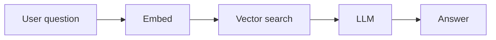

# Contributing

Thank you for helping make **AI Architecture From Scratch** better. There are two ways to contribute — pick the one that fits you.

## 1. I don't use Git (most of our audience)

You do **not** need to be a developer to improve this project.

- **Suggest or correct a tool, fix an error, or propose an example:** use the
  [suggestion / correction form](contribute.html) on the site.
- **Spotted something out of date?** Tool names, prices, model capabilities, and
  regulations change monthly — telling us is genuinely valuable.

That's it. We triage suggestions and update the content.

## 2. I'm comfortable with Git

### Repo layout

```
tracks/<NN>-track/<NN>-lesson/docs/en.md   # the lesson (Markdown)
tracks/<NN>-track/<NN>-lesson/outputs/     # optional: extra "ask Claude" prompt files
tracks/<NN>-track/<NN>-lesson/assets/      # optional: images for the lesson
library/                                    # decision-frameworks, tool-cards, glossary
curriculum.json                             # source of truth for nav / catalog / roadmap
assets/                                     # the static site (HTML/CSS/JS)
```

### Adding or editing a lesson

1. Create/edit `tracks/<track>/<lesson>/docs/en.md`.
2. Add an entry (or set `"status": "published"`) in [`curriculum.json`](curriculum.json).
3. Run it locally: `npm run dev` then open http://localhost:3000.

### Lesson frontmatter

Every lesson starts with a YAML-style frontmatter block:

```markdown
---
title: Retrieval-Augmented Generation (RAG)
track: 01-foundations
order: 11
summary: One-line summary shown in nav and search.
readingTime: 9
prerequisites:
  - Embeddings & vectors
  - What is AI?
tags:
  - rag
  - retrieval
lastReviewed: 2026-05-30
sources:
  - Title of source — https://example.com
  - Another source — https://example.com
---
```

- **`lastReviewed`** is rendered as a freshness badge. Update it whenever you review the lesson.
- **`sources`** render as a linked list at the foot of the lesson. **Every governance,
  compliance, or tooling claim must have a primary source.**

### The lesson template

Aim to include these sections (omit ones that don't apply):

`Overview` · `Why this matters` · `Core concepts` · `Visual explanation` ·
`How it works` · `Decision framework` · `Common mistakes` · `Real business examples` ·
`Governance considerations` · `How an architect thinks` · `Tools in this category` ·
`How to ask Claude / Cursor` · `Key takeaways` · `Self-check` · `Sources`.

### Content widgets (authored as fenced code blocks)

The renderer turns special fenced blocks into styled components. Authoring stays pure
Markdown — no build step.

**Decision card** — ` ```decision `
```decision
title: RAG or fine-tuning?
Does your knowledge change often or need fresh facts? → **RAG**
Need the model to adopt a style, format, or behaviour? → **Fine-tune (often LoRA)**
Both? → **RAG for facts + a light fine-tune for behaviour**
```

**Tool card** — ` ```toolcard `
```toolcard
name: Qdrant
category: Vector database
use: Store & search embeddings for RAG / semantic search
alternatives: Pinecone, pgvector, Weaviate, Milvus
when: Self-hosting, open-source, cost control
whennot: You already run Postgres (consider pgvector first)
```

**Architect note** — ` ```architect ` (the "the real question isn't X, it's…" reframe)
```architect
The real question isn't "which vector database." It's scale, latency, cost,
retrieval quality, and data sensitivity. Pick those first; the product follows.
```

**Governance box** — ` ```governance `
```governance
Retrieved chunks can leak confidential data into prompts and logs. Decide what may be
indexed, who can query it, and what is retained — before you build.
```

**Prompt block** — ` ```prompt ` (renders with a Copy button)
```prompt
Act as my AI architect. I want a RAG system over our internal policy PDFs...
```

**Callout** — ` ```callout ` (general highlight). Add `title:` as the first line of any widget to set its heading.

**Diagrams** — use a normal ` ```mermaid ` block. Add an alt line for accessibility:


### Style

- **Voice:** authoritative but plain — an expert peer talking to a smart non-coder.
  Confident, concrete, no fluff, no condescension.
- **Abstract, don't remove, technical concepts.** Explain what/why/when, not how to
  derive equations.
- **No unexplained jargon.** Link key terms to the glossary.
- **Be honest about limits** — never imply non-coders can ship secure production systems alone.

### Before you open a PR

- Run `npm run validate` to check `curriculum.json`.
- Check the lesson renders locally (widgets, diagrams, sources, badge).

By contributing you agree your content is licensed under **CC BY 4.0** and code under **MIT**.
