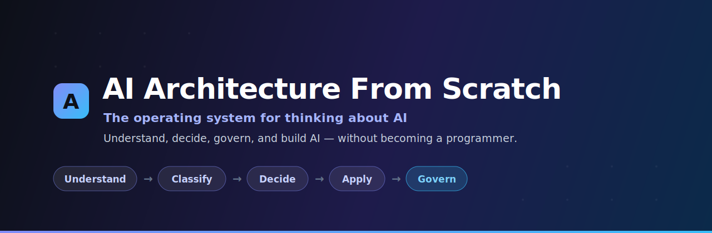
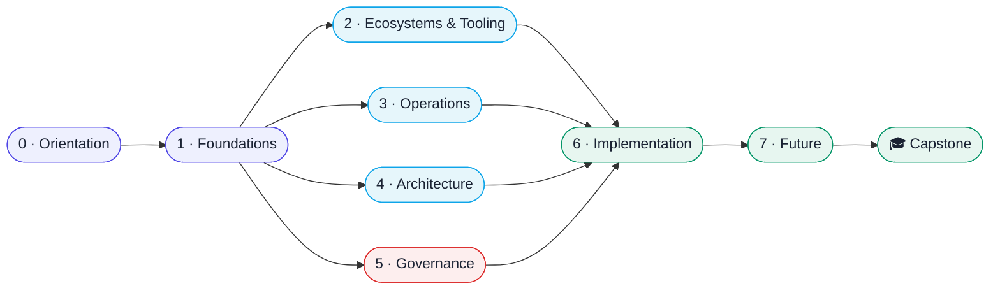
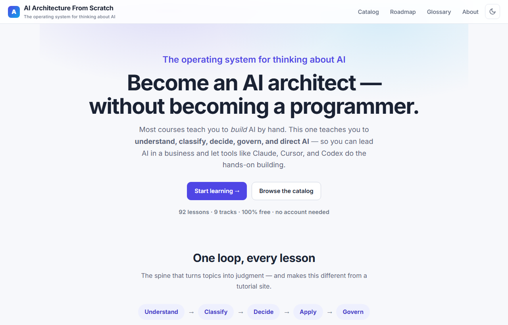
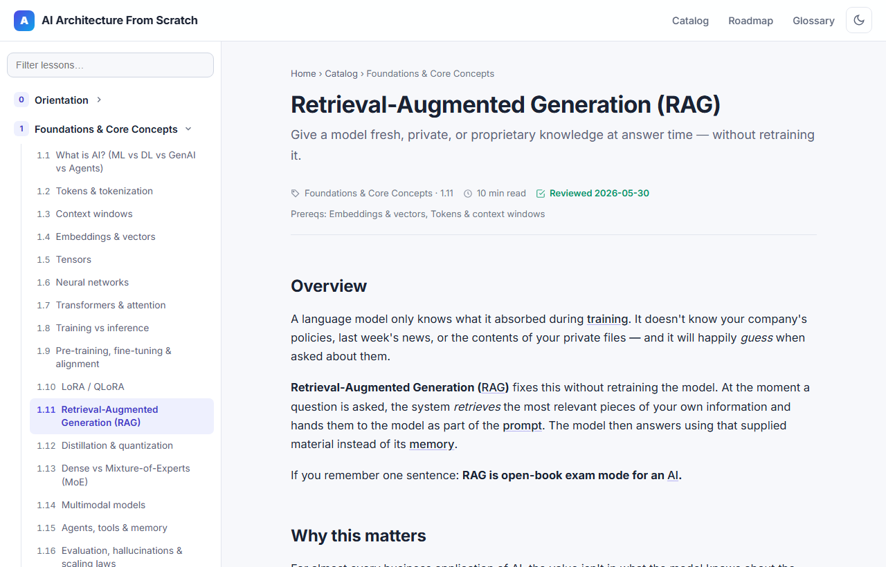
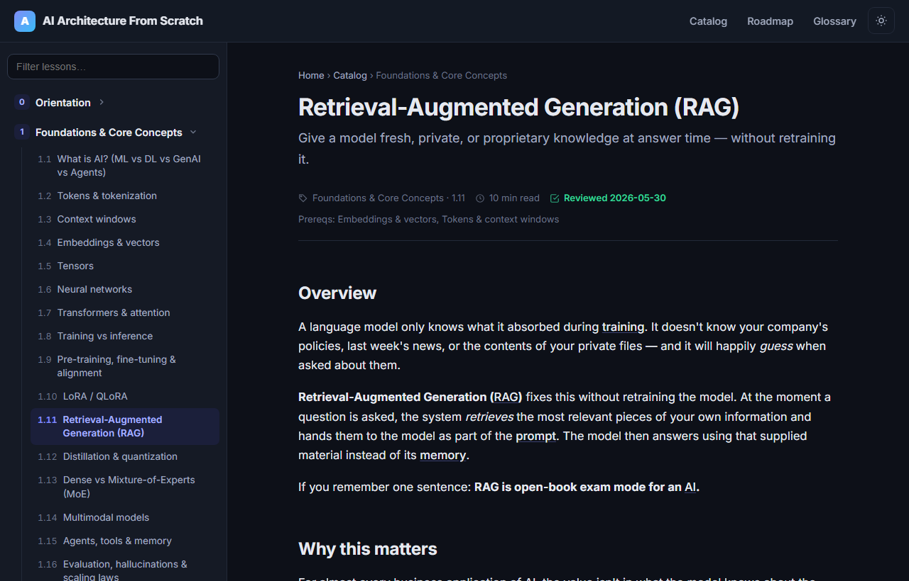
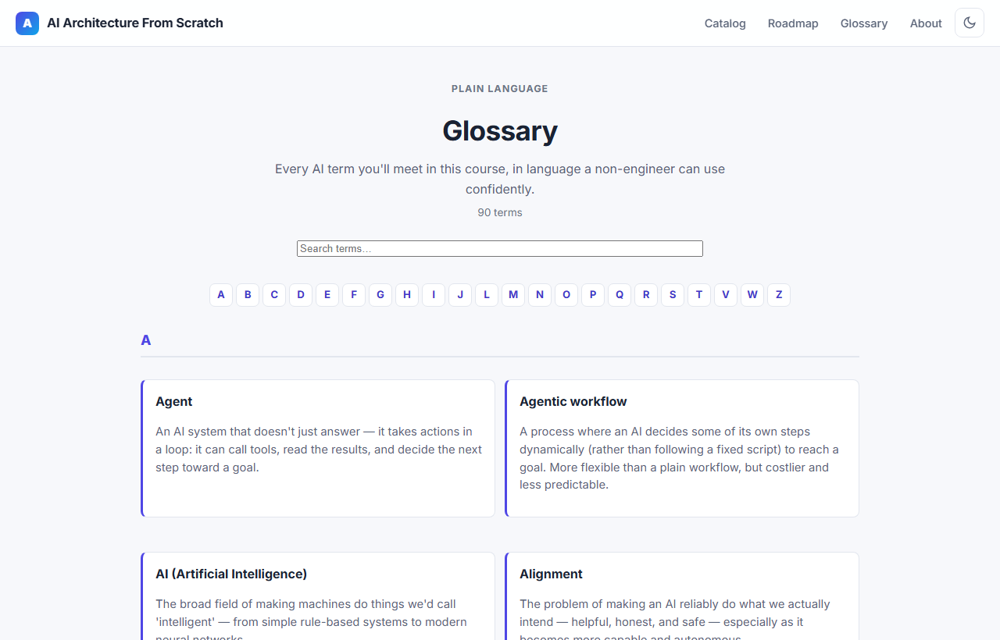

<div align="center">



<br/>

[](https://codingrockz.github.io/ai-architecture-from-scratch/)
&nbsp;
[](https://codingrockz.github.io/ai-architecture-from-scratch/catalog.html)


**Become an AI architect — without becoming a programmer.**

Most courses teach you to *build* AI by hand. This one teaches you to **understand, classify, decide, govern, and direct** AI — so you can lead it in a business and let tools like Claude, Cursor, and Codex do the hands-on building.

</div>

---

## Contents

- [Why this is different](#why-this-is-different)
- [Who it's for](#who-its-for)
- [The five-verb loop](#the-five-verb-loop)
- [The curriculum](#the-curriculum)
- [Take a look](#take-a-look)
- [Run it locally](#run-it-locally)
- [How it's built](#how-its-built)
- [Contributing](#contributing)
- [Trust & freshness](#trust--freshness)
- [License](#license)

---

## Why this is different

| | Most AI courses | **AI Architecture From Scratch** |
|---|---|---|
| **Teach you to** | build algorithms by hand | understand systems & make decisions |
| **Make you** | an AI engineer | an AI **architect / operator / decision-maker** |
| **Prerequisite** | comfortable coding | **none** — "you only know AI as ChatGPT" |
| **Implementation** | you write it line by line | you **direct AI tools** to build it |
| **Governance** | a footnote | a **core pillar in every lesson** |

> You start knowing AI only as "ChatGPT." You finish able to look at a business, find the high-value AI opportunities, choose the right architecture and tools, control cost, manage risk and governance, and direct AI agents to build internal tools and prototypes — and you know when a system needs a real engineer before production.

It's **free**, open-source, and runs as a self-contained static site — clone it and it just works.

## Who it's for

Founders · executives · consultants · product & operations managers · lawyers, accountants & other domain experts · IT managers · analysts · and engineers who want the systems / operations / governance lens. **No coding required.**

## The five-verb loop

Every lesson follows the same spine — the thing that turns topics into judgment:

> ### Understand → Classify → Decide → Apply → Govern

You understand the idea, learn where it sits in the ecosystem, get a framework for *when* to use it, see how it applies in real businesses, and learn its governance implications.

## The curriculum

Nine tracks, a capstone, and cross-cutting libraries (Decision Frameworks, Tool Cards, a 90-term Glossary). Foundations branches into the applied tracks, which converge on directing AI to build:



| # | Track | Lessons | What you'll be able to do |
|---|-------|:---:|---|
| 0 | Orientation | 4 | Adopt the architect/operator mindset; drive AI tools |
| 1 | Foundations & Core Concepts | 16 | Understand AI deeply — no hand-derived math |
| 2 | AI Ecosystems & Tooling | 12 | Classify the chaos; know which tool is which |
| 3 | AI Operations & Business Transformation | 12 | Find ROI; redesign processes with AI |
| 4 | AI Systems Architecture | 12 | Design RAG, agents, memory, routing, local-vs-cloud |
| 5 | AI Governance, Risk & Security | 14 | Deploy AI safely, legally, and in control |
| 6 | AI Implementation via AI Agents | 11 | Spec, direct, and validate AI-built systems |
| 7 | Future AI & Research Thinking | 8 | Reason about where this is all going |
| 🎓 | Capstone | 3 | Design, govern, and build a real system end-to-end |

➡️ **[Follow the full learning path](https://codingrockz.github.io/ai-architecture-from-scratch/roadmap.html)** or **[browse every lesson](https://codingrockz.github.io/ai-architecture-from-scratch/catalog.html)**.

## Take a look

Clean, distraction-free lessons with decision cards, architecture diagrams, governance callouts, a glossary, and copy-paste "ask Claude/Cursor" prompts — in light and dark mode.

|  |  |
|---|---|
|  |  |
| **Home** — the learning path at a glance | **A lesson** — concepts, diagrams, decision frameworks |
|  |  |
| **Dark mode** — easy on the eyes | **Glossary** — 90 plain-language terms, A–Z |

## Run it locally

It's just static files — you only need any local web server (so the browser can `fetch()` the Markdown lessons).

```bash
# Node (recommended) — tiny zero-dependency server, serves on http://localhost:3000
npm start          # or: node server.mjs

# Or with Python
python -m http.server 3000
```

Then open **http://localhost:3000**.

## How it's built

Deliberately low-tech, so anyone can fork it and it just works:

- **Content** = Markdown files under [`tracks/`](tracks/) (`tracks/<track>/<lesson>/docs/en.md`).
- **Site** = plain HTML + vanilla JS that fetches a lesson by `?path=…` and renders it. No build step, no framework.
- **Manifest** = [`curriculum.json`](curriculum.json) drives the navigation, catalog, and learning path.
- **Diagrams** = [Mermaid](https://mermaid.js.org/), rendered in the browser.
- **Widgets** (decision cards, tool panels, architect notes, governance boxes, prompts) are authored as fenced Markdown blocks — see [`CONTRIBUTING.md`](CONTRIBUTING.md).
- **Glossary** terms auto-link inside lessons, with definitions on hover.

## Contributing

You don't need to know Git to help. Spotted an out-of-date tool, a broken decision, or a missing example?

- **Non-coders:** use the [suggestion / correction form](https://codingrockz.github.io/ai-architecture-from-scratch/contribute.html).
- **Coders:** see [`CONTRIBUTING.md`](CONTRIBUTING.md) to add or edit lessons.

## Trust & freshness

AI moves fast, so we keep volatile specifics (tools, prices, regulations) in dated cards and stamp every lesson with a **"last reviewed"** date and **primary-source links**. This is education, **not** legal or professional advice.

If it helps you, [sponsoring the project](SPONSORS.md) keeps the content maintained. Free forever.

## License

- **Code:** [MIT](LICENSE)
- **Content** (lessons, diagrams, text): [CC BY 4.0](LICENSE-CONTENT.md)

---

<div align="center"><sub>Built in the open. Not affiliated with any AI vendor.</sub></div>
