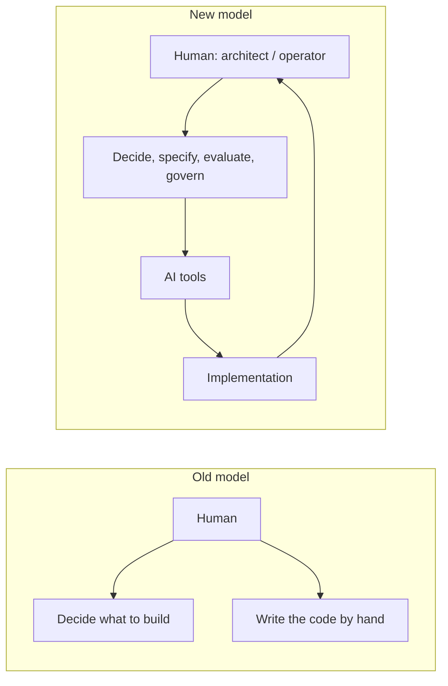

## Overview

For decades, the person who *understood* a system and the person who *built* it were often
the same — and building was the bottleneck. AI is dissolving that bottleneck. Increasingly,
the implementation can be delegated to a tool. What can't be delegated is the judgment about
*what* to build, *why*, and *whether it's safe to ship*.

That judgment is the new role. Call it **architect**, **operator**, or **orchestrator** — it's
the same shift: from doing the work to directing and owning the work.

## Why this matters

If implementation is becoming cheap and abundant, then implementation is no longer where your
value sits. Value moves up the stack — to specification, evaluation, integration, and
governance. People who only know how to type code lose leverage; people who know how to
*direct* the system gain it.

This isn't speculative. It's the same pattern every powerful tool has produced: the value
moves from the manual skill to the judgment about how to use it.

## Core concepts

The new role wears several hats:

- **Orchestrator** — decides what gets built, in what order, and how the pieces fit.
- **Architect** — chooses the approach and structure (RAG vs fine-tune, local vs cloud,
  agent vs workflow) and the trade-offs that come with each.
- **Evaluator** — judges whether the AI's output is correct, safe, and good enough. This is
  the skill AI cannot do *for* you, because someone accountable has to decide.
- **Workflow designer** — fits AI into how real work actually happens, including the humans.
- **Governance owner** — owns the risk: privacy, security, compliance, cost, and what happens
  when the AI is wrong.

Notice none of these require writing code. All of them require *understanding* the system.

## Visual explanation



## How it works

The architect operates in a loop: **specify → let AI build → evaluate → correct → govern →
ship**. The human is in the loop at the points that need accountability and judgment; the AI
does the heavy lifting in between.

Crucially, the architect doesn't need to *out-code* the AI. They need to:

- Describe the goal and constraints precisely enough that the AI can act.
- Recognise when the output is wrong, risky, or subtly off.
- Know enough about the options to choose well and to call in a specialist when the stakes
  demand it.

## Decision framework

```decision
title: Should I do this myself, direct an AI to do it, or bring in a specialist?
Routine, low-stakes, well-understood? → **Direct an AI tool** and review the result.
Novel or judgement-heavy, but you understand the domain? → **Direct + evaluate closely**; you're the accountable reviewer.
High-stakes, regulated, or production-critical (security, money, safety, legal)? → **Direct for a prototype, then bring in a qualified specialist** to validate and harden before it ships.
You don't understand the problem well enough to evaluate the output? → **Learn the concept first** (that's what this course is for) — never ship what you can't judge.
```

## Common mistakes

- **Confusing "I can't build it" with "I can't lead it."** The architect's power is judgment,
  not syntax.
- **Becoming a "prompt tourist"** — generating outputs you can't evaluate. Without the ability
  to judge quality, you're not directing; you're gambling.
- **Over-delegating accountability.** The AI is not accountable. You are. Own the outcome.
- **Under-delegating implementation.** Equally, don't insist on hand-doing what a tool does
  faster and better. Reserve your effort for the decisions.

## Real business examples

- A **product manager** writes a crisp spec, has an AI agent build a working prototype in a
  day, evaluates it against real user needs, and decides what ships — a role that used to need
  a full eng team for the first pass.
- An **operations lead** redesigns a workflow, directs an AI to automate the repetitive parts,
  and owns the governance (approvals, fallback, logging) — never writing a line of code.
- A **consultant** architects a client's AI stack and writes the governance plan, bringing in
  engineers only to harden the production build.

## Governance considerations

```governance
The new role concentrates accountability in a single person — you. That's a feature, but it carries duties:
- **You own evaluation.** If you can't assess whether an output is correct and safe, you can't responsibly ship it.
- **You own the risk decisions** — what data the system touches, what it's allowed to do, and what happens when it fails.
- **Delegating the build does not delegate the responsibility.** "The AI wrote it" is never a defence.
```

## How an architect thinks

```architect
The implementer asks "how do I build this?" The architect asks "should this be built, what's the right shape for it, how will I know it works, and what could go wrong?" — and only then, "what's the fastest way to get it built?" The order of those questions is the whole job.
```

## Key takeaways

- AI is moving value **from implementation to judgment**. The new role is **architect /
  operator / orchestrator**.
- The hats: **orchestrator, architect, evaluator, workflow designer, governance owner** — none
  require coding; all require understanding.
- **Evaluation and accountability cannot be delegated** to the AI.
- Direct the build, evaluate the result, own the risk — and call in specialists for
  high-stakes production work.

## Self-check

1. Why does AI moving the "build" bottleneck increase the value of judgment?
2. What is a "prompt tourist," and why is that a trap?
3. Which parts of the architect role can you *not* delegate to an AI, and why?
