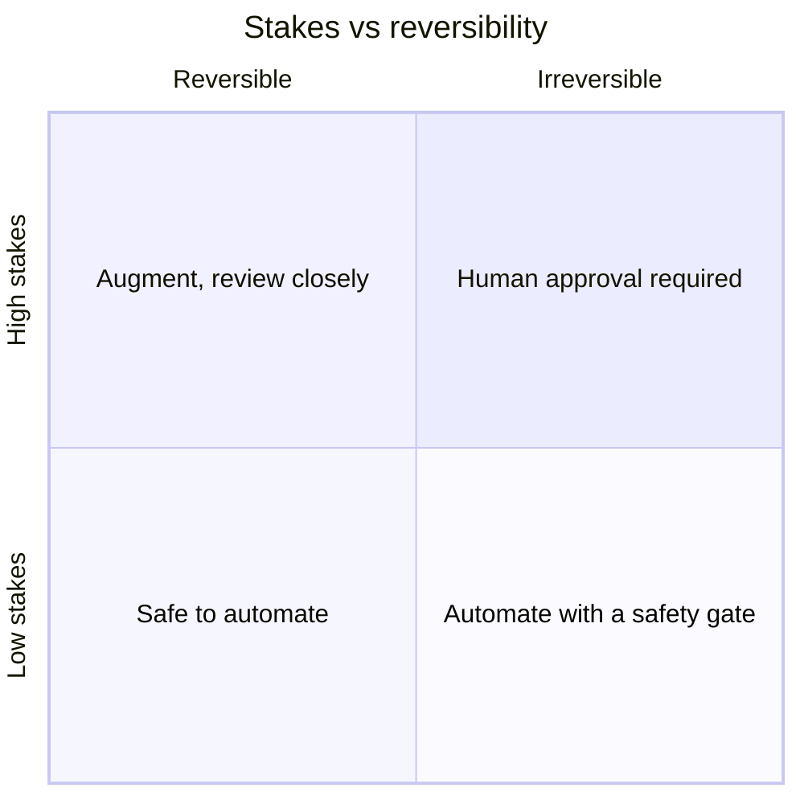

## Overview

Before we touch any specific technology, you need a small toolkit of mental models. These are
the lenses an architect looks through, and we'll use them in every track. Master these five
and most AI decisions get noticeably easier.

## Why this matters

AI is noisy. New tools launch weekly, each promising to change everything. Without a stable
way of thinking, you drown — chasing hype, over-building, or freezing. Mental models are the
antidote: they let you reason from first principles instead of reacting to marketing.

## Core concepts

**1. Think in systems, not features.** An AI capability is never alone — it sits in a system
of data, users, tools, costs, failure modes, and people. "Add a chatbot" is a feature.
"Where does the data come from, who can see it, what happens when it's wrong, who's
accountable?" is a system. Architects think the second way.

**2. Everything is a trade-off.** There is no free lunch — only choices. Faster usually costs
more. Cheaper usually means slower or less capable. More autonomous means more risk. The
question is never "what's best?" but "best *for what*, given which constraints?"

**3. Blast radius.** When (not if) something goes wrong, how much damage can it do? A model
that drafts text has a small blast radius. The same model wired to send money has a huge one.
You design to keep the blast radius small relative to the stakes.

**4. Reversibility.** Can you undo it? Reversible actions are safe to automate and to
experiment with. Irreversible ones (deleting data, sending a legal notice, paying an invoice)
deserve a human gate. Favour reversibility; gate irreversibility.

**5. Right altitude.** Match your level of detail to the decision. A CEO choosing an AI
strategy doesn't need to know CUDA kernels; an engineer tuning latency does. Operating at the
wrong altitude — too deep or too shallow — wastes effort and hides the real decision.

## Visual explanation



## How it works

Put together, these models give you a repeatable way to approach any AI decision:

1. **Frame it as a system** — map the data, users, actions, costs, and failure modes.
2. **Name the trade-offs** — what are you optimising for, and what are you giving up?
3. **Estimate the blast radius** — worst realistic outcome if it's wrong or attacked.
4. **Check reversibility** — can mistakes be undone? Where do you need a human gate?
5. **Pick your altitude** — decide at the level the decision actually lives.

You'll notice these are exactly the questions the decision cards throughout this course are
built from.

## Decision framework

```decision
title: A universal first-pass on any AI idea
What system does this live in (data → users → action → failure)? Map it before judging it.
What am I optimising for — speed, cost, quality, control? You can't have all four maxed.
What's the worst realistic outcome if it's wrong or abused? That sets how cautious to be.
Is it reversible? If not, put a human in the loop.
Am I reasoning at the right altitude for who has to decide?
```

## Common mistakes

- **Optimising one dimension blindly** (usually "most capable model") and getting blindsided
  by cost, latency, or governance.
- **Ignoring failure modes** because the happy path demos well. The demo is not the system.
- **Treating reversible and irreversible actions the same** — either over-gating everything
  (slow) or under-gating the dangerous ones (catastrophic).
- **Wrong altitude** — executives lost in technical weeds, or engineers hand-waving strategy.

## Real business examples

- A team wants the "best" model for a high-volume, low-stakes classification task. Trade-off
  thinking says: a cheaper, faster, smaller model is *better here* — capability was the wrong
  thing to maximise.
- A startup considers auto-sending AI-drafted contracts. Blast-radius + reversibility thinking
  says: drafting is fine to automate; *sending* a legal document is irreversible and
  high-stakes — gate it with a human.

## Governance considerations

```governance
These models are the seed of a governance practice. "Blast radius" and "reversibility" are exactly how frameworks like the NIST AI RMF reason about risk: identify what can go wrong, how badly, and how to contain it. Carrying these lenses into every decision means governance isn't a separate step bolted on at the end — it's baked into how you think.
```

## How an architect thinks

```architect
Beginners collect tools. Architects collect *models for choosing between tools*. The specific products will change every year; "everything is a trade-off," "mind the blast radius," and "favour reversibility" will still be true in a decade. Invest in the models, not the menu.
```

## Key takeaways

- Five reusable lenses: **systems thinking, trade-offs, blast radius, reversibility, right
  altitude**.
- There is no "best" — only **best for a purpose under constraints**.
- Keep the **blast radius small** relative to the stakes; **gate irreversible** actions.
- These lenses are the raw material of every decision card — and of governance itself.

## Self-check

1. Restate "everything is a trade-off" using a real choice between two AI models.
2. What's the difference between blast radius and reversibility, and how does each change your
   design?
3. Give an example of operating at the wrong altitude for a decision.
