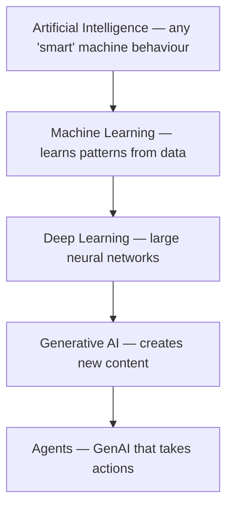

## Overview

"AI" is used to mean a dozen different things. To make good decisions you need a clean mental
map: what the major terms mean and how they relate. The good news is they nest neatly inside
each other, like Russian dolls.

## Why this matters

When a vendor says "AI-powered," you should be able to ask "which kind, and does that even
help here?" Most confusion (and most wasted money) comes from blurring these categories.

## Core concepts

- **Artificial Intelligence (AI)** — the broadest term: any technique that makes machines do
  things we'd call "intelligent." Includes old-school rule-based systems, not just modern
  neural nets.
- **Machine Learning (ML)** — systems that *learn patterns from data* instead of being
  explicitly programmed with rules. (Spam filters, recommendation engines, fraud detection.)
- **Deep Learning (DL)** — ML using large *neural networks* with many layers. This is what
  powers modern image recognition, speech, and language models.
- **Generative AI (GenAI)** — deep-learning models that *create* new content (text, images,
  audio, code) rather than just classifying or predicting a number. ChatGPT, Claude, image
  generators.
- **Agents** — GenAI systems that don't just produce content but *take actions in a loop*:
  call tools, read results, and decide the next step toward a goal.

## Visual explanation



## How it works

The key shift modern AI represents: instead of humans writing explicit rules ("if email
contains 'free money', mark as spam"), we show the system many examples and it *learns* the
patterns itself. Deep learning scales this up with neural networks that can learn extremely
complex patterns — like the structure of language — given enough data and compute.

Generative AI is the moment those models got good enough not just to recognise patterns but to
*produce* fluent new content. Agents are the current frontier: wrapping that generative ability
in a loop with tools so it can *do* things, not just *say* things.

## Decision framework

```decision
title: What kind of AI does this problem actually need?
Predict a number or category from data (churn, fraud, demand)? → Classic **ML** — often cheaper and more reliable than an LLM.
Understand or generate language, images, or code? → **Generative AI / LLMs**.
Need it to take multi-step actions across tools to reach a goal? → An **agent** — but only if a simple workflow won't do (agents add cost and risk).
A fixed, well-defined rule? → You may not need "AI" at all — plain software is cheaper and predictable.
```

## Common mistakes

- **Reaching for an LLM for everything.** Many business problems (forecasting, scoring) are
  better, cheaper, and more reliable as classic ML.
- **Calling a simple automation an "agent."** Agents imply autonomy and a decision loop — and
  with that, more cost and risk. Use the word precisely.
- **Believing "AI" is one thing.** The governance and cost profile of a spam filter and an
  autonomous agent are worlds apart.

## Real business examples

- **Classic ML:** a lender predicts default risk from historical data — no LLM needed.
- **Generative AI:** a marketing team drafts campaign copy and images.
- **Agent:** a research assistant that searches the web, reads results, and compiles a
  sourced brief — deciding its own steps.

## Governance considerations

```governance
The category sets the risk profile. Classic ML on personal data raises fairness and privacy questions. Generative AI adds hallucination and IP concerns. Agents add the biggest surface — they take actions, so they need least-privilege, human gates, and monitoring. Always ask "which kind of AI is this?" because the controls differ sharply.
```

## How an architect thinks

```architect
The architect doesn't ask "can we use AI?" — almost anything can be labelled AI. They ask "what's the simplest technique that solves this reliably?" Sometimes that's a frontier LLM; often it's boring, cheap classic ML or even plain rules. Matching the technique to the problem is worth more than using the fanciest model.
```

## Key takeaways

- The terms **nest**: AI ⊃ ML ⊃ Deep Learning ⊃ Generative AI, with **Agents** built on top.
- **ML** learns from data; **GenAI** creates content; **agents** take actions.
- Match the **technique to the problem** — the fanciest option is often the wrong one.
- Each category has a different **cost and governance** profile.

## Self-check

1. Put these in order of nesting: Deep Learning, AI, Generative AI, Machine Learning.
2. Give a business problem better solved by classic ML than by an LLM.
3. What distinguishes an "agent" from a generative model that just answers questions?
