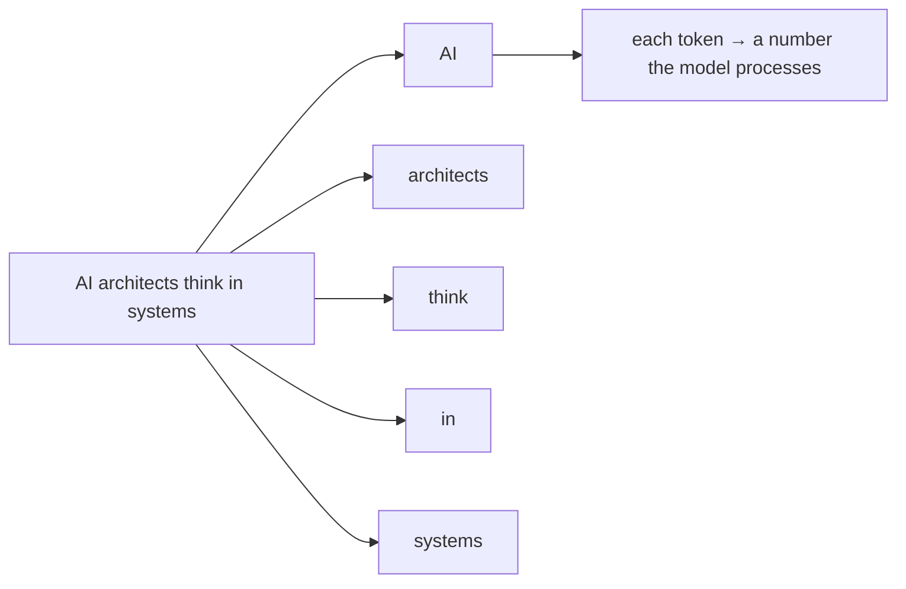

## Overview

A language model doesn't see words the way you do. It breaks text into **tokens** — chunks
that are often a word, part of a word, or a piece of punctuation — and works entirely in those
units. Tokens are small and abstract, but they matter because **you pay per token** and
**context limits are measured in tokens.**

## Why this matters

Almost every practical and financial fact about using AI is denominated in tokens: how much a
request costs, how much text fits, how fast it responds. Understanding tokens turns "AI is
expensive/cheap" from a vibe into a number you can estimate and control.

## Core concepts

- A **token** is roughly ¾ of a word in English — about 4 characters. "Tokenization" is
  rare-word, so it might split into "token" + "ization."
- Both the **input** (your prompt + any documents) and the **output** (the model's reply) are
  counted in tokens.
- **Pricing** is per-token, usually quoted per million tokens, often with input cheaper than
  output.
- Different languages and code tokenize differently — non-English text and unusual strings can
  use more tokens per word.

## Visual explanation



## How it works

Before a model can process text, a *tokenizer* converts it into a sequence of token IDs
(numbers). The model works on those numbers and produces new ones, which are converted back
into text. You never see this directly, but it explains some quirks: why models sometimes
miscount letters in a word (they see tokens, not letters), and why pasting a giant document
can get expensive fast.

A practical rule of thumb: **1,000 tokens ≈ 750 words ≈ 1.5 pages.** A 100-page document is
very roughly 50,000 tokens.

## Decision framework

```decision
title: How do I keep token costs under control?
Sending huge documents every request? → Use retrieval (RAG) to send only the relevant chunks, not everything.
Long back-and-forth conversations? → Summarise or trim old turns instead of resending the whole history.
High volume of simple requests? → Use a smaller, cheaper model; reserve frontier models for hard tasks.
Costs unclear? → Estimate: (input tokens + output tokens) × price-per-token × number of requests. Do this before you build.
```

## Common mistakes

- **Ignoring output tokens.** Long, verbose responses cost more — and output is often the
  pricier side.
- **Stuffing entire documents into every prompt** when retrieval would send a fraction.
- **Forgetting conversation history compounds.** Each turn can resend everything before it.
- **Assuming word count = token count.** Code, JSON, and non-English text can be token-heavy.

## Real business examples

- A support bot's costs balloon because every reply resends the full knowledge base. Switching
  to retrieval cuts tokens — and the bill — dramatically.
- A team estimates a feature will process 10M tokens/day; at the model's price, that's a clear
  number they can budget and compare across models *before* committing.

## Governance considerations

```governance
Tokens are also a cost-governance lever. Runaway token usage is one of the most common ways AI spend spirals. Set budgets and alerts, prefer retrieval over dumping data into prompts, and remember that every token of sensitive data you send also leaves your environment — token efficiency and data minimisation often point the same way.
```

## How an architect thinks

```architect
The architect treats tokens as the currency of the system. "Which model is best?" becomes "what's the cost per successful task, in tokens, at our volume?" That reframing turns model selection and design choices (retrieval, summarisation, smaller models) into a budget you can actually manage.
```

## Key takeaways

- Models work in **tokens** (~¾ of a word), not words or letters.
- **Both input and output** are counted; **cost and context limits** are in tokens.
- Rule of thumb: **1,000 tokens ≈ 750 words.**
- Control cost with **retrieval, trimming history, and smaller models** — and estimate before
  you build.

## Self-check

1. Roughly how many tokens is a 10-page document?
2. Why might a model miscount the letters in a word?
3. Name two ways to reduce token costs in a chatbot.
