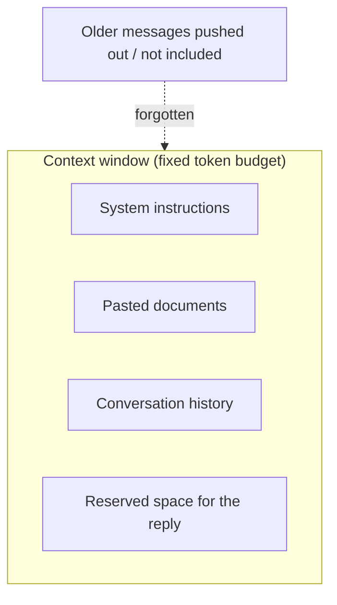

## Overview

The **context window** is the maximum amount of text — measured in tokens — a model can
consider at once. It's the model's short-term working memory: everything you send *plus*
everything it replies must fit inside it. Understanding this one limit explains a huge amount
about what AI can and can't do in a single shot.

## Why this matters

The context window decides whether you can paste a whole contract for review, how much
conversation history the model remembers, and whether you need retrieval (RAG) at all. It's
also widely misunderstood: a bigger window is genuinely useful but doesn't make the model
*remember forever* or *reason perfectly* over everything in it.

## Core concepts

- The window holds **the entire exchange**: your instructions, any documents you paste, the
  conversation so far, and the model's response.
- **It is not long-term memory.** When a conversation ends (or scrolls past the limit), the
  model doesn't retain it. Persistent memory is a separate system you add.
- **Bigger windows help but degrade.** Models can technically accept very large contexts, but
  they often attend less reliably to material buried in the middle — the so-called
  "lost in the middle" effect. More context also costs more and runs slower.

## Visual explanation



## How it works

Think of the window as a fixed-size desk. You can lay out instructions, documents, and chat
history on it — but only so much fits. Add more and something falls off the edge (older
messages, or content you didn't include). The model reasons only over what's on the desk
*right now*.

This is exactly why **RAG** exists: instead of trying to fit your entire knowledge base on the
desk, you retrieve just the relevant pages and place those on it for each question.

## Decision framework

```decision
title: My content is bigger than I can comfortably fit — what do I do?
A few documents, occasionally? → Just paste them into the context for that task.
A large, changing knowledge base? → Use **RAG** to retrieve only the relevant chunks per question.
Long ongoing conversations? → Summarise older turns, or use a memory system to persist key facts.
Need the model to "remember" across sessions? → Add an explicit memory layer — the context window won't do it.
```

## Common mistakes

- **Assuming the window is memory.** Close the chat and it's gone unless you saved it elsewhere.
- **Dumping everything into a huge context** and trusting the model to find the needle —
  retrieval is usually more reliable and cheaper.
- **Forgetting the reply needs room too.** If you fill the window with input, there's little
  left for a long answer.
- **Believing a bigger window removes the need for RAG.** It reduces it sometimes, but cost,
  speed, and reliability still favour retrieval at scale.

## Real business examples

- A lawyer pastes a 30-page contract and asks for risk flags — fits comfortably, no RAG needed.
- A company wants to "chat with" 10,000 documents — far beyond any window, so RAG is the
  architecture, not a bigger context.
- A support assistant starts giving inconsistent answers in long chats because early context
  scrolled out — solved by summarising the conversation.

## Governance considerations

```governance
Whatever sits in the context window is sent to the model provider and may be logged. A large window makes it easy to paste in far more sensitive data than necessary — including documents the user shouldn't expose. Practise data minimisation: send only what the task needs (another argument for retrieval), and be deliberate about what goes on the "desk."
```

## How an architect thinks

```architect
Vendors market context-window size like a spec-sheet number. The architect asks a different question: "what's the most *reliable, cost-effective* way to get the right information in front of the model for each task?" Often the answer is good retrieval feeding a modest window — not brute-forcing everything into the biggest window available.
```

## Key takeaways

- The context window is the model's **working memory**, measured in **tokens**, holding the
  whole exchange.
- It is **not long-term memory** — persistence is a separate system.
- **Bigger isn't automatically better**: cost, speed, and "lost in the middle" all bite.
- **RAG** exists precisely to manage information that's larger than the window.

## Self-check

1. What four kinds of content compete for space in the context window?
2. Why isn't a large context window a substitute for long-term memory?
3. When would you paste a document directly vs. use RAG?
