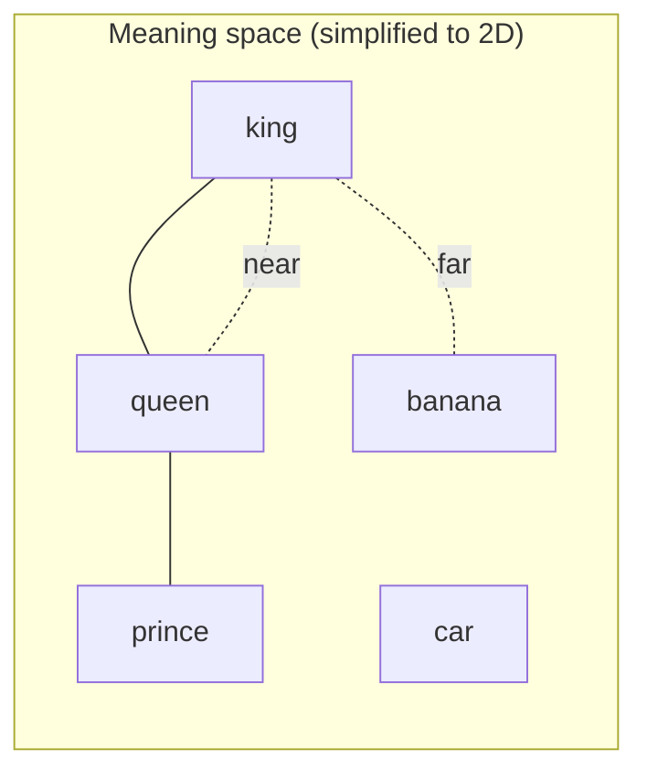

## Overview

An **embedding** is a list of numbers — a **vector** — that represents the *meaning* of
something (a sentence, an image, a product) in a way a computer can compare. The magic
property: things with similar meaning get similar vectors, so they sit close together in
"meaning space." This single idea powers semantic search, RAG, recommendations, and more.

## Why this matters

Computers can't compare meaning directly, only numbers. Embeddings are the bridge. Once you
understand that meaning can be turned into coordinates, a whole family of capabilities — "find
me documents *about* this, even if they don't share the exact words" — stops being magic and
becomes a tool you can reason about.

## Core concepts

- A **vector** is just an ordered list of numbers, e.g. `[0.12, -0.88, 0.03, …]` — often
  hundreds or thousands long. Each number is a coordinate in an abstract space.
- An **embedding model** converts input into such a vector. Similar inputs → nearby vectors.
- **Distance = dissimilarity.** "King" and "queen" land near each other; "king" and "banana"
  land far apart. You measure closeness to find related things.
- Embeddings can be made for **text, images, audio, or anything** — and "multimodal"
  embeddings put text and images in the *same* space, so you can search images with words.

## Visual explanation



## How it works

An embedding model has learned, from huge amounts of data, to place inputs so that meaning
corresponds to position. You don't interpret the individual numbers — they're not "this one
means royalty." What matters is the *relationships*: nearby = similar.

To use it, you embed your content once and store the vectors (in a **vector database**). Then
you embed a query and ask "which stored vectors are closest?" The closest ones are the most
semantically relevant — even if they share no keywords with the query. That's **semantic
search**, and it's the retrieval engine inside RAG.

## Decision framework

```decision
title: Do I need embeddings / semantic search?
Searching by *meaning* ("find docs about cancellation policy" matching "ending your plan")? → Yes, embeddings.
Exact keyword or ID lookup is enough? → A normal database/search is simpler and cheaper.
Building RAG, recommendations, deduplication, or clustering? → Embeddings are the core ingredient.
Tiny data set? → You may not need a vector database; brute-force comparison can be fine.
```

## Common mistakes

- **Trying to read the numbers.** Individual dimensions aren't human-interpretable; only
  relative distances matter.
- **Using a weak embedding model** and blaming poor search results on "the AI." Embedding
  quality drives retrieval quality.
- **Mixing embedding models.** Vectors from different models live in different spaces and
  aren't comparable — embed queries and documents with the *same* model.
- **Assuming embeddings understand like a person.** They capture statistical meaning, not true
  comprehension — close vectors are usually but not always truly relevant.

## Real business examples

- **Semantic search:** an internal tool finds the right policy even when staff phrase the
  question completely differently from the document.
- **Recommendations:** "products similar to this" computed as nearest vectors.
- **Deduplication:** spotting near-duplicate support tickets or records by vector closeness.
- **RAG:** the retrieval step that finds relevant chunks to answer a question.

## Governance considerations

```governance
Embeddings are derived from your source data, and they can leak information — research has shown text can sometimes be partially reconstructed from its embeddings. So treat a vector database as sensitive: it inherits the confidentiality of whatever you embedded. Control who can query it, where it's hosted (residency), and what was allowed into it in the first place.
```

## How an architect thinks

```architect
The beginner asks "which vector database?" The architect first asks "which embedding model, and is our retrieval actually returning the right things?" The database is plumbing; the embedding model and your evaluation of retrieval quality determine whether the whole system is useful. Get those right before fussing over the store.
```

## Key takeaways

- An **embedding** turns meaning into a **vector** (a list of numbers); **similar meaning →
  nearby vectors**.
- This enables **semantic search** — finding things by meaning, not keywords — the engine
  inside RAG and recommendations.
- **Embedding-model quality** and consistent use (same model for queries and docs) drive
  results.
- Vector stores are **sensitive data**; govern access, residency, and what gets embedded.

## Self-check

1. In plain words, what does it mean for two pieces of text to have "close" embeddings?
2. Why must you use the same embedding model for your documents and your queries?
3. Why should a vector database be treated as sensitive data?
