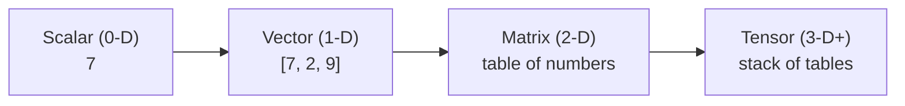

## Overview

You'll see "tensor" everywhere in AI — TensorFlow, Tensor Cores, "it's all just tensor math."
A **tensor** is simply a container for numbers arranged in a grid of one or more dimensions.
That's it. Understanding the word demystifies a lot of jargon and explains why AI is so
hungry for specialised hardware.

## Why this matters

Every input, every weight, and every output in a neural network is a tensor. The reason AI
needs GPUs, the reason it's expensive, and the reason it can be parallelised all trace back to
"AI is enormous amounts of tensor arithmetic." You don't need to *do* the math — but knowing
what's being computed makes infrastructure and cost conversations make sense.

## Core concepts

Tensors are just numbers organised by how many dimensions (axes) they have:

- **0-D — a scalar:** a single number. `7`
- **1-D — a vector:** a list. `[7, 2, 9]` (an embedding is a vector — a 1-D tensor.)
- **2-D — a matrix:** a table of numbers (rows × columns).
- **3-D and up:** stacks of tables — e.g. an image is a 3-D tensor (height × width × colour),
  and a batch of images is 4-D.

A model's "weights" (everything it learned) are huge tensors. Running the model means
multiplying your input tensors by these weight tensors, over and over.

## Visual explanation



## How it works

Neural networks are, mechanically, long chains of tensor multiplications and simple
operations. The same operation is applied to millions or billions of numbers. That's a
problem ordinary CPUs are bad at (they do a few things quickly, one after another) and GPUs
are great at (they do many simple things in parallel). Modern AI chips even have dedicated
"Tensor Cores" built specifically to multiply tensors fast.

So when people say "we need more GPUs," they mean "we have more tensor math than our current
hardware can chew through in reasonable time and cost."

## Decision framework

```decision
title: When do tensors / hardware actually enter my decisions?
Just *using* a hosted model via an API? → You never touch tensors or GPUs; you pay per token. (Most people, most of the time.)
Running an open model yourself? → Now GPU memory and type directly limit which models you can run and how fast — tensor size matters.
Training or fine-tuning? → Tensor sizes drive the GPU count, time, and cost. This is where the big bills live.
```

## Common mistakes

- **Thinking you must understand tensor math to use AI.** You don't — hosted APIs hide it
  entirely.
- **Underestimating that model size = tensor size = hardware cost.** A "bigger" model is
  literally bigger tensors needing more GPU memory.
- **Confusing training and inference hardware needs.** Training is far more tensor-intensive
  than running a model.

## Real business examples

- A team using Claude via API never thinks about tensors — they think about tokens and cost.
- A company wanting to self-host an open model discovers the model's tensor size won't fit on
  their GPU's memory, forcing a smaller (quantized) model — a direct tensor-to-budget link.

## Governance considerations

```governance
Tensors themselves aren't a governance topic, but the choice they force — hosted API vs. self-hosted on your own GPUs — absolutely is. Self-hosting keeps tensors (and your data) on your hardware, which can satisfy data-residency and confidentiality needs, at the cost of buying or renting GPUs. That trade-off recurs throughout the Architecture and Governance tracks.
```

## How an architect thinks

```architect
The architect treats "tensor" as a unit of cost and capability, not a math object. "This model has 70 billion parameters" tells them roughly how much GPU memory and money it needs, and whether to host it or call an API. They reason about size and hardware fit, and leave the actual arithmetic to the silicon.
```

## Key takeaways

- A **tensor** is just numbers in a grid (scalar → vector → matrix → higher-D). Embeddings are
  1-D tensors; model weights are huge tensors.
- AI is **massive tensor arithmetic**, which is why it needs **GPUs**.
- Using a hosted API hides tensors entirely; **self-hosting, training, and fine-tuning** are
  where tensor size becomes cost.
- You need the *concept*, not the calculations.

## Self-check

1. What's the difference between a scalar, a vector, and a matrix?
2. Why does AI need GPUs rather than ordinary CPUs?
3. In what situations do tensor sizes start to affect your budget directly?
