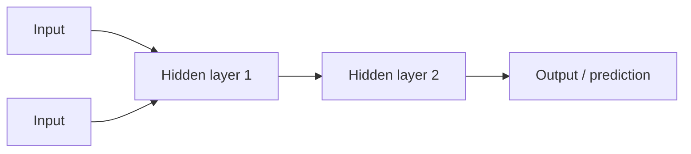

## Overview

A **neural network** is the engine inside deep learning. Loosely inspired by the brain, it's a
web of simple units ("neurons") connected in layers, each connection carrying a number called a
**weight**. Learning means adjusting those weights until the network produces good outputs.
You can understand the whole idea without a single equation.

## Why this matters

Neural networks are what "the model" actually is. Knowing — at an intuitive level — how they
learn explains training cost, why models need so much data, why they sometimes fail in weird
ways, and what "the weights" everyone refers to really are.

## Core concepts

- **Neurons & layers.** A neuron takes in numbers, combines them, and passes a number on.
  Neurons are stacked in layers; the output of one layer feeds the next. "Deep" learning just
  means *many* layers.
- **Weights.** Each connection has a weight that strengthens or weakens a signal. The full set
  of weights *is* what the model has learned — its "knowledge," stored as huge tensors.
- **Learning = adjusting weights.** The network makes a prediction, compares it to the right
  answer, measures the error, and nudges the weights to reduce that error. Repeat millions of
  times. (The nudging algorithm is "backpropagation" — you don't need the math, just the idea:
  *blame the error on the weights and adjust them a little.*)
- **Training data.** The examples it learns from. More and better data generally means a better
  network — which is why data is so central.

## Visual explanation



## How it works

Picture learning to recognise a cat photo. Early layers learn tiny patterns (edges, corners).
Middle layers combine those into shapes (ears, whiskers). Later layers combine *those* into
concepts ("cat"). Nobody programmed "a cat has pointy ears" — the network discovered useful
patterns by adjusting weights to reduce its errors over many examples.

The same principle scales to language: a large network adjusts billions of weights until it's
very good at predicting the next token, and in doing so it absorbs grammar, facts, and
reasoning patterns from its training text.

## Decision framework

```decision
title: How deep do I need to go into network internals?
Using or buying AI products? → The intuition here is plenty. You'll never touch a weight.
Choosing between models? → Care about *parameter count* (roughly, number of weights) as a proxy for capability and cost, not the internal wiring.
Fine-tuning or training? → You (or your tools) will adjust weights — but even then, you direct the process; you don't hand-compute gradients.
```

## Common mistakes

- **Over-anthropomorphising.** "Neurons" are simple math, not brain cells; the network doesn't
  "understand" the way you do.
- **Assuming more layers/parameters is always better.** Bigger costs more and can overfit;
  right-sized beats biggest.
- **Forgetting data quality.** A network is only as good as what it learned from — garbage in,
  garbage out.

## Real business examples

- A retailer's demand-forecasting network learns seasonal patterns from years of sales — no
  rules written, patterns discovered.
- An LLM is a (very large) neural network whose learned weights let it predict language well
  enough to draft, summarise, and answer.

## Governance considerations

```governance
Two governance facts flow from how networks learn. First, **they inherit their training data's biases** — if the data is skewed, the weights encode that skew, which matters for any decision about people. Second, **the weights are opaque**: you can't read off *why* a network made a decision the way you'd read code. That's the root of the "explainability" problem and why high-stakes uses need human oversight and testing rather than blind trust.
```

## How an architect thinks

```architect
The architect doesn't picture neurons; they picture a function that was *shaped by data* rather than written by hand. That reframing predicts the failure modes: it will be confidently wrong outside its training distribution, it will reflect its data's biases, and it can't fully explain itself. Designing around those properties matters far more than knowing the wiring diagram.
```

## Key takeaways

- A neural network is **layers of simple units** connected by **weights**; the weights are the
  learned knowledge.
- **Learning = adjusting weights to reduce error** over many examples (that's all
  backpropagation is, conceptually).
- **Data quality and quantity** drive performance; bigger isn't automatically better.
- Networks are **opaque and inherit data bias** — the source of explainability and fairness
  concerns.

## Self-check

1. In one sentence, what are "the weights" of a model?
2. Describe, without math, what "learning" means for a neural network.
3. Why are neural networks hard to explain, and why does that matter for governance?
