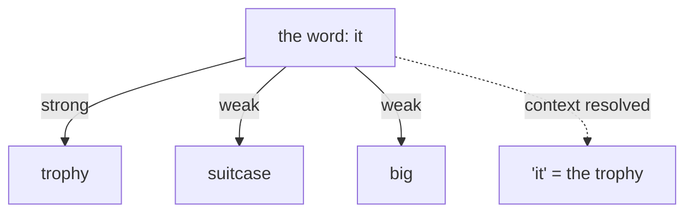

## Overview

Almost every modern language model — GPT, Claude, Gemini, Llama — is a **transformer**. It's
the neural-network design introduced in 2017 that made today's AI boom possible. Its key
innovation is **attention**: the ability for the model to weigh how much each word should
"pay attention to" every other word when figuring out meaning. You can grasp why it matters
without any of the math.

## Why this matters

The transformer is the reason AI suddenly got good at language. Understanding attention
explains a lot of model behaviour: why context matters so much, why models can lose track in
very long inputs, and why compute cost grows with input length. It's the architectural fact
underneath most other foundations.

## Core concepts

- **Sequence in, sequence out.** A transformer reads a sequence of tokens and predicts the
  next one, again and again, to generate text.
- **Attention.** For each token, the model asks "which other tokens are relevant to
  understanding this one?" and weights them accordingly. In "the trophy didn't fit in the
  suitcase because *it* was too big," attention helps the model link "it" to "trophy."
- **Parallelism.** Unlike older designs that read word-by-word in order, transformers process
  the whole sequence at once. That parallelism is why they train efficiently on GPUs — and a
  big reason they scaled so well.
- **Self-attention is the engine; everything else is plumbing** around it (layers, the
  feed-forward parts you don't need to track).

## Visual explanation



## How it works

Attention lets every token gather information from every other token in the context, weighted
by relevance. Stack many attention layers and the model builds up an increasingly rich
understanding of how the words relate — grammar, references, meaning, even reasoning patterns.

There's a catch worth knowing: attention compares every token with every other token, so the
work grows roughly with the *square* of the input length. Double the input, quadruple the
attention work. That's the deep reason long contexts cost more and get slower — and why making
attention more efficient is a hot research area.

## Decision framework

```decision
title: What does "it's a transformer" tell me practically?
Cost & speed grow faster than linearly with input length → keep prompts focused; don't pad context needlessly.
The model reasons over *relationships in the context* → giving it the right context is high-leverage (the basis for prompting and RAG).
Almost all LLMs share this architecture → differences between them come from size, training data, and tuning — not usually a different core design.
```

## Common mistakes

- **Thinking each model has a radically different architecture.** Most are transformer
  variants; the differences are scale, data, and fine-tuning.
- **Ignoring the quadratic cost of length** and wondering why huge prompts are slow and pricey.
- **Treating attention as "understanding."** It's a powerful weighting mechanism, not human
  comprehension — it can still misresolve references and hallucinate.

## Real business examples

- Knowing attention is "relationship-aware" explains why *how you structure a prompt* (putting
  key info clearly, not burying it) measurably changes output quality.
- A team debugging slow, expensive long-document calls realises the quadratic cost of length is
  the culprit and switches to retrieving shorter, relevant chunks.

## Governance considerations

```governance
The transformer's reliance on in-context information is why **prompt injection** works: the model attends to *all* text in its context, including malicious instructions hidden in a document it's reading — it can't inherently tell "your instructions" from "content." This architectural fact (covered in the Governance track) is why we design AI systems to separate untrusted content from privileged actions.
```

## How an architect thinks

```architect
The architect doesn't memorise the transformer diagram; they internalise two consequences of it: (1) context is king — the model reasons over what's in front of it, so curating that context (prompting, RAG) is the main lever; and (2) length is costly and a little risky. Those two facts inform more real decisions than any equation.
```

## Key takeaways

- The **transformer** (2017) is the architecture behind essentially all modern LLMs.
- **Attention** lets each token weigh the relevance of every other — the breakthrough that made
  language models work.
- Cost/latency grow **faster than linearly with input length** (roughly quadratic).
- Models differ mostly in **size, data, and tuning**, not core architecture — and attention to
  *all* context is why prompt injection is possible.

## Self-check

1. In plain language, what does "attention" let a model do?
2. Why do longer prompts cost disproportionately more?
3. How does the transformer's design relate to the prompt-injection risk?
