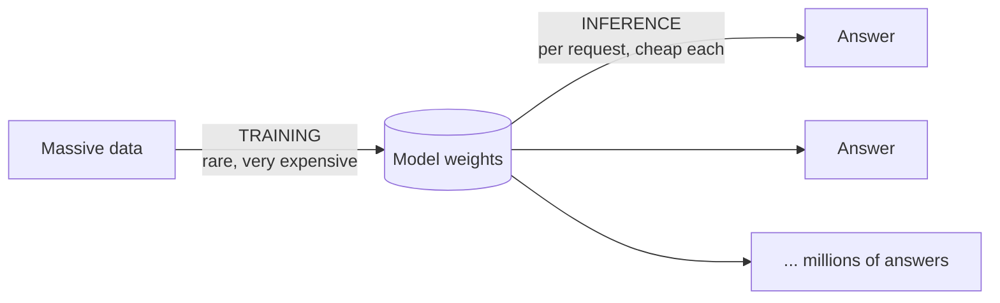

## Overview

There are two completely different activities people lump together as "doing AI":
**training** (teaching a model, by adjusting its weights from data) and **inference** (running
the finished model to get answers). They have wildly different costs, hardware needs, and risk
profiles — and confusing them leads to bad decisions and budgets.

## Why this matters

When someone says "AI is expensive," you need to ask *which part*. Training a frontier model
costs tens or hundreds of millions of dollars and happens rarely. Inference costs a fraction
of a cent per request but happens constantly — and at scale, inference is usually where *your*
money goes. Knowing the difference is fundamental to cost and architecture decisions.

## Core concepts

- **Training** — the one-off (or periodic) process of building the model by adjusting its
  weights over enormous data. Hugely compute-intensive; needs large GPU clusters; done by the
  model maker. **Fine-tuning** is a smaller, cheaper form of training on top of an existing
  model.
- **Inference** — using the trained model to produce an output for a given input. Comparatively
  cheap *per call*, but you do it over and over, so total cost scales with usage.
- **The asymmetry:** training is a big upfront capital-like cost; inference is an ongoing
  operating cost. For most businesses *using* AI, inference dominates the bill.

## Visual explanation



## How it works

During training, the model sees data, makes predictions, measures error, and adjusts weights —
billions of times. This requires keeping the whole model and lots of intermediate data in GPU
memory, which is why it needs huge, costly clusters.

During inference, the weights are frozen. You feed in a prompt, the model does a single
forward pass of tensor math, and out comes a response. Much lighter — but every user, every
message, every retry is another inference. Multiply by your traffic and it adds up.

## Decision framework

```decision
title: Train, fine-tune, or just use inference?
Need general capability (chat, drafting, analysis)? → **Just do inference** on an existing model. Don't train anything.
Need fresh or private *facts*? → Inference + **RAG**, not training.
Need a specific *behaviour/style/format* an existing model won't adopt via prompting? → A small **fine-tune** (cheap training).
Genuinely need a new foundation model? → Almost never for a normal business — training from scratch is a frontier-lab undertaking.
```

## Common mistakes

- **Assuming you must "train your own AI."** The vast majority of value comes from inference on
  existing models, often plus RAG. Training from scratch is rarely justified.
- **Budgeting for the model maker's costs, not yours.** Headlines about $100M training runs are
  irrelevant to your bill — *your* cost is inference at your volume.
- **Confusing fine-tuning with training from scratch.** Fine-tuning is comparatively small and
  often unnecessary (try prompting + RAG first).
- **Ignoring inference scaling.** A cheap-per-call model can still be a big bill at millions of
  calls — estimate volume early.

## Real business examples

- A startup "wants to train an AI for customer support." What they actually need: inference on
  a frontier model + RAG over their help docs. Cost and time drop by orders of magnitude.
- A company with a very specific tone fine-tunes a small model (modest training cost) after
  finding prompting alone wasn't consistent — then serves it via inference.

## Governance considerations

```governance
The two worlds carry different governance concerns. **Training/fine-tuning** raises questions about the *data you train on* — its licensing, privacy, consent, and the risk of memorising sensitive records into the weights (and poisoning). **Inference** raises questions about *the data you send at runtime* — where it goes, logging, and residency. Map your controls to whichever you're doing; for most users it's inference, so focus there first.
```

## How an architect thinks

```architect
The architect's instinct on hearing "let's train a model" is to ask "do we actually need to change the weights, or do we need to change what the model *knows* (RAG) or *how we ask* (prompting)?" Nine times out of ten the answer avoids training entirely. They reserve training for genuine behaviour gaps, and they budget around *inference at expected volume*, because that's the real recurring cost.
```

## Key takeaways

- **Training** builds the model (rare, very expensive, the maker's job); **inference** runs it
  (cheap per call, constant, usually *your* main cost).
- Most business value comes from **inference on existing models**, often **+ RAG** — not from
  training your own.
- **Fine-tuning** is small-scale training; try prompting + RAG first.
- Budget around **inference at your volume**, not headline training figures.

## Self-check

1. What's the difference between training and inference in one sentence each?
2. For a typical company using AI, which one usually dominates the cost, and why?
3. A stakeholder insists on "training our own AI" for support. What would you likely propose
   instead?
