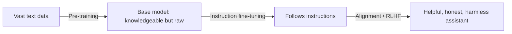

## Overview

A finished AI assistant isn't built in one step. It's shaped in stages: **pre-training**
(absorbing language and knowledge from vast data), **fine-tuning** (learning to follow
instructions and do specific tasks), and **alignment** (being made helpful, honest, and
harmless). Knowing these stages explains why models behave as they do — and where your own
fine-tuning fits.

## Why this matters

People often ask "can we fine-tune it to know our data / behave our way?" To answer well, you
need to understand what each stage does and doesn't change. It also explains why two models
built on similar foundations can feel very different (different fine-tuning and alignment), and
why models refuse some requests (alignment).

## Core concepts

- **Pre-training.** The model reads enormous amounts of text and learns to predict the next
  token. This is where it absorbs grammar, facts, and reasoning patterns. Hugely expensive;
  produces a "base model" that's knowledgeable but raw — not yet a helpful chat assistant.
- **Fine-tuning (instruction tuning).** The base model is further trained on examples of
  instructions and good responses, teaching it to be *useful* — to follow directions, answer
  questions, format output. This is what turns a text-predictor into an assistant.
- **Alignment (e.g. RLHF).** The model is tuned using human (or AI) preferences to be helpful,
  honest, and harmless — to refuse dangerous requests, avoid toxic output, and behave well.
  "RLHF" (reinforcement learning from human feedback) is the best-known method.

## Visual explanation



## How it works

Pre-training is like a voracious reader who has absorbed the internet but doesn't yet know how
to be *useful* in conversation. Instruction fine-tuning teaches it the job of an assistant.
Alignment then shapes its judgment and manners — what to do, what to refuse, how to be safe.

Your own **fine-tuning** is a small version of stage two: you take an already-aligned model and
nudge its behaviour with your examples (tone, format, a narrow skill). Crucially, fine-tuning
mainly changes *behaviour*, not knowledge — for facts, you use RAG (see the RAG lesson).

## Decision framework

```decision
title: Do I need to fine-tune, or is there a better lever?
Want it to *know* current/private facts? → **RAG**, not fine-tuning. Fine-tuning is poor at reliably injecting facts.
Want a consistent *tone, format, or narrow skill* that prompting can't reliably get? → **Fine-tune** (often a light LoRA).
Just want better results now? → Improve the **prompt** and add **examples** first — it's free and instant.
Need both fresh facts and custom behaviour? → **RAG for facts + a light fine-tune for behaviour.**
```

## Common mistakes

- **Fine-tuning to teach facts.** It's unreliable and hard to update — use retrieval.
- **Skipping prompting.** Many "we need to fine-tune" problems vanish with a better prompt and
  a few examples.
- **Fine-tuning away alignment.** Aggressive fine-tuning can erode safety behaviour — handle
  with care, especially in sensitive domains.
- **Underestimating maintenance.** A fine-tuned model is a thing you now own and must
  re-tune as needs change; RAG and prompts are easier to update.

## Real business examples

- A firm wants answers in its exact house style and structured format → a small fine-tune
  delivers consistency prompting couldn't.
- A team wants the assistant to "know our product catalogue" → RAG over the catalogue, *not*
  fine-tuning, because the catalogue changes weekly.

## Governance considerations

```governance
Fine-tuning means training on *your* data, which raises the governance bar: ensure you have rights to use that data, strip or protect personal/confidential information (it can be memorised into the weights), and track the data lineage for audits. Also note that fine-tuning can weaken a model's safety alignment — in regulated settings, re-test safety behaviour after tuning. Alignment is *why* models refuse harmful requests; don't casually undo it.
```

## How an architect thinks

```architect
The architect orders the levers by cost and reversibility: **prompting** (free, instant, reversible) → **RAG** (moderate, great for facts, easy to update) → **fine-tuning** (more effort, for behaviour, harder to maintain) → **training from scratch** (essentially never). They climb that ladder only as far as the problem demands, and they know fine-tuning changes *how* a model acts, not *what* it reliably knows.
```

## Key takeaways

- Models are shaped in stages: **pre-training** (knowledge) → **fine-tuning** (follows
  instructions) → **alignment** (helpful, honest, harmless).
- Your **fine-tuning** changes **behaviour**, not reliable knowledge — use **RAG** for facts.
- Climb the lever ladder: **prompt → RAG → fine-tune → (almost never) train**.
- Fine-tuning on your data raises **data-rights, privacy, and safety-retest** obligations.

## Self-check

1. What does each stage — pre-training, fine-tuning, alignment — contribute?
2. Why is fine-tuning a poor way to give a model fresh facts?
3. What governance checks should precede fine-tuning on company data?
