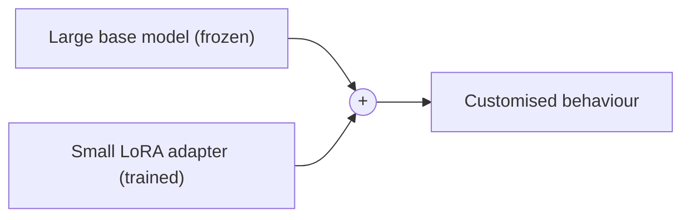

## Overview

Fully fine-tuning a large model means adjusting *all* its billions of weights — expensive and
hardware-hungry. **LoRA** (Low-Rank Adaptation) is a clever shortcut: freeze the big model and
train only a small set of extra parameters that "steer" it. **QLoRA** goes further by also
compressing the model in memory, so you can fine-tune large models on a single modest GPU.

## Why this matters

LoRA/QLoRA are why fine-tuning went from "needs a data-centre" to "doable on rented hardware
for a few dollars." For a decision-maker, this changes the economics: customising a model's
behaviour is now cheap enough to consider — though still rarely the *first* thing you should
reach for (prompting and RAG come first).

## Core concepts

- **LoRA.** Instead of editing the model's huge weight tensors, you add small "adapter"
  matrices and train only those. You get most of the benefit of fine-tuning for a tiny
  fraction of the compute — and the adapter is a small file you can swap in and out.
- **QLoRA.** LoRA applied to a *quantized* (compressed) version of the model, slashing the
  memory needed. This is what makes fine-tuning big open models affordable on one GPU.
- **Adapters are portable & stackable.** Because a LoRA adapter is small and separate, you can
  keep many (one per task or client) and load the right one — without duplicating the whole
  model.

## Visual explanation



## How it works

The insight behind LoRA is that the *change* needed to specialise a model is much "smaller"
than the model itself, so it can be captured by a compact add-on. You train that add-on on
your examples while leaving the giant base untouched. Result: faster training, far less GPU
memory, and a tiny artifact (megabytes, not gigabytes) that encodes your customisation.

You won't run these commands yourself — tools like Unsloth and Axolotl (see the Ecosystems
track) handle it, and you direct them. What you need is the judgment about *when* it's worth
doing.

## Decision framework

```decision
title: Is LoRA/QLoRA the right move?
Have you tried prompting and RAG first? → Do that before any fine-tuning. Most needs are met there.
Need consistent behaviour/style/format that prompting can't reliably achieve? → LoRA is the cheap way to fine-tune.
Self-hosting an open model and want it specialised? → QLoRA lets you do it affordably.
Need to inject changing facts? → Still RAG, not LoRA — fine-tuning doesn't reliably store facts.
Multiple clients/tasks needing different behaviour? → LoRA adapters (one per case) are ideal.
```

## Common mistakes

- **Jumping to LoRA before exhausting prompting + RAG.** Cheaper fine-tuning doesn't mean
  fine-tuning is the right first tool.
- **Expecting LoRA to teach facts.** It adapts behaviour, not reliable knowledge.
- **Forgetting data governance.** It's still training on your data — rights, privacy, and
  safety-retest still apply.
- **Adapter sprawl.** Many adapters can become a versioning/maintenance burden if untracked.

## Real business examples

- An agency maintains a separate LoRA adapter per client to match each brand's voice, all on
  one shared base model — cheap and tidy.
- A company fine-tunes an open model with QLoRA to reliably output a strict JSON format its
  systems consume, after prompting alone proved inconsistent.

## Governance considerations

```governance
LoRA lowers the *cost* of fine-tuning but not the *responsibilities*. You're still training on data you must have rights to, that may contain personal or confidential information, and the result can drift from the base model's safety alignment. Track which adapter is trained on which data (lineage), and re-test behaviour — especially in regulated domains. Cheap to make is not the same as safe to ship.
```

## How an architect thinks

```architect
The architect sees LoRA as a cost shift, not a strategy shift. It makes "customise behaviour" affordable, which is useful — but it doesn't change the order of operations: prompt, then retrieve, then (if a real behaviour gap remains) fine-tune, ideally with LoRA. They also love that adapters are small and swappable, which fits multi-client and multi-task architectures neatly.
```

## Key takeaways

- **LoRA** fine-tunes by training a small **adapter** on top of a frozen base — cheap, fast,
  and a tiny portable file.
- **QLoRA** adds compression so you can fine-tune large models on **one modest GPU**.
- It adapts **behaviour**, not facts (use RAG for facts), and is **not** your first lever
  (prompt and RAG first).
- Cheaper fine-tuning still carries **data-rights, privacy, lineage, and safety** duties.

## Self-check

1. What does LoRA train instead of the full model, and why is that cheaper?
2. What does QLoRA add on top of LoRA?
3. Where does LoRA sit in the prompt → RAG → fine-tune ladder, and why?
