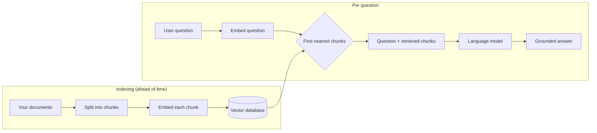

## Overview

A language model only knows what it absorbed during training. It doesn't know your
company's policies, last week's news, or the contents of your private files — and it will
happily *guess* when asked about them.

**Retrieval-Augmented Generation (RAG)** fixes this without retraining the model. At the
moment a question is asked, the system *retrieves* the most relevant pieces of your own
information and hands them to the model as part of the prompt. The model then answers using
that supplied material instead of its memory.

If you remember one sentence: **RAG is open-book exam mode for an AI.**

## Why this matters

For almost every business application of AI, the value isn't in what the model knows about
the world — it's in what it can do with *your* knowledge. RAG is the single most common way
to connect a general model to specific, current, private information. It underpins support
assistants, internal "ask our docs" tools, research copilots, and most "chat with your data"
products you've seen.

It also matters because the alternative people reach for first — *fine-tuning* the model on
their data — is usually the wrong tool for *facts*. Knowing when to retrieve versus when to
fine-tune is one of the defining decisions of an AI architect.

## Core concepts

RAG has two phases.

**1. Indexing (done ahead of time).** You take your documents, split them into bite-sized
**chunks**, convert each chunk into an **embedding** (a list of numbers that captures its
meaning), and store those in a **vector database**.

**2. Retrieval + generation (done per question).** When a user asks something, you embed
their question the same way, find the chunks whose embeddings are *closest* in meaning,
and paste those chunks into the prompt alongside the question. The model answers, grounded
in what you gave it.

The magic ingredient is the embedding: because similar meanings produce nearby vectors, you
can find relevant text even when the user's words don't match the document's words.

## Visual explanation



## How it works

At the right altitude — what each stage does and why it exists:

- **Chunking.** Whole documents are too big and too unfocused to retrieve well. You split
  them into passages (often a few hundred words, frequently overlapping). Chunk size is a
  real quality lever: too big and you retrieve noise; too small and you lose context.
- **Embedding.** An embedding model turns each chunk into a vector. The choice of embedding
  model affects retrieval quality more than most people expect.
- **Storing.** A vector database keeps these vectors and can find the nearest ones to a query
  in milliseconds, even across millions of chunks.
- **Retrieval.** The user's question is embedded and matched against the store. The top *k*
  chunks come back (often 3–10).
- **Re-ranking (optional, high value).** A second model reorders the candidates by true
  relevance before they reach the LLM — one of the cheapest ways to lift answer quality.
- **Generation.** The chunks plus the question go into the prompt. A good system also asks
  the model to **cite** which chunk each claim came from, so answers are checkable.

You do not need to implement any of this by hand. Your job is to understand the pieces well
enough to make the decisions and direct a tool to build it — see *How to ask Claude / Cursor*
below.

## Decision framework

```decision
title: Should I use RAG or fine-tuning?
Do you need the model to use **fresh, private, or frequently-changing facts**? → **RAG**. It's the right tool for knowledge.
Do you need to change **how** the model behaves — its tone, format, or a narrow skill? → **Fine-tuning** (often a light LoRA).
Need both (e.g. on-brand answers *about* your live data)? → **RAG for the facts + a light fine-tune for the behaviour.**
Not sure? → **Start with RAG.** It's cheaper, faster to change, and easier to audit, because you can see exactly which sources produced an answer.
```

A useful rule of thumb: **RAG changes what the model knows; fine-tuning changes how it
acts.** Facts that change weekly belong in retrieval, not baked into weights you'd have to
retrain.

## Common mistakes

- **Reaching for fine-tuning to "teach it our data."** Slow, expensive, hard to update, and
  it still hallucinates. Retrieval is almost always the better first move for facts.
- **Ignoring chunking and embedding choices**, then blaming "the AI" when answers are vague.
  Most bad RAG is bad *retrieval*, not a bad model.
- **No citations.** If the system can't show its sources, nobody can trust or verify it —
  and you've lost RAG's biggest governance advantage.
- **Indexing everything indiscriminately**, including data the asker shouldn't see. Retrieval
  inherits all the access-control problems of the underlying documents (see Governance).
- **Stuffing too many chunks into the prompt.** More context isn't always better; it raises
  cost, latency, and the chance the model latches onto the wrong passage.

## Real business examples

- **Support assistant (founder/operator).** A SaaS company points RAG at its help centre and
  past tickets. The bot answers customer questions with links to the exact article — deflecting
  routine tickets while staying accurate because every answer is grounded.
- **"Ask our policies" (operations/HR manager).** Staff ask plain-language questions and get
  answers drawn only from the current, approved internal policies — with the source section
  cited, so it's defensible.
- **Research copilot (consultant/analyst).** An advisory firm indexes its reports and lets
  consultants query across years of work, with citations, instead of hunting through folders.
- **Regulated domain (lawyer/clinician).** A firm grounds answers strictly in its own vetted
  document set so the model can't wander into invented "facts" — pairing RAG with mandatory
  citation and human review.

## Governance considerations

```governance
RAG moves your private data into prompts — and prompts flow to the model provider and into logs. Decide deliberately:
- **Access control.** Retrieval must respect who is allowed to see each document. If a user can't open a file, the bot must not retrieve from it. RAG does not grant permissions for free.
- **Data residency & vendor exposure.** Retrieved chunks may leave your jurisdiction when sent to a cloud model. Where data must stay local, that constrains your model and hosting choices.
- **Confidentiality & IP.** Indexing a document makes its contents reachable by anyone who can query the system. Be intentional about what goes in the index.
- **Auditability.** Because RAG cites sources, you *can* log exactly what informed each answer — a genuine compliance advantage. Use it.
- **Poisoning.** If attackers can edit your source documents, they can steer answers. Treat the knowledge base as a trust boundary.
```

## How an architect thinks

```architect
The beginner asks "which vector database should I use?" The architect asks a different set of questions first:

- **Retrieval quality** — are we returning the *right* chunks? (This dominates everything; the model can't answer from material it never received.)
- **Data sensitivity** — what's allowed in the index, and who can query it?
- **Freshness** — how often does the source change, and how does the index stay current?
- **Cost & latency** — how many chunks, how big, how often re-ranked?
- **Evaluation** — how will we measure whether answers are correct and grounded?

Get those right and the specific database is almost an implementation detail. Get them wrong and no database will save you.
```

## Tools in this category

```toolcard
name: Vector database
category: Storage & retrieval for embeddings
use: Store chunk embeddings and find the nearest matches to a query, fast, at scale
alternatives: Pinecone, Qdrant, Weaviate, Milvus, pgvector (Postgres extension)
when: You have more than a trivial amount of content, or need fast semantic search
whennot: A handful of documents — you can often just put them straight in the prompt
```

```toolcard
name: Embedding model
category: Turns text into meaning-vectors
use: Convert chunks and queries into embeddings so similar meanings sit close together
alternatives: OpenAI text-embedding-3, Cohere Embed, Voyage AI, open-source (e.g. BGE, E5)
when: Always, for RAG — this choice strongly affects retrieval quality
whennot: n/a (it's a core RAG component)
```

> Don't over-engineer the start. If you have only a few short documents, "RAG" can be as
> simple as pasting them into the context window — no database required. Reach for the full
> pipeline when scale, freshness, or access control demand it.

## How to ask Claude / Cursor

You don't build this by hand. You specify it clearly and let a coding agent implement it —
then you validate. A strong opening prompt:

```prompt
Act as my AI architect and engineer. I want a RAG system over our internal documents.

Context:
- Documents: ~2,000 PDFs and Word files of company policies and past projects.
- Users: internal staff only; answers must cite the source document and section.
- Constraint: sensitive data — propose options that keep data in our region, and flag any that don't.

Please:
1. Recommend an architecture (chunking strategy, embedding model, vector store, optional re-ranker) and explain the trade-offs in plain language.
2. Call out the governance decisions I need to make (access control, data residency, logging) before we build.
3. Give me a minimal first version I can test on 20 documents, then how to scale it.
4. Tell me how we'll measure whether retrieval is actually returning the right chunks.

Ask me any clarifying questions before writing code.
```

Notice what that prompt does: it states the data, users, and constraints; demands trade-offs
and governance, not just code; asks for a small testable slice first; and insists on
evaluation. That is the difference between *directing* a build and *hoping* for one.

## Key takeaways

- RAG = **open-book mode**: retrieve relevant material and let the model answer from it.
- It's the default way to give a model **fresh, private, or proprietary knowledge** — usually
  better than fine-tuning for *facts*.
- **Retrieval quality is the whole game.** Chunking, the embedding model, and re-ranking
  matter more than which database you pick.
- Its citations are a **governance gift** — but it inherits your data's **access-control and
  residency** obligations. Decide what may be indexed, and who may query it.
- You **direct** the build with a clear spec; you don't hand-code it.

## Self-check

1. In one sentence, what problem does RAG solve that a plain model has?
2. A colleague says "let's fine-tune the model on our handbook so it knows our policies." What
   would you suggest instead, and why?
3. Why is retrieval quality more important than the choice of vector database?
4. Name two governance questions you must answer before indexing internal documents.
5. Your RAG bot gives a confident but wrong answer. What feature should the system have had to
   make this catchable?
