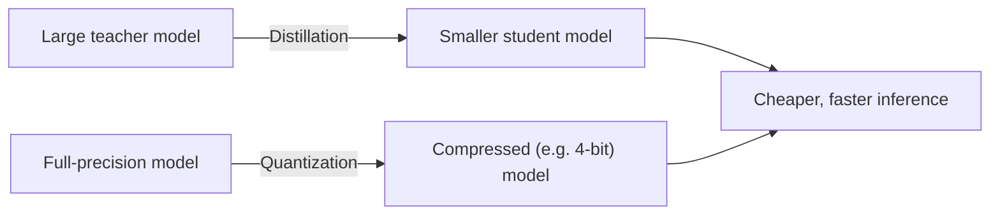

## Overview

Big models are capable but expensive and slow. **Distillation** and **quantization** are the
two main ways to shrink them so they run cheaper and faster — on smaller GPUs, or even on a
laptop or phone. They achieve this differently, and both involve a quality trade-off you should
understand before relying on a "small" model.

## Why this matters

Most cost and latency problems in AI come down to "the model is bigger than the job needs."
Distillation and quantization are how teams get acceptable quality at a fraction of the cost —
and they're why capable models can now run locally, which matters hugely for privacy and
residency. Knowing the trade-offs keeps you from either overpaying for a giant model or
shipping a degraded one.

## Core concepts

- **Distillation.** Train a smaller "student" model to imitate a larger "teacher" model. The
  student learns to reproduce the teacher's outputs, ending up much smaller while keeping a lot
  of the capability. Many small, fast models you see are distilled from bigger ones.
- **Quantization.** Store the model's numbers at lower precision (e.g. 4-bit instead of 16-bit).
  This shrinks memory and speeds up inference, with usually a modest quality cost. It's a
  *compression* of an existing model, not a retraining.
- **They stack.** You can distill *and* quantize. QLoRA (previous lessons) uses quantization to
  make fine-tuning cheap.

## Visual explanation



## How it works

Distillation transfers behaviour: the student watches the teacher and learns to mimic it, so
you get a compact model that punches above its size. Quantization transfers nothing — it just
represents the same weights with fewer bits, like saving a photo at lower resolution. Both make
the model lighter; both can lose some nuance, especially on hard or edge-case inputs.

The practical upshot: smaller/quantized models are excellent for high-volume, well-scoped
tasks, and increasingly good enough to run **locally** — which is a governance superpower
(your data never leaves your machine).

## Decision framework

```decision
title: Should I use a smaller / quantized model?
High volume of simple, well-defined tasks? → Yes — a smaller or quantized model can cut cost and latency dramatically.
Need to run on-device or on-prem for privacy/residency? → Quantized open models make local inference feasible.
Hardest reasoning or highest-stakes outputs? → Keep a larger/full-precision model; don't trade quality where it matters.
Unsure of the quality hit? → Test the smaller model on *your* real tasks before committing — quality loss is task-dependent.
```

## Common mistakes

- **Assuming "smaller = strictly worse."** For many real tasks the quality drop is negligible
  and the savings are large.
- **Assuming "smaller = fine everywhere."** On hard reasoning or rare cases, quality can drop
  noticeably — test on your actual workload.
- **Skipping evaluation after shrinking.** Always measure the smaller model on representative
  tasks, not vibes.
- **Confusing the two.** Distillation makes a new smaller model; quantization compresses an
  existing one.

## Real business examples

- A company runs a quantized open model on its own servers for document processing so sensitive
  data never leaves its network — cheaper *and* compliant.
- A product uses a distilled small model for instant autocomplete-style features where latency
  matters more than peak intelligence, reserving a frontier model for complex requests.

## Governance considerations

```governance
Shrinking models is often what *enables* good governance: quantized models small enough to run **locally or on-prem** keep data in your control, supporting residency and confidentiality requirements (a recurring theme in the Architecture and Governance tracks). The flip side: a degraded model may fail more often on edge cases, so in high-stakes uses, validate that the quality trade-off is acceptable and keep human oversight where errors are costly.
```

## How an architect thinks

```architect
The architect routes by difficulty: cheap small/quantized models for the bulk of easy, high-volume work; big models reserved for the genuinely hard or high-stakes minority (see model routing in the Architecture track). They treat "which size model" as a per-task cost/quality decision backed by evaluation — not a single global choice.
```

## Key takeaways

- **Distillation** trains a smaller student to imitate a big teacher; **quantization** compresses
  a model to lower precision. Both make inference **cheaper and faster**.
- Quality loss is **task-dependent** — often negligible, sometimes real on hard cases. **Test on
  your own tasks.**
- Smaller/quantized models **enable local/on-prem inference**, a major privacy and residency win.
- Route easy work to small models, hard/high-stakes work to large ones.

## Self-check

1. What's the difference between distillation and quantization?
2. Why can a smaller model be the *better* choice for a high-volume task?
3. How do these techniques help with data residency and privacy?
