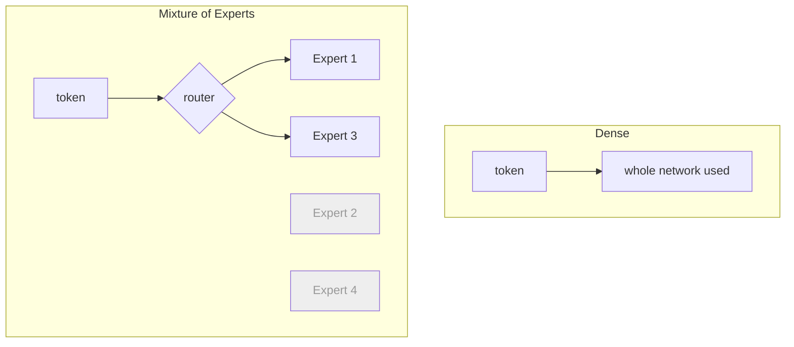

## Overview

When models got huge, builders found two strategies. A **dense** model uses *all* of its
parameters for every token. A **Mixture-of-Experts (MoE)** model contains many specialist
sub-networks ("experts") and a router that activates only a few per token — so it has enormous
total capacity but only uses a slice of it each time. This is a behind-the-scenes design
choice, but it has real cost and capability consequences.

## Why this matters

MoE is why some models advertise huge parameter counts yet remain relatively fast and cheap to
run: they're big in *total* but small in *active* compute per token. Understanding the
distinction helps you read model specs honestly and explains some performance and cost
patterns you'll encounter.

## Core concepts

- **Dense model.** Every parameter participates in every computation. Simpler, predictable;
  cost scales straightforwardly with size.
- **MoE model.** Made of many experts plus a **router** that picks a few experts per token.
  Total parameters can be massive, but **active parameters** (used per token) are far fewer —
  giving big-model capability at smaller-model running cost.
- **Two numbers to watch.** MoE models quote *total* parameters (capacity) and *active*
  parameters (cost-per-token). The active number better predicts speed and price.

## Visual explanation



## How it works

Think of a dense model as one big generalist that always does all the work, and an MoE model
as a panel of specialists with a receptionist (the router) who sends each question to the two
or three most relevant specialists. You get the knowledge of the whole panel but only pay for
the few who actually answer.

The trade-offs: MoE can deliver more capability per unit of running cost, but it's more complex
to train and to serve (you must hold *all* experts in memory even though you use few per token),
which affects self-hosting.

## Decision framework

```decision
title: Does dense vs MoE matter for my decision?
Using a hosted model via API? → It barely matters — judge by quality, speed, and price, not the internal design.
Self-hosting? → It matters: MoE needs enough memory for *all* experts, even though compute-per-token is lower. Check both total and active sizes against your hardware.
Comparing model specs? → Don't be wowed by a huge *total* parameter count on an MoE; look at *active* parameters for the real cost/speed picture.
```

## Common mistakes

- **Comparing a dense model's parameter count to an MoE's *total* count** as if they're
  equivalent — they're not; compare active parameters for cost/speed.
- **Assuming MoE is always better.** It's a trade-off (capability-per-cost vs. complexity and
  memory footprint), not a free win.
- **Overthinking it as an API user.** If you're calling an endpoint, just evaluate outputs and
  price.

## Real business examples

- A team evaluating two models sees "400B parameters" (MoE) vs "70B" (dense) and almost picks
  the bigger number — until they note the MoE's *active* size is ~40B, making it cheaper to run
  than the headline suggests; they decide on measured quality and price instead.
- A company self-hosting must budget GPU memory for an MoE's full expert set, changing the
  hardware math versus a same-"size" dense model.

## Governance considerations

```governance
Dense vs MoE is mostly an engineering trade-off, but it touches cost governance and self-hosting decisions. MoE's lower compute-per-token can reduce inference spend at scale, while its larger memory footprint raises the bar for on-prem hosting (relevant when residency requires keeping models local). As always, governance cares less about the internal design and more about where the model runs and what it costs to run reliably.
```

## How an architect thinks

```architect
The architect reads model cards for the *two* numbers that matter — total vs active parameters — and translates them into "how good" and "how cheap/fast to run." They don't romanticise MoE or dense; they ask which model, at which price and latency, clears the quality bar for the task. The internal architecture is an input to that, not the decision itself.
```

## Key takeaways

- **Dense** = whole model used every token; **MoE** = a router activates a few **experts** per
  token.
- MoE gives **big-model capability at lower compute-per-token**, but needs memory for **all**
  experts.
- Compare MoE models by **active** (not total) parameters for real cost/speed.
- For API users it rarely matters; for **self-hosting and cost**, it does.

## Self-check

1. What's the difference between total and active parameters in an MoE model?
2. Why can an MoE model be cheaper to run than its headline size suggests?
3. Why does MoE complicate self-hosting even when compute-per-token is low?
