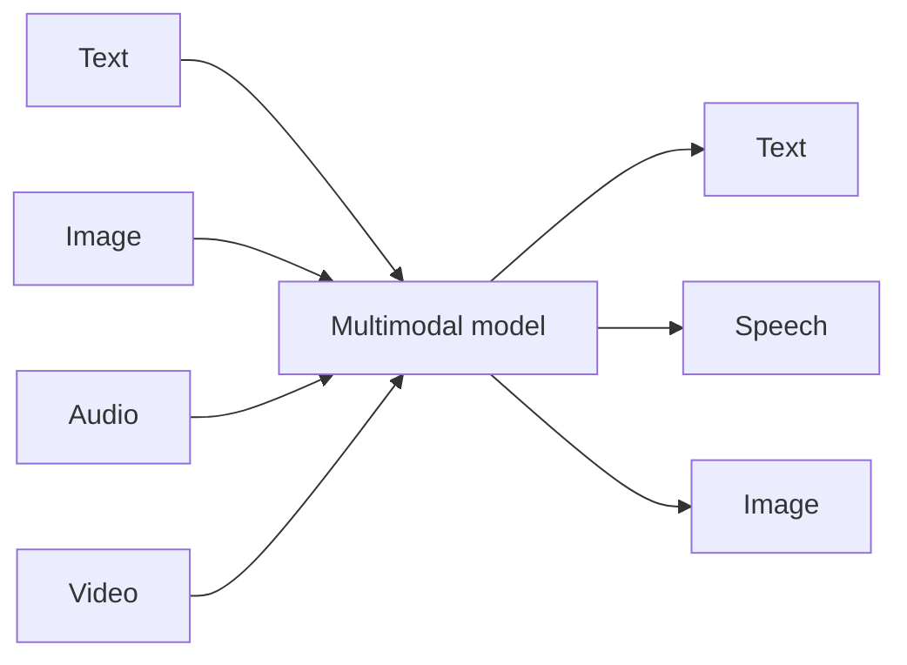

## Overview

A **multimodal** model handles more than one type of data — text *and* images, audio, or
video. Modern frontier models can look at a photo, listen to speech, watch a clip, and respond
in text or voice. This unlocks a huge range of applications beyond the text box, from
"describe this diagram" to real-time voice assistants.

## Why this matters

Much of the world's information isn't text — it's documents with layout, photos, screenshots,
phone calls, and video. Multimodal models let AI work with all of it. For businesses, this is
where many high-value, "wow" applications live: AI receptionists, visual inspection, document
understanding, accessibility tools. Knowing what's possible (and its limits) helps you spot
real opportunities.

## Core concepts

- **Modalities** are types of data: text, image, audio, video. "Multimodal" = more than one.
- **Input vs output modalities differ.** A model might *accept* images and text but only
  *produce* text (vision-language). Others produce audio (text-to-speech) or accept audio
  (speech-to-text). Check both directions.
- **Common combinations:**
  - **Vision-language** — see an image, answer in text ("what's in this chart?").
  - **Speech-to-text** (transcription) and **text-to-speech** (voice generation).
  - **Speech-to-speech** — hear you and reply in voice, enabling natural real-time
    conversation (the basis of voice agents).
  - **Image/video generation** — create images or clips from a prompt.
- **Shared meaning space.** Many multimodal systems map different modalities into a common
  embedding space, so "a photo of a dog" and the words "a dog" land near each other — enabling
  things like searching images by text.

## Visual explanation



## How it works

Conceptually, a multimodal model learns to translate each modality into a common internal
representation it can reason over together — so it can relate the words of your question to the
pixels of your image. For voice, a speech-to-speech system perceives audio, understands intent,
and generates a spoken reply, ideally fast enough to feel like a real conversation (latency is
the make-or-break factor for voice).

You don't build these from scratch — you call multimodal APIs or assemble specialist tools
(transcription, voice, vision) which we cover in the Ecosystems track.

## Decision framework

```decision
title: Which multimodal capability do I actually need?
Understand documents/screenshots/photos? → A **vision-language** model that accepts images.
Turn calls or recordings into text? → **Speech-to-text** (transcription).
Give your product a natural voice? → **Text-to-speech**, or **speech-to-speech** for live conversation.
Real-time voice agent (e.g. receptionist)? → **Speech-to-speech** — and obsess over **latency**, the deciding factor.
Generate images or video? → Dedicated **image/video generation** models, separate from your text LLM.
```

## Common mistakes

- **Assuming one model does it all well.** Frontier models are broadly multimodal, but
  specialist tools (e.g. dedicated transcription or voice) often beat them on a specific
  modality.
- **Ignoring latency for voice.** A smart voice agent that responds slowly feels broken — speed
  matters as much as intelligence.
- **Forgetting that more modalities = more attack surface and more sensitive data** (voices,
  faces, documents).
- **Overlooking accessibility upside.** Multimodal AI is a powerful accessibility tool —
  describing images, transcribing audio — easy to miss.

## Real business examples

- **AI receptionist:** a speech-to-speech agent answers calls, books appointments, and routes
  urgent issues — turning missed calls into handled ones (explored in the Operations track).
- **Document understanding:** a vision-language model reads invoices or forms *with layout*,
  extracting fields more robustly than text-only OCR.
- **Visual QA:** a model inspects product photos for defects.
- **Accessibility:** auto-describing images and captioning audio for users who need it.

## Governance considerations

```governance
Multimodal data is often *more* sensitive and more regulated than text. Voices and faces can be **biometric data** with specific legal protections; recordings of calls trigger consent and retention rules; uploaded documents may contain confidential or personal information. Each modality you add expands what you must protect and where it can leak. Decide consent, storage, residency, and retention for *each* modality — and remember images and audio can carry hidden prompt-injection content too.
```

## How an architect thinks

```architect
The architect picks modalities by the job and assembles best-of-breed pieces rather than assuming one model is best at everything. For a voice agent they think in a pipeline (hear → understand → act → speak) and optimise the weakest link — usually latency. And they treat every added modality as added sensitivity, budgeting governance accordingly.
```

## Key takeaways

- **Multimodal** models handle more than one data type (text, image, audio, video); check both
  **input and output** modalities.
- Key combos: **vision-language, speech-to-text, text-to-speech, speech-to-speech, image/video
  generation.**
- For **voice agents, latency is decisive**; for many modalities, **specialist tools beat
  generalists.**
- Each modality adds **sensitive-data and consent** obligations (voices/faces can be biometric).

## Self-check

1. Why must you check input *and* output modalities of a model?
2. For a real-time voice receptionist, what's the make-or-break factor and why?
3. Why is multimodal data often a bigger governance concern than text?
