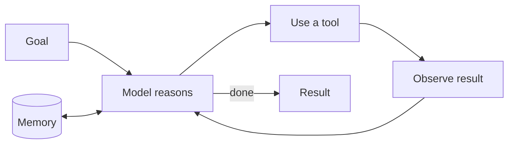

## Overview

A plain LLM only talks. An **agent** *acts*: it can use **tools** (search the web, query a
database, send an email, run code), observe the results, and decide its next step — looping
until it reaches a goal. Add **memory** so it can persist information across steps and sessions,
and you have a system that does work, not just chat. This is the current frontier — and the
highest-risk part of the field.

## Why this matters

Agents are where AI moves from "drafts text for me" to "completes tasks for me." That's
enormously valuable and enormously riskier — because a system that can *act* can also act
wrongly, expensively, or be hijacked. Understanding the anatomy of an agent lets you spot when
you genuinely need one (versus a simpler workflow) and how to keep it safe.

## Core concepts

- **The agent loop.** Think → act (use a tool) → observe the result → think again → … until
  done. The LLM is the "brain"; tools are its hands.
- **Tools.** Functions the model can call: search, calculators, APIs, databases, code
  execution, sending messages. Tools are what let it affect the world.
- **Memory.** The context window is short-term and temporary. *Memory* is an added layer that
  stores facts, past interactions, or progress — short-term (within a task) and long-term
  (across sessions), often using retrieval (RAG-style) to recall relevant bits.
- **Autonomy is a dial, not a switch.** From "suggest an action for a human to approve" to
  "act fully on its own" — you choose how much leash, based on stakes.

## Visual explanation



## How it works

Given a goal, the agent decides which tool to use, calls it, reads the output, and decides what
to do next — repeating the loop. Memory lets it carry information forward (what it's tried, what
it learned, your preferences). The power comes from chaining many steps; the danger comes from
the same place — more steps and more tools mean more ways to go wrong or be manipulated.

A key judgment: **most "agent" needs are actually simple workflows.** A fixed sequence of steps
(do A, then B, then C) is more reliable and cheaper than a free-roaming agent. Reserve true
agency for genuinely open-ended tasks.

## Decision framework

```decision
title: Do I need an agent, or just a workflow?
Fixed, known sequence of steps? → A **workflow** (deterministic, cheaper, safer). Don't use an agent.
Task needs open-ended reasoning and adapting steps to what it finds? → An **agent** may be justified.
Actions are high-stakes or irreversible? → Keep autonomy **low**: agent proposes, human approves.
Just need an answer from your data? → That's **RAG**, not an agent.
Tempted by a multi-agent swarm? → Start with the simplest thing that works; add agents only when a single one demonstrably can't cope.
```

## Common mistakes

- **Building an agent where a workflow would do.** Agents are harder to control, debug, and
  predict; use the simplest sufficient design.
- **Giving agents broad standing permissions.** This is the core security risk — least
  privilege is essential (see Governance).
- **No human gate on consequential actions.** Money, deletions, external messages should not be
  fully autonomous.
- **Confusing memory with the context window.** Real persistence requires a deliberate memory
  layer.
- **Over-trusting autonomy after a good demo.** Agents fail in the long tail; pilot carefully.

## Real business examples

- **Research agent:** given a question, it searches, reads, and compiles a sourced brief —
  deciding its own steps. Genuine agency, moderate stakes.
- **Workflow (not an agent):** "when an invoice arrives, extract fields, post to the ledger,
  flag exceptions." Fixed steps → a workflow with an AI step, more reliable than an agent.
- **Coding agent:** Claude Code or Cursor planning and editing across files — a high-value
  agent you supervise.

## Governance considerations

```governance
Agents are the highest-risk pattern because they combine untrusted input with the ability to act. Apply the strongest controls:
- **Least privilege** — minimum tools, data, and permissions; scope every credential.
- **Human-in-the-loop** for irreversible or high-impact actions.
- **Separate untrusted content from privileged tools** — an agent reading the open web shouldn't also be able to move money in the same unguarded flow (prompt injection, see Governance track).
- **Logging & limits** — record every action; cap spend and tool calls to contain runaway loops.
```

## How an architect thinks

```architect
The architect's first question about any agent idea is "can a workflow do this instead?" — because determinism beats autonomy whenever the steps are known. When agency is truly needed, they design for the failure case: minimal permissions, human gates on the dangerous actions, hard limits, and full logging. They treat autonomy as a dial set by stakes, not a badge of sophistication.
```

## Key takeaways

- An **agent** = LLM + **tools** + a **loop** (think → act → observe), optionally with
  **memory** for persistence.
- Agents **do**, not just talk — high value, high risk.
- **Most needs are workflows, not agents** — prefer the simplest sufficient design.
- Govern hard: **least privilege, human gates on consequential actions, separation of untrusted
  input from powerful tools, logging and limits.**

## Self-check

1. Describe the agent loop in four words.
2. Give a task that's better as a fixed workflow than an agent, and say why.
3. Why are agents the highest-risk AI pattern, and name two controls that help.
