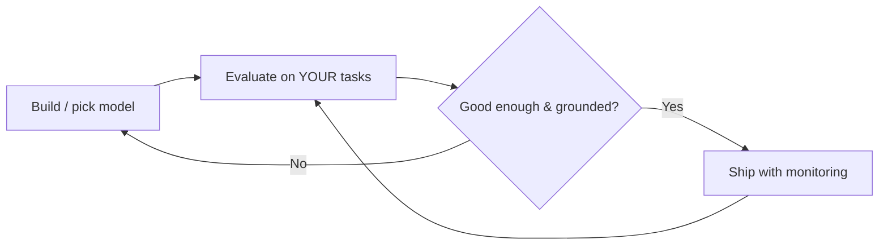

## Overview

Three foundational ideas that recur everywhere: **evaluation** (how you measure whether a model
or system is actually good), **hallucinations** (why models state false things confidently),
and **scaling laws** (the observation that bigger models trained on more data predictably got
better — the engine of the AI boom). Together they explain how to judge AI, how it fails, and
why it advanced so fast.

## Why this matters

You cannot responsibly ship what you cannot measure — so evaluation is the backbone of every
serious AI project. Hallucinations are the defining reliability risk you must design around.
And scaling laws explain both the past few years and why the field keeps changing under your
feet. These three ideas turn "the AI seems good" into something you can reason about.

## Core concepts

**Evaluation.** Measuring quality systematically rather than by vibes. Approaches include test
sets with known answers, human review, "LLM-as-judge" (using a model to grade outputs against
criteria), and tracking real-world metrics (task success, complaint rates). The golden rule:
**evaluate on *your* tasks**, not generic leaderboards.

**Hallucination.** When a model produces fluent, confident output that is simply false. It
happens because the model generates *plausible* text, not *verified* truth — it has no built-in
sense of "I don't actually know this." It's a feature of how these models work, not a bug you
can fully remove — only manage (with grounding/RAG, citations, and human review).

**Scaling laws.** Empirically, increasing model size, data, and compute improved performance in
a smooth, predictable way. This discovery justified the enormous investments in ever-larger
models. (More recently, gains from raw size are getting harder, pushing attention toward
data quality, reasoning techniques, and efficiency — but the principle drove the boom.)

## Visual explanation



## How it works

Because a model predicts likely text, it will happily fill a gap with something that *sounds*
right — that's a hallucination. The defences are architectural: **ground** answers in real
sources (RAG), demand **citations** so claims are checkable, lower the stakes of errors, and
keep **humans in the loop** where being wrong is costly. None of these make the model
*incapable* of error; they make errors catchable and contained.

Evaluation is how you know any of this is working. You assemble representative examples of your
real task, define what "good" means, and measure — before launch and continuously after,
because models and usage drift.

## Decision framework

```decision
title: How do I evaluate an AI system before trusting it?
Pick the metric that matches the job → accuracy, groundedness, format-correctness, task success, safety — not a generic score.
Build a test set from *your real* cases, including hard and edge cases → not a public benchmark.
Decide who/what grades it → exact-match where possible, human review for judgement, LLM-as-judge for scale (with spot-checks).
Set a quality bar and a fallback → what score is "ship-able," and what happens when it's below.
Keep measuring in production → quality drifts as inputs and models change.
```

## Common mistakes

- **Trusting public leaderboards** as if they predict performance on *your* task. They don't,
  reliably — evaluate on your data.
- **"It demoed well" as evidence.** A few good examples aren't evaluation; the failure tail is
  what bites.
- **Treating hallucination as fixable.** It's manageable, not eliminable — design for it.
- **No production monitoring.** Quality silently degrades; without measurement you won't notice
  until customers do.
- **Chasing the biggest model** assuming scaling laws mean "bigger always wins" — for your task,
  test; gains have diminishing returns and costs rise.

## Real business examples

- A team picks a model off a leaderboard, ships, and gets poor results — because their task
  (messy internal documents) looks nothing like the benchmark. A 50-example custom test set
  would have caught it.
- A legal-research tool requires every answer to cite a source document and routes
  low-confidence cases to a human — turning hallucination from a liability into a managed risk.

## Governance considerations

```governance
Evaluation *is* governance evidence. For audits, regulators, and your own risk register, you need to show how you measured accuracy and safety, what the failure rate is, and how errors are caught — especially in high-stakes domains. Hallucination management (grounding, citations, human approval) is a core control; document it. And re-evaluate after any model change, because a vendor's silent model update can shift your system's behaviour overnight (a lifecycle risk covered in the Governance track).
```

## How an architect thinks

```architect
The architect builds the evaluation *before* falling in love with a model. They ask "what does good look like on our real task, how will we measure it, and what's our plan for when the model is wrong?" — because every model hallucinates and every model will be swapped or updated. Evaluation is the instrument panel; flying without it is how projects crash quietly.
```

## Key takeaways

- **Evaluate on your own tasks** with a representative test set — not public leaderboards or
  demos.
- **Hallucination** is inherent: models produce *plausible*, not *verified*, text. Manage it
  with **grounding (RAG), citations, and human review** — you can't fully remove it.
- **Scaling laws** (bigger model + data + compute → predictably better) drove the boom; gains
  now shift toward data quality, reasoning, and efficiency.
- Evaluation is both an engineering necessity and **governance evidence**; keep measuring in
  production.

## Self-check

1. Why is evaluating on a public benchmark not enough before shipping?
2. In one sentence, why do models hallucinate — and name two ways to manage it.
3. What do scaling laws describe, and why should you still test rather than just pick the
   biggest model?
