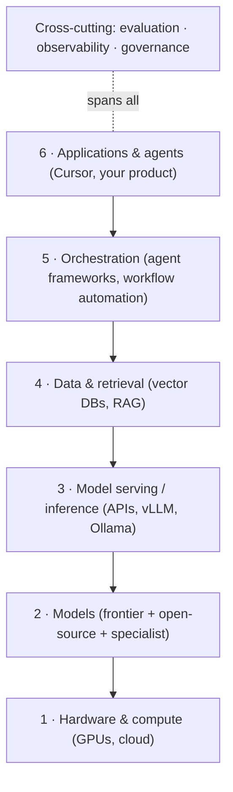

## Overview

There are thousands of AI tools and a dozen new launches every week. It's genuinely
overwhelming — and most of the noise comes from not having a place to *put* each new thing.
This lesson gives you that: a layered map of the ecosystem. Once you can slot any tool into a
layer, the chaos becomes navigable and you stop being impressed by every announcement.

## Why this matters

Your most valuable ecosystem skill isn't knowing every product — it's **classifying** any
product in seconds. "Oh, that's just another agent framework" or "that's an inference engine"
instantly tells you what it competes with, what it's for, and whether you care. This map is the
backbone of the entire track.

## Core concepts

Picture the ecosystem as a stack of layers, bottom to top:

1. **Hardware & compute** — GPUs and the cloud/on-prem they run on. (You rarely buy this
   directly; you rent it via providers.)
2. **Models** — the brains. Split into **frontier (closed) LLMs** (Claude, GPT, Gemini) and
   **open-source models** (Llama, Qwen, Mistral, Gemma), plus specialist models (speech,
   image, video, embeddings).
3. **Model serving / inference** — how models are run and exposed: hosted APIs, or self-hosted
   via inference engines (vLLM, Ollama).
4. **Data & retrieval** — vector databases and pipelines that feed models your knowledge (RAG).
5. **Orchestration** — frameworks that coordinate models, tools, and steps: agent frameworks
   (LangGraph, CrewAI) and workflow automation (n8n, Make).
6. **Applications & agents** — the things end-users touch, including coding agents (Claude
   Code, Cursor) and your own products.
7. **Cross-cutting: evaluation, observability, and governance** — measuring, monitoring, and
   controlling everything above.

## Visual explanation



## How it works

Every tool you'll ever encounter lives in one (occasionally two) of these layers. When a new
product launches, you ask: *which layer is this?* That single question tells you its
competitors and its job. A "revolutionary new AI platform" is usually a familiar layer with new
marketing.

Most businesses **assemble** across layers rather than build any one: a frontier model
(layer 2) via API (layer 3), with a vector DB (layer 4) and a workflow tool (layer 5), wrapped
in their app (layer 6), watched by an eval/observability tool (cross-cutting). Knowing the map
helps you see what you need and what you can buy off the shelf.

## Decision framework

```decision
title: Triage any new AI tool in 30 seconds
Which layer is it in? → models / serving / data / orchestration / application / cross-cutting. This names its competitors.
What does it replace or complement in my stack? → If nothing, you probably don't need it.
Is it a new capability or a repackaging? → Most launches are a known layer with better UX or marketing.
Does it lock me in? → Note switching cost before adopting (vendor risk, covered in Governance).
```

## Common mistakes

- **Tool-chasing.** Adopting shiny tools without knowing which layer gap they fill — leading to
  a bloated, fragile stack.
- **Believing every launch is novel.** Pattern-match to the layer; novelty is rarer than the
  press release suggests.
- **Confusing layers.** E.g. treating an agent framework (orchestration) as a model, or an
  inference engine as a model — they do very different jobs.
- **Ignoring the cross-cutting layer.** Teams buy models and orchestration but forget
  evaluation, observability, and governance — then can't tell if anything works or is safe.

## Real business examples

- A founder overwhelmed by "100 AI tools to try" uses the map to realise they only need three
  layers filled (a model API, a vector DB, a workflow tool) — and ignores the rest.
- A consultant audits a client's "AI stack" by drawing this map and finding they over-invested
  in orchestration while having no evaluation or governance at all.

## Governance considerations

```governance
The map is also a governance map. Each layer leaks or controls data differently: models and serving (does data leave your environment?), data/retrieval (what's indexed, who can query), orchestration and agents (what actions are possible). The cross-cutting layer — evaluation, observability, governance — is exactly where you prove the whole stack is accurate, monitored, and controlled. Teams that skip it can't answer "is this safe and working?"
```

## How an architect thinks

```architect
The architect carries this map in their head and *places* every new tool before judging it. They design top-down (what does the application need?) but buy bottom-up (which layers can we rent vs. must we build?). And they never forget the cross-cutting layer — because a stack you can't measure or govern isn't a system, it's a liability.
```

## Key takeaways

- The ecosystem is a **stack of layers**: hardware → models → serving → data/retrieval →
  orchestration → applications, with **evaluation/observability/governance** cross-cutting.
- Your key skill is **classifying** any tool into a layer in seconds — that reveals its job and
  rivals.
- Most businesses **assemble across layers**; few build any single one.
- Don't skip the **cross-cutting** layer — it's how you know the stack works and is safe.

## Self-check

1. Name the layers of the ecosystem from hardware up.
2. A new product claims to "revolutionise AI agents." Which layer is it likely in, and what
   does that tell you?
3. Why is the cross-cutting (eval/observability/governance) layer so often neglected, and why
   does that matter?
