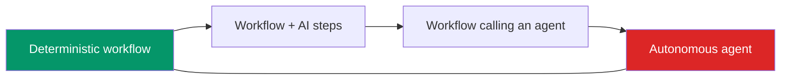

## Overview

**Workflow automation** tools — **n8n**, **Make**, **Zapier**, **Power Automate** — connect
your apps and run a defined sequence of steps automatically, increasingly with AI steps mixed
in ("when an email arrives, summarise it with an LLM, then create a task"). They're often the
fastest, most reliable way to get real value from AI — and they're frequently confused with
agents. The distinction matters.

## Why this matters

Most business "AI automation" wins don't need an autonomous agent — they need a *workflow*: a
predictable, fixed sequence with an AI step or two. Workflows are cheaper, more reliable, and
easier to govern than agents. Knowing when to use which saves money and avoids unnecessary risk.

## Core concepts

- **Workflow = deterministic.** A fixed, predefined path: step A → step B → step C. You know
  exactly what it will do. AI can be one step (e.g. classify, summarise, draft) inside it.
- **Agent = autonomous.** Decides its own steps dynamically toward a goal. Flexible but less
  predictable, costlier, and riskier.
- **The spectrum.** Pure workflow → workflow with AI steps → workflow that calls an agent for
  one hard sub-task → fully autonomous agent. Move right only as needed.
- **No/low-code.** Workflow tools are often visual and usable by non-developers — a big part of
  their appeal for operators.

## Visual explanation



## How it works

A workflow tool listens for a trigger (new email, form submission, schedule), then runs steps
you configured, passing data along — calling other apps and, where useful, an AI model. Because
the path is fixed, you can predict, test, and audit it. That predictability is exactly what
makes workflows the right default for business processes, where reliability beats cleverness.

You reach for an agent only when the steps genuinely can't be known in advance.

## Decision framework

```decision
title: Workflow or agent?
Can you write down the exact steps in advance? → **Workflow.** It'll be cheaper, more reliable, and easier to govern.
Do the steps depend on what's discovered along the way, unpredictably? → Consider an **agent** (or a workflow that calls one for that part).
Mostly moving data between apps with an AI step? → **Workflow automation tool** (n8n / Make / Zapier).
High-stakes or irreversible actions? → Favour a **workflow with explicit human-approval steps** over autonomy.
```

## Common mistakes

- **Building an agent where a workflow fits.** The most common over-engineering — you pay in
  cost, reliability, and debuggability.
- **Underusing workflow tools.** Many high-value automations are a 30-minute n8n/Make build, not
  a project.
- **No approval steps for risky actions.** Even workflows should gate irreversible actions with a
  human.
- **Sprawl.** Dozens of unmanaged "Zaps" become invisible, ungoverned automations — track them.

## Real business examples

- **Workflow:** new invoice email → AI extracts fields → entry created in accounting system →
  exceptions flagged to a human. Predictable, auditable, hugely time-saving.
- **Workflow with AI step:** support ticket arrives → AI categorises and drafts a reply → human
  approves and sends.
- **Agent (justified):** "research this prospect across the web and compile a brief" — steps
  can't be predefined, so an agent fits.

## Tools in this category

```toolcard
name: Workflow automation platforms
category: Connect apps and run defined sequences (often no/low-code)
use: Automate predictable business processes with optional AI steps and human approvals
alternatives: n8n (open-source/self-host), Make, Zapier, Power Automate
when: The steps are known in advance — most business automations
whennot: Truly open-ended tasks needing dynamic decision-making (use an agent)
```

## Governance considerations

```governance
Workflows are the governance-friendly choice: deterministic, testable, auditable, and easy to insert human-approval gates into. Prefer them for anything touching money, customers, or sensitive data. Two cautions: (1) automations can quietly accumulate ("shadow automation") — keep an inventory and owners; (2) self-hosted tools like n8n keep data in your environment (good for residency) but mean you own their security and uptime. Either way, log what each automation does and gate irreversible actions.
```

## How an architect thinks

```architect
The architect's default is "the simplest thing that reliably works," and for known processes that's a workflow, not an agent. They reserve autonomy for genuine uncertainty and otherwise compose deterministic steps with AI sprinkled in where it adds value — getting most of the benefit with a fraction of the risk and cost. "Could this be a workflow instead?" is one of their most-used questions.
```

## Key takeaways

- **Workflow automation** (n8n, Make, Zapier) runs **deterministic, predefined** steps — often
  no-code — with optional AI steps.
- **Workflows beat agents** for known processes: cheaper, more reliable, easier to govern.
- Use an **agent only when steps can't be predefined**; otherwise prefer a workflow, with
  **human gates** on risky actions.
- Watch for **shadow automation sprawl**; keep an inventory.

## Self-check

1. What's the core difference between a workflow and an agent?
2. Give a business task that's clearly a workflow, and one that genuinely needs an agent.
3. Why are workflows generally easier to govern than agents?
