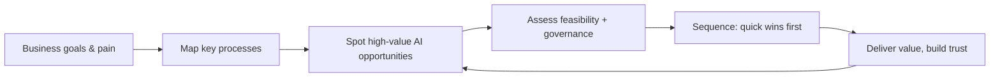

## Overview

An AI transformation architect looks at a business and figures out *where AI creates real value*
and *how to apply it well* — before touching any tool. This is the operator's core skill: starting
from business goals and pain, not from technology, and translating between the two. This lesson
sets the mindset for the whole Operations track.

## Why this matters

The most common way AI initiatives fail isn't bad technology — it's solving the wrong problem.
Teams adopt AI because it's exciting, automate the flashy thing, and miss the boring process that
was actually bleeding money. The transformation architect prevents that by anchoring everything to
value and feasibility.

## Core concepts

- **Value first, technology second.** Start from "what does this business need / where does it
  hurt?", not "where can we use AI?". Technology is the means.
- **Translate both ways.** You bridge business language ("reduce response time," "cut admin cost")
  and AI capability ("classification," "RAG," "an agent"). Few people can do both; that's your
  edge.
- **Think in processes and tasks, not departments.** Transformation happens task by task (recall
  automate/augment/human). Map the work, then intervene where it pays.
- **Feasibility × value.** A great opportunity that's infeasible (or ungovernable) isn't an
  opportunity yet. Weigh both.
- **Sequence for momentum.** Early, visible wins build trust and budget for bigger moves. Don't
  start with the hardest, riskiest project.

## Visual explanation



## How it works

The architect's loop: understand the business and its pain → map how work actually flows → spot
where AI could remove cost, time, or error → filter by feasibility and governance → sequence so
early wins fund and de-risk later ones. Crucially they keep asking "what's the *value* here, and
who feels it?" rather than "what's the coolest thing we could build?" The next lessons turn each
step into a method (opportunity mapping, ROI, process redesign).

## Decision framework

```decision
title: Is this a real transformation opportunity?
Does it tie to a real business goal or pain (cost, time, quality, revenue, risk)? → If not, it's a toy, not a project.
Is it high-volume or high-cost enough to matter? → Small, rare tasks rarely justify the effort.
Is it feasible now (data available, governable, within AI's reliable abilities)? → If not, park it or reduce scope.
Will it produce a visible win reasonably fast? → Favour these early to build momentum and trust.
Could it be a simple workflow rather than a big build? → Prefer the simplest intervention that captures the value.
```

## Common mistakes

- **Technology-first thinking** — "we need an AI strategy" instead of "we need to fix X, and AI
  might help."
- **Chasing the flashy use case** over the boring, valuable one.
- **Boiling the ocean** — a giant transformation program instead of sequenced, value-led steps.
- **Ignoring feasibility and governance** until late, then stalling.
- **No owner of value** — projects that aren't tied to a measurable business outcome drift.

## Real business examples

- A consultant resists a client's "build us an AI chatbot" request and instead maps their
  operations, finding the real win is automating invoice processing — far more value, less risk.
- An operator sequences an AI rollout to start with an internal, low-risk drafting copilot
  (quick visible win) before tackling a customer-facing system.
- A founder reframes "we should use AI" into three concrete, prioritised problems AI can address —
  turning vague ambition into a plan.

## Governance considerations

```governance
Thinking like a transformation architect includes folding governance into opportunity assessment from the start: an opportunity that can't be governed (e.g. requires sending regulated data to a non-compliant tool, or fully automating a high-stakes decision) isn't yet viable. Treat feasibility as including data availability, residency, risk, and accountability — not just technical possibility. The best operators kill or reshape ungovernable ideas early, before sunk cost sets in.
```

## How an architect thinks

```architect
The transformation architect's instinct is to translate excitement into value: when someone says "let's use AI for X," they ask "what outcome are we actually trying to move, how big is it, and is AI the right lever?" They map work as processes and tasks, weigh value against feasibility-and-governance, and sequence for early wins. They're comfortable saying "AI isn't the answer here" — which is precisely what makes their "yes" credible.
```

## Key takeaways

- Start from **value and pain**, not technology; **translate** between business and AI.
- Work **task by task**, weigh **value × feasibility (incl. governance)**, and **sequence quick
  wins** first.
- Prefer the **simplest intervention** that captures the value (often a workflow, not a big build).
- The credible operator can say **"AI isn't the answer here"** when it isn't.

## Self-check

1. Why is "value first, technology second" the core of the mindset?
2. What does it mean to weigh value against feasibility-and-governance?
3. Why sequence quick wins early in a transformation?
