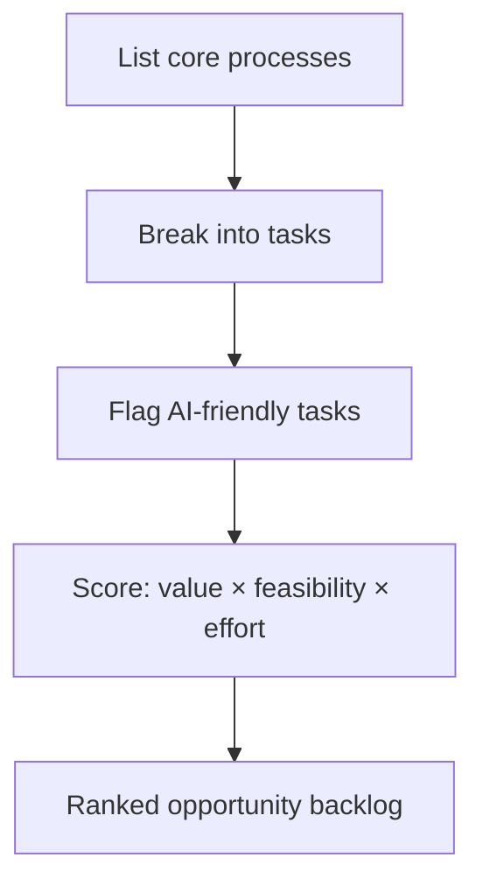

## Overview

Knowing AI creates value somewhere is useless without a method to find *where*. This lesson is a
practical opportunity-mapping process: scan the business systematically, surface candidate uses,
and prioritise them — so you invest where the return is real, not where the hype is loudest.

## Why this matters

A structured scan beats brainstorming. It surfaces the unglamorous, high-value opportunities
people overlook, avoids the trap of automating the first idea someone shouts, and produces a
ranked list you can act on and defend to stakeholders.

## Core concepts

- **Follow the work.** Map the main processes and the tasks within them — where time, money, and
  errors accumulate. AI opportunities live in tasks, not org charts.
- **Look for AI-friendly task signatures:** lots of repetitive language/document work; information
  buried in unstructured text; routine decisions with clear criteria; bottlenecks waiting on a
  human for simple judgement; high-volume customer interactions.
- **Two lenses:**
  - **Efficiency** — do the same work cheaper/faster (automate or augment).
  - **Effectiveness/Revenue** — do better work or new things (better insights, new capabilities,
    new offerings).
- **Score each candidate** on value (time/cost/quality/revenue), feasibility (data, reliability,
  governance), and effort — then rank.

## Visual explanation



## How it works

You walk the business process by process, breaking each into tasks and noting where the
"AI-friendly signatures" appear. For each candidate you estimate the value (how much time/cost/
error/revenue is at stake), the feasibility (is the data there? can it be governed? is it within
AI's reliable abilities?), and the effort to build. Scoring turns a messy list into a ranked
backlog. The top items — high value, feasible, reasonable effort — become your roadmap; quick
wins float to the front (per the previous lesson).

## Decision framework

```decision
title: Is this candidate worth putting on the roadmap?
High value (significant time/cost/quality/revenue at stake)? → Keep; quantify it (feeds ROI lesson).
Feasible now (data available, reliably doable, governable)? → If not, park or reduce scope.
Reasonable effort vs the value? → Favour high-value/low-effort "quick wins" first.
Repetitive, language/document-heavy, or a simple-judgement bottleneck? → Strong AI-friendly signature — prioritise.
Rare, bespoke, or needs deep human judgement/trust? → Likely augment or leave-human, not automate.
```

## Common mistakes

- **Brainstorming instead of scanning** — you miss the boring, valuable opportunities.
- **Only looking at efficiency** — ignoring effectiveness/revenue upside (new insights, new
  offerings).
- **Falling for the first idea** without comparing it against a ranked list.
- **Ignoring data availability** — a great idea with no usable data isn't feasible yet.
- **Skipping the score** — without value/feasibility/effort, you can't prioritise objectively.

## Real business examples

- A professional-services firm maps its work and finds the top opportunity isn't client-facing AI
  but automating internal report assembly — huge recurring time saved, low risk.
- A retailer's scan surfaces both an efficiency win (auto-categorising support tickets) and a
  revenue win (better product recommendations) — and ranks them by value and effort.
- A clinic identifies that transcription/admin (not diagnosis) is the safe, high-value place to
  start.

## Governance considerations

```governance
Bake governance into the feasibility score, not as a later gate. For each candidate ask: what data does it need, is that data available and allowed to be used (privacy/residency/confidentiality), and can the use be governed (accountability, oversight)? An opportunity that's technically attractive but ungovernable (e.g. needs regulated data in a non-compliant tool, or fully automates a high-stakes decision) should be reshaped or parked early. Scoring governance up front saves wasted build effort later.
```

## How an architect thinks

```architect
The architect maps work, not wishes. They scan systematically for AI-friendly task signatures, look through both efficiency and revenue lenses, and force-rank candidates by value × feasibility × effort — including governance in feasibility. They resist anchoring on the first shiny idea and instead produce a defensible, prioritised backlog where the boring high-value wins rise to the top. The output is a roadmap, not a wish list.
```

## Key takeaways

- **Follow the work**: map processes → tasks → flag **AI-friendly signatures** (repetitive,
  text-heavy, routine decisions, simple-judgement bottlenecks, high-volume interactions).
- Use **two lenses**: efficiency *and* effectiveness/revenue.
- **Score by value × feasibility (incl. governance) × effort** and rank into a backlog; float
  **quick wins** forward.
- Beware **brainstorming over scanning** and **ignoring data availability/governance**.

## Self-check

1. What "signatures" mark a task as a good AI candidate?
2. Why use both an efficiency and an effectiveness/revenue lens?
3. How does governance enter the prioritisation, and why early?
