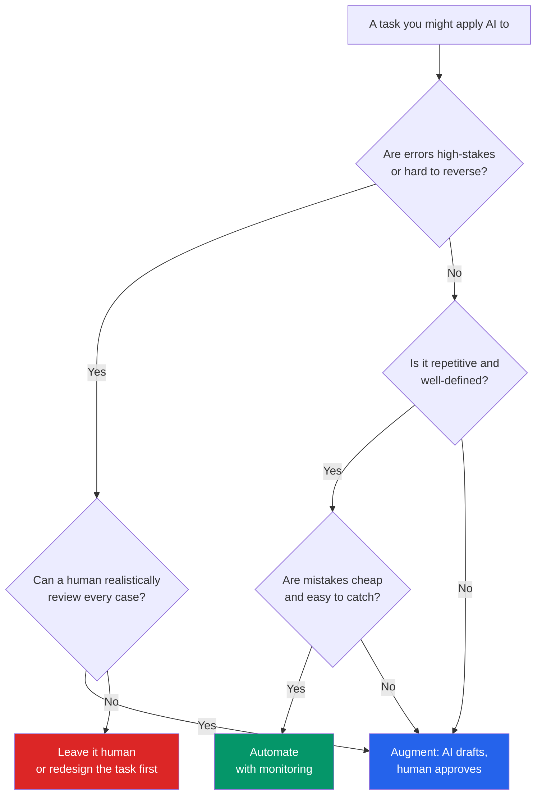

## Overview

When people get excited about AI in a business, the instinct is "what can we **automate**?"
That's the wrong first question. The right one is: for *this specific task*, is the best move
to **automate** it, **augment** the human doing it, or **leave it human**?

Getting this call right is most of the value of an AI strategist. Get it wrong and you either
leave money on the table (over-cautious) or create risk, rework, and angry customers
(over-automated). This lesson turns that call into a framework you can apply to any task.

## Why this matters

AI doesn't transform a "business" in the abstract — it transforms specific tasks. The
WEF's Future of Jobs research frames the near term not as wholesale job replacement but as a
*reshaping* of tasks within roles: some automated, many augmented, some firmly human. The
operator's skill is deciding which is which — repeatedly, across a whole operation — rather
than applying one slogan to everything.

This is also where governance starts. The automate/augment/human choice *is* a risk decision:
it determines where a wrong answer can do damage with no human to catch it.

## Core concepts

Three options, not two:

- **Automate** — AI does the task end-to-end, with little or no human involvement. Best for
  high-volume, repetitive, well-defined, low-stakes work where errors are cheap and checkable.
- **Augment** — AI assists a human who stays in control (a copilot): it drafts, suggests,
  summarises, or triages, and the human decides. Best for judgement-heavy, higher-stakes, or
  relationship work where speed helps but accountability must stay human.
- **Leave it human** — AI stays out of the critical path. Best where stakes are high, context
  is subtle, trust or empathy is the point, or the cost of being wrong is severe and hard to
  reverse.

Two dimensions decide it most of the time: **how high are the stakes if it's wrong?** and
**how repetitive / well-defined is the task?**

## Visual explanation



## How it works

Score a task on a few factors, and the answer usually becomes obvious:

- **Stakes / reversibility.** What happens if it's wrong, and can you undo it? High and
  irreversible → keep a human in control.
- **Volume & repeatability.** Hundreds of similar cases a week → automation pays off. A
  handful of bespoke cases → augment instead.
- **Definability.** Can you describe "done right" clearly? Fuzzy goals resist full automation.
- **Error detectability.** Can mistakes be caught cheaply (by a check, a rule, the next step)?
  If wrong answers slip through silently, don't automate.
- **Relationship / trust.** Is the human connection the actual value (sensitive HR
  conversations, key-account sales)? Then a person stays front and centre.
- **Regulatory / accountability.** Does someone have to be answerable for the decision? That
  pushes toward augmentation with a human decision-maker.

Note the progression: most tasks start as **augment**, and *earn* their way to **automate**
once you've watched the AI perform and trust the error rate. Augmentation is also how you
gather the data and confidence to automate later.

## Decision framework

```decision
title: Automate, augment, or leave it human?
**Automate** when: high volume, repetitive, well-defined, low-stakes, and errors are cheap and easy to catch. (e.g. categorising inbound emails, extracting fields from invoices.)
**Augment** when: judgement matters, stakes are moderate-to-high, or accountability must stay human — but speed and a good first draft help. (e.g. drafting customer replies, first-pass document review, summarising research.)
**Leave it human** when: stakes are high and hard to reverse, context is subtle, or trust/empathy is the actual product. (e.g. firing decisions, a major medical or legal judgement, crisis customer calls.)
**When unsure → start with augment.** It captures most of the upside, keeps a human accountable, and lets you measure performance before considering full automation.
```

```decision
title: Is this automation even worth doing?
Will it save meaningful, recurring time or cost? → If no, **stop** — not every task is worth automating.
Is the task stable, or does it change constantly? → Constantly-changing tasks cost more to automate than they save.
Can you measure whether the automation is working? → If you can't measure quality, you can't safely automate.
Do the savings beat the build + maintenance + oversight cost? → Automation has ongoing costs (monitoring, fixing, governance), not just a one-off build.
```

## Common mistakes

- **Automating the exciting task instead of the valuable one.** The biggest wins are usually
  boring, high-volume back-office work — not the flashy customer-facing bot.
- **Jumping straight to full automation** without an augmentation phase to learn the error
  rate. You're flying blind on risk.
- **"Paving the cow path."** Automating a broken process just makes the mess faster. Redesign
  the task first (that's the next lesson).
- **Ignoring the oversight cost.** An automation that needs constant babysitting may cost more
  than the work it replaced.
- **Removing the human from a high-stakes loop** to save a few minutes, then discovering the
  failure mode in production — on a customer.
- **Treating it as permanent.** The right answer moves over time as models improve and as you
  build trust. Revisit it.

## Real business examples

- **Invoice data entry (operator).** High volume, well-defined, mistakes caught by
  reconciliation → **automate**, with monitoring and exception handling. A classic "10 hours a
  week back" win.
- **Customer support (ops manager).** **Augment** first: AI drafts replies, agents approve and
  send. Routine, high-confidence categories *graduate* to automation; nuanced or upset
  customers stay human.
- **Hiring decisions (HR).** AI can **augment** by summarising and organising applications —
  but the decision stays human for fairness, legal, and accountability reasons. **Leave the
  decision human.**
- **AI receptionist (founder).** When no one is answering the phone at all, a speech-to-speech
  agent that books appointments is a clear **automate** win — the baseline is *missed calls*,
  so the bar is low and the upside is high.
- **Legal advice to a client (lawyer).** **Augment** internal research; **leave human** the
  advice and sign-off. The professional remains accountable.

## Governance considerations

```governance
The automate/augment/human choice is a governance decision in disguise:
- **Accountability.** Automation doesn't remove responsibility — someone still owns the outcome. Name them. For regulated or high-impact decisions, keep a human decision-maker (augment), don't fully automate.
- **Auditability.** Automated decisions need logging and the ability to explain *why* — especially where customers or regulators can challenge them.
- **Fairness & bias.** Automating decisions about people (hiring, credit, benefits) carries legal and ethical risk; default to augmentation with human judgement.
- **Failure handling.** Every automation needs a defined fallback: what happens when the AI is unsure, wrong, or down? "It just fails silently" is not an answer.
- **Reversibility.** Prefer to automate reversible actions; gate irreversible ones behind a human.
```

## How an architect thinks

```architect
The novice asks "what can we automate?" The operator asks "**where is the highest-value place to apply AI, and at what level of autonomy?**"

They think in a portfolio, not a single bet:
- Most tasks → **augment** (broad, low-risk productivity gains across many people).
- A few stable, high-volume tasks → **automate** (deep savings, with monitoring).
- A protected set → **stay human** (the stakes or trust make it non-negotiable).

And they treat the line as **moving**: today's "augment" can become tomorrow's "automate" once the error rate is proven. The skill isn't picking one slogan — it's placing each task correctly and revisiting it.
```

## Tools in this category

```toolcard
name: Workflow automation platform
category: Connect apps & automate defined processes (often no-code)
use: Wire AI steps into real business workflows — triggers, approvals, hand-offs to humans
alternatives: n8n, Make, Zapier, Power Automate
when: The task is well-defined and you want automation with human-approval steps built in
whennot: The task needs open-ended reasoning across many steps — consider an agent instead
```

## How to ask Claude / Cursor

Use AI to do the opportunity analysis *with* you:

```prompt
Act as an AI transformation advisor. Help me decide how to apply AI to a task.

The task:
- [Describe it: who does it, how often, how long it takes, what "done right" means, and what happens if it's wrong.]

Please:
1. Score it on stakes/reversibility, volume, definability, error-detectability, and accountability.
2. Recommend: automate, augment, or leave-it-human — and explain the reasoning.
3. If automate or augment, outline the smallest first version and how I'd measure whether it's working.
4. Flag the governance issues (accountability, fairness, fallback, auditability) I must address.
5. Tell me what would have to change for the recommendation to move (e.g. when augment could become automate).

Ask clarifying questions first if you need them.
```

## Key takeaways

- It's **three** options, not two: **automate**, **augment**, **leave it human**.
- Two questions decide most cases: **how high are the stakes if it's wrong?** and **how
  repetitive and well-defined is it?**
- **Default to augment when unsure** — it captures most of the value, keeps a human
  accountable, and lets you measure before automating.
- Don't automate the *exciting* task; automate the *valuable, boring, high-volume* one — and
  only if the savings beat the oversight cost.
- The choice is a **governance decision**: it sets where a wrong answer can do damage
  unchecked. Treat the line as **moving**, and revisit it.

## Self-check

1. What are the three options, and what mainly distinguishes them?
2. Why is "augment" usually the right starting point even for tasks you'll eventually automate?
3. Give an example of a high-volume task that's still a poor automation candidate, and say why.
4. Why is the automate/augment/human decision also a governance decision?
5. A client wants to fully automate hiring decisions to save time. What do you advise, and why?
