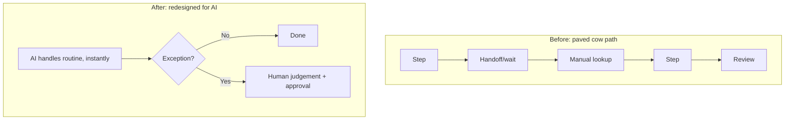

## Overview

The biggest AI wins rarely come from dropping AI into an existing process unchanged. They come
from **redesigning the process** around what AI makes possible. "Paving the cow path" —
automating a workflow that was shaped by old human limits — leaves most of the value on the table.
This lesson is about rethinking the work, not just accelerating it.

## Why this matters

A process designed for humans often has steps that exist only because of human constraints
(handoffs, batching, waiting, manual lookups). Bolt AI onto that and you make a suboptimal process
faster. Redesign it and you can remove whole steps, change who does what, and capture far more
value. The difference between "10% faster" and "transformed" is usually redesign.

## Core concepts

- **Pave-the-cow-path trap.** Automating each existing step 1:1 preserves the old structure's
  inefficiencies.
- **Redesign questions:** Why does this step exist? Does it still need to, given AI? Can steps be
  removed, merged, reordered, or made parallel? Who *should* do each task now (human, AI, or
  AI-with-human-approval)?
- **From sequential to on-demand.** Many human processes batch and queue; AI can make them instant
  and continuous, changing the whole shape.
- **Redesign the human role too.** As AI takes routine parts, redesign what humans focus on —
  usually exceptions, judgement, and relationships (collaborative intelligence).
- **Keep the controls.** Redesign must preserve necessary checks (approvals, audit) — streamline,
  don't strip, governance.

## Visual explanation



## How it works

You take a mapped process and challenge every step: does it exist for a good reason, or because
humans used to be the only option? You remove steps AI makes unnecessary, collapse handoffs,
parallelise what was sequential, and reassign tasks by the automate/augment/human logic — leaving
humans on exceptions, judgement, and relationships. You keep the governance checks that matter
(approvals, audit) but streamline them. The result is a process shaped around the new
capabilities, not the old constraints.

## Decision framework

```decision
title: Redesigning a process for AI
Does each step still need to exist given AI? → Remove or merge the ones that don't.
Is it sequential because of human batching/handoffs? → Consider making it instant/parallel.
Who should own each task now? → Reassign via automate / augment / leave-human.
What's the new human role? → Point humans at exceptions, judgement, and relationships.
Which checks are essential vs. legacy? → Keep essential governance, streamline the rest — never strip required controls.
```

## Common mistakes

- **Paving the cow path** — automating steps 1:1 and preserving the old inefficiencies.
- **Redesigning away necessary controls** — removing approvals/audit in the name of speed.
- **Ignoring the human role** — taking routine work without redefining what people now focus on
  (causing fear or idle confusion).
- **Big-bang redesign** — flipping everything at once instead of piloting and iterating.
- **Forgetting change management** — a redesigned process people won't adopt delivers nothing
  (next lessons).

## Real business examples

- A loan process redesigned around AI eliminates several manual lookup and rekeying steps,
  turning a multi-day sequential flow into a near-instant one where humans only handle flagged
  exceptions.
- A content team stops "AI drafts each existing step" and instead redesigns: AI produces a full
  first draft and research pack; humans shift entirely to editing and strategy.
- A support operation redesigns triage so AI resolves routine tickets instantly and routes only
  nuanced cases to agents — who now spend their time on harder, higher-value problems.

## Governance considerations

```governance
Redesign is the moment to get governance *right*, not to discard it. As you remove and reorder steps, deliberately preserve the controls that matter — approvals for high-stakes actions, audit trails, access restrictions — while cutting only the legacy friction. A redesigned process should be *more* governable (clearer ownership, instrumented steps), not less. Re-map the data flows too: a new process can change where data goes and who/what can see it, which may shift your privacy and access-control obligations.
```

## How an architect thinks

```architect
The architect refuses to automate the existing process verbatim. Their reflex is "if we were designing this from scratch knowing what AI can do, what would it look like?" They strip steps that only existed because of human limits, make batched flows instant, reassign tasks by stakes, and redirect humans to judgement and relationships — all while keeping the essential controls. They pilot the redesign rather than big-bang it, and they treat adoption as part of the design.
```

## Key takeaways

- The big wins come from **redesigning the process**, not bolting AI onto the old one ("paving the
  cow path").
- Challenge every step's existence; **remove, merge, parallelise**, and **reassign** tasks by
  automate/augment/human.
- **Redefine the human role** toward exceptions, judgement, and relationships.
- **Preserve essential controls** (approvals, audit) and re-map data flows; **pilot, don't
  big-bang**.

## Self-check

1. What does "paving the cow path" mean and why is it a trap?
2. What questions do you ask to redesign a process for AI?
3. How should redesign treat governance controls and the human role?
