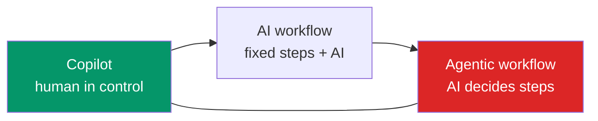

## Overview

In practice, AI shows up in work as one of three patterns: a **copilot** (assists a person in real
time), an **AI workflow** (AI steps inside an automated, predefined process), or an **agentic
workflow** (AI decides some steps autonomously). Knowing these patterns — and which fits a given
task — is how you turn opportunities into concrete designs.

## Why this matters

"Use AI for this" is too vague to build. Naming the pattern makes it concrete and sets the cost,
risk, and governance profile. It also keeps you from over-reaching (an autonomous agent where a
copilot would do) or under-reaching (a manual copilot where automation would scale).

## Core concepts

- **Copilot (augment).** AI assists a human who stays in control — drafting, suggesting,
  summarising. The human decides and is accountable. Lowest risk; broad applicability. (Your
  coding assistant, a writing copilot, a research helper.)
- **AI workflow (automate, deterministic).** A predefined sequence runs automatically with AI
  doing specific steps (classify, extract, draft), often with human-approval gates. Predictable,
  governable, scalable. (Invoice processing, ticket triage.)
- **Agentic workflow (automate, autonomous).** AI decides some steps dynamically toward a goal,
  using tools. Most flexible, most risk/cost; reserve for genuinely open-ended tasks. (Research
  agent, multi-step task automation.)
- **They combine.** A workflow can call a copilot step (human approval) or an agent for one hard
  sub-task. Compose patterns; don't force one everywhere.

## Visual explanation



## How it works

You match the pattern to the task using the automate/augment/human logic plus the workflow-vs-agent
distinction. Judgement-heavy, relationship, or high-stakes work → **copilot** (human keeps
control). Known, repeatable processes → **AI workflow** (automate the sequence, gate risky steps).
Genuinely open-ended tasks where steps can't be predefined → **agentic workflow** (but constrain
it hard). Most real systems are workflows with copilot or agent steps mixed in where they earn
their place.

## Decision framework

```decision
title: Which pattern fits this task?
Human must decide / it's judgement or relationship work? → **Copilot** (augment): AI assists, human decides.
Known, repeatable sequence of steps? → **AI workflow**: automate it, with human-approval gates on risky steps.
Steps genuinely can't be predefined; needs dynamic reasoning across tools? → **Agentic workflow** — constrained (least privilege, limits, human gates).
High-stakes or irreversible actions anywhere? → Keep a human gate regardless of pattern.
Tempted by an agent? → Check a workflow can't do it first — it usually can, cheaper and safer.
```

## Common mistakes

- **Defaulting to "an agent"** when a copilot or workflow fits — more cost, risk, and
  unpredictability.
- **Forcing automation on judgement work** that should stay a copilot.
- **Manual copilots for high-volume routine** that should be automated workflows.
- **Unconstrained agentic workflows** without least privilege, limits, and human gates.
- **One pattern everywhere** instead of composing the right mix.

## Real business examples

- **Copilot:** sales reps draft proposals with AI assistance, editing and owning the final
  version.
- **AI workflow:** inbound emails auto-classified and routed, with AI-drafted replies a human
  approves — predictable and scalable.
- **Agentic workflow:** a research task where the AI decides what to look up and synthesises a
  sourced brief — justified autonomy, tightly scoped.
- **Composed:** a workflow that calls an agent for the open-ended "research" step and a human for
  final sign-off.

## Governance considerations

```governance
Governance load rises left-to-right: copilots keep a human accountable by design (lowest risk); AI workflows are deterministic and easy to gate and audit; agentic workflows carry the full agent risk set (prompt injection, runaway loops, over-broad permissions) and need the strongest controls — least privilege, step/cost limits, human gates on consequential actions, and thorough logging. Choosing the least-autonomous pattern that does the job is itself a governance decision: it minimises blast radius.
```

## How an architect thinks

```architect
The architect picks the least-autonomous pattern that achieves the goal, because autonomy buys flexibility at the price of risk and cost. Their default ladder is copilot → workflow → agentic, climbing only when forced. They compose patterns freely — a deterministic workflow with a copilot approval and an agent for one genuinely open step — rather than dogmatically applying one. "Could this be a copilot or a workflow instead of an agent?" is among their most-asked questions.
```

## Key takeaways

- Three patterns: **copilot** (human-in-control assist), **AI workflow** (automated fixed steps),
  **agentic workflow** (autonomous step selection).
- **Risk and cost rise with autonomy**; pick the **least-autonomous pattern** that does the job.
- **Compose** patterns; most real systems are workflows with copilot/agent steps mixed in.
- Match to **automate/augment/human** and keep **human gates** on high-stakes actions.

## Self-check

1. Describe each of the three patterns in one line.
2. Why prefer the least-autonomous pattern that works?
3. Give an example of composing patterns in one system.
