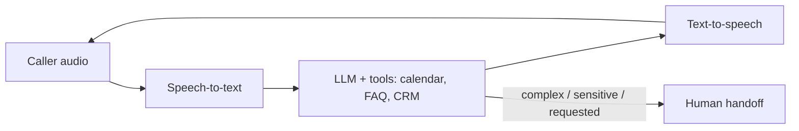

## Overview

Let's make the operations skills concrete with a case study: a small business is missing calls —
no one's free to answer, and missed calls mean lost bookings. Could an **AI receptionist**
(speech-to-speech) handle calls, answer questions, and book appointments? This lesson walks the
full decision, design, and governance of that real, common opportunity.

## Why this matters

Voice is a high-value, increasingly feasible AI application, and the "AI receptionist" is one of
the clearest ROI cases because the baseline is often *missed calls* — a low bar with real revenue
attached. Working it end to end shows how the whole Operations toolkit fits together on a concrete
problem.

## Walking the decision

**1. Value & opportunity (mapping + ROI).** The pain: missed calls = lost bookings and poor
service. Value: more bookings captured, 24/7 coverage, staff freed from interruptions. Quantify:
missed-call volume × conversion × average value. Often a strong, clear ROI because the baseline is
*nothing answering*.

**2. Automate / augment / human.** Routine calls (hours, bookings, FAQs) are repetitive and
well-defined → good for **automation**. Sensitive, complex, or upset callers → escalate to a
**human**. So: automate the routine, route the rest. (Not all-or-nothing.)

**3. Pattern.** This is an **agentic/automated workflow** with tools (calendar, CRM) and a hard
**human handoff** path — and the autonomy is bounded (it books and answers; it doesn't make
high-stakes commitments).

## How it works (architecture sketch)



The pipeline (from the multimodal and speech-tools lessons): **transcribe → understand & act →
speak**, with calendar/CRM tools for booking and a handoff to a human when needed. The make-or-
break factor is **latency** — it must feel like a real conversation.

## Decision framework

```decision
title: Should this business deploy an AI receptionist?
Are calls currently missed or poorly handled? → Strong case — the baseline is low, upside high.
Are most calls routine (hours, bookings, FAQs)? → Good automation fit; route the rest to humans.
Can it integrate with the calendar/CRM it needs? → Feasibility check; if not, scope down.
Is low latency achievable with the chosen tools? → Essential for a usable experience.
Sensitive/regulated context (health, legal)? → Tighten governance: consent, data handling, clear escalation, disclosure that it's AI.
```

## Common mistakes

- **Over-automating** — trying to handle every call instead of routing complex/sensitive ones to a
  human.
- **Ignoring latency** — a smart but laggy agent feels broken and frustrates callers.
- **No graceful handoff** — trapping callers with the AI when they need a person.
- **Skipping disclosure** — not telling callers they're speaking to AI (a transparency/compliance
  issue).
- **Underestimating edge cases** — accents, noise, unusual requests; pilot before full rollout.

## Real business examples

- A dental clinic deploys an AI receptionist for after-hours and overflow calls, capturing
  bookings it used to miss, with anything clinical or sensitive routed to staff next morning.
- A home-services firm uses one to handle quote requests and scheduling 24/7, with a "press 0 for
  a human" style escape hatch always available.

## Governance considerations

```governance
A voice agent concentrates several governance duties (see the speech-tools and security lessons):
- **Disclosure/transparency.** Tell callers they're talking to AI (a likely regulatory requirement).
- **Consent & recording.** Call audio/transcripts trigger consent, retention, and residency rules; voices can be biometric data.
- **Data handling.** Bookings touch personal data — apply privacy and access controls; mind where audio is processed.
- **Bounded autonomy + handoff.** It should book and inform, not make high-stakes commitments; always offer a human path.
- **Security.** It takes actions (calendar/CRM) from untrusted caller input — apply least privilege and guard against manipulation.
- **Fallback.** If the AI or a provider is down, calls must still reach a human or voicemail, not vanish.
```

## How an architect thinks

```architect
The architect treats the receptionist as a bounded automated workflow, not a free-roaming agent: it does a defined job (answer, inform, book), routes everything else to humans, and can't make high-stakes commitments. They obsess over latency (the UX make-or-break), design the handoff as a first-class path, and front-load the governance — disclosure, consent, data handling — because voice is sensitive and regulated. The ROI is compelling precisely because the baseline (missed calls) is so poor.
```

## Key takeaways

- The **AI receptionist** is a high-ROI case because the baseline is often **missed calls**.
- **Automate the routine, route the rest** to humans; keep autonomy **bounded** with a real
  **handoff**.
- It's a **speech pipeline** (STT → LLM+tools → TTS) where **latency is decisive**.
- Voice concentrates governance: **disclosure, consent/recording, data handling, security,
  fallback** — design them in.

## Self-check

1. Why does the AI receptionist often have a strong ROI?
2. What should be automated vs routed to a human, and why?
3. List three governance duties specific to a voice agent.
