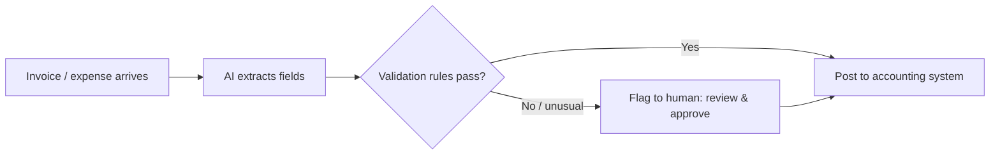

## Overview

Not every win is a flashy product. Often the highest-ROI move is quietly removing a recurring
manual chore. This case study: an admin spends ~10 hours a week processing incoming
invoices/expenses — reading documents, extracting data, entering it into the accounting system,
flagging anomalies. Let's design an automation that gives most of those hours back, safely.

## Why this matters

These boring back-office tasks are where AI delivers reliable, measurable ROI — and they're often
overlooked in favour of shiny ideas. Walking one end to end shows how to scope a *small*
automation correctly: enough to save real time, bounded enough to stay safe.

## Walking the design

**1. Value & ROI.** ~10 hrs/week × loaded hourly cost = the benefit ceiling, plus fewer entry
errors and faster close. Costs: build/integration, modest usage, **human review time**, and
maintenance. Net is usually strongly positive — and measurable.

**2. Automate / augment / human.** The task is repetitive, well-defined, and mistakes are
catchable (reconciliation) → a good **automation** candidate — *with* a human reviewing
exceptions and approving postings, because money is involved.

**3. Pattern.** An **AI workflow** (deterministic) with AI steps: ingest document → extract fields
(vision-language model, from the multimodal lesson) → validate against rules → post routine ones →
**flag exceptions to a human**. Not an autonomous agent — the steps are known.

## How it works (sketch)



This is a workflow-automation build (n8n/Make or similar, from the ecosystems track) with an AI
extraction step and a human-approval gate for anything that fails validation or exceeds a
threshold. You'd direct a coding/automation tool to build it (Track 6), then verify.

## Decision framework

```decision
title: Scoping a small back-office automation
Is it recurring and time-consuming enough to matter? → 10 hrs/week clears the bar easily.
Repetitive and well-defined? → Good automation fit.
Are errors catchable (e.g. by reconciliation/rules)? → Yes here — but money means keep human approval for exceptions.
Start narrow? → Automate the clean, routine 80%; route the messy 20% to the human. Expand as trust grows.
Measurable? → Track hours saved and error rate to prove (or improve) ROI.
```

## Common mistakes

- **Trying to automate 100%** including every weird edge case — start with the clean majority,
  route the rest.
- **No human approval on financial postings** — money is high-stakes; gate it.
- **Skipping validation rules** — let obviously wrong extractions through.
- **No measurement** — can't prove the hours saved or catch degradation.
- **Treating it as set-and-forget** — vendors change formats; monitor and maintain.

## Real business examples

- A firm automates expense processing: AI extracts and pre-fills, routine items post after rule
  checks, anomalies go to the admin — who now spends ~2 hours/week reviewing instead of 10 doing.
- A small business automates invoice data entry into its accounting tool, cutting errors and
  closing the books faster, with a human approving anything over a set amount.

## Governance considerations

```governance
Even a humble automation needs governance: financial data is sensitive (privacy, access control); postings are consequential, so keep a **human-approval gate** for exceptions and amounts over a threshold (don't let the AI move money unchecked); add **validation rules** and **logging** so every automated entry is auditable; and define a **fallback** (if the AI/integration fails, items queue for manual handling, nothing is lost or silently mis-posted). Start with low autonomy and widen it only as the measured error rate earns trust.
```

## How an architect thinks

```architect
The architect scopes small and safe: automate the clean majority, gate the money and the exceptions with a human, and instrument everything so ROI and error rate are visible. They recognise this unglamorous task as a better first project than a flashy one — high, measurable ROI and low risk build the trust and budget for bigger moves. They design it as a deterministic workflow (not an agent) because the steps are known, and they widen autonomy only as evidence accrues.
```

## Key takeaways

- The highest-ROI move is often **removing a recurring manual chore**, not a flashy product.
- Design it as a **deterministic AI workflow**: extract → validate → auto-post routine → **flag
  exceptions to a human**.
- **Gate money and exceptions** with human approval; add **validation, logging, and a fallback**.
- **Start narrow** (clean 80%), **measure** hours saved and errors, and widen autonomy as trust
  grows.

## Self-check

1. Why is this task a good automation candidate, and what keeps it safe?
2. Why design it as a workflow rather than an autonomous agent?
3. Where does the human stay in the loop, and why there?
