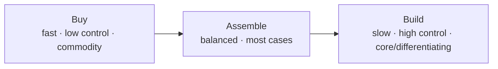

## Overview

Once you've chosen an AI opportunity, you must decide *how to acquire* the capability: **buy** a
ready-made product, **build** something custom, or **assemble** from components (models, vector
DBs, workflow tools). Most real systems are assembled. Choosing well saves time and money and
avoids both reinventing wheels and getting locked into something that doesn't fit.

## Why this matters

The default instincts are usually wrong: engineers over-build, executives over-buy. The right
answer depends on whether the capability is core/differentiating, how well off-the-shelf options
fit, and your capacity to maintain what you make. Getting this decision right is a major lever on
cost, speed, and control.

## Core concepts

- **Buy** — adopt a finished product (e.g. an AI support tool). Fastest, least effort; least
  control/customisation; ongoing subscription and vendor dependence.
- **Assemble** — combine existing components (frontier/open model + vector DB + workflow tool +
  your glue), often built by directing AI coding tools. The common middle path: much of the
  benefit of custom, far less than building from scratch.
- **Build** — create custom software/models. Most control and fit; most cost, time, and
  maintenance. Reserve for genuinely core, differentiating capability.
- **The deciding questions:** Is this capability *core/differentiating* (build/assemble) or
  *commodity* (buy)? How well do off-the-shelf options fit? Do you have the capacity to maintain
  what you make?

## Visual explanation



## Decision framework

```decision
title: Build, buy, or assemble?
Is this capability commodity (not your differentiator) and a good product exists? → **Buy.**
Is it core/differentiating, with no off-the-shelf fit, and you can maintain it? → **Build** (or assemble heavily).
Somewhere in between (common)? → **Assemble** from components — often by directing AI coding tools.
No capacity to maintain custom software? → Lean **buy/assemble**; don't build what you can't sustain.
Worried about lock-in either way? → Prefer options with exportable data and swappable parts (vendor lesson).
```

## How it works

You classify the capability (core vs commodity) and survey off-the-shelf options. Commodity needs
with good products → buy. Core, differentiating needs with poor fit → build or heavily assemble.
Most fall in the middle → assemble: pick components (a model via API or self-hosted, a vector DB, a
workflow/automation tool) and connect them, frequently by directing a coding agent (Track 6). You
weigh total cost (including maintenance and oversight, from the ROI lesson) and lock-in (vendor
lesson) across the options.

## Common mistakes

- **Building what you could buy** — reinventing a commodity, then owning its maintenance forever.
- **Buying what you should build/assemble** — forcing a poorly-fitting product onto a core need.
- **Ignoring maintenance capacity** — building or assembling something you can't sustain.
- **Underrating assemble** — defaulting to all-buy or all-build when composing components fits
  best.
- **Ignoring lock-in** — picking options you can't migrate off later.

## Real business examples

- A company **buys** an off-the-shelf AI note-taker (commodity, good fit) rather than building one.
- A firm **assembles** a custom internal knowledge assistant from a frontier model + vector DB +
  its docs, directed via a coding agent — too specific to buy, not worth building from scratch.
- A startup whose AI matching engine *is* its differentiator **builds** it custom, while buying
  everything non-core around it.

## Governance considerations

```governance
The build/buy/assemble choice shifts where governance burden sits. **Buy:** governance leans on vendor diligence and data terms (privacy, residency, security) — you depend on the vendor's controls, so scrutinise them. **Build/assemble:** you own more of the controls (security, data handling, logging) but gain more control to meet residency/confidentiality needs. Either way, keep the abstraction and exportability that limit lock-in, and record the decision and its data-handling implications in your governance documentation.
```

## How an architect thinks

```architect
The architect's instinct is "assemble by default, buy the commodity, build only the core." They separate what truly differentiates the business (worth building/assembling and controlling) from commodity capability (buy it, don't reinvent it), and they always weigh maintenance capacity — building something you can't sustain is a slow failure. They factor lock-in and total cost (not just licence/build) into the call, and they use AI coding tools to make "assemble" cheaper than it used to be.
```

## Key takeaways

- Three options: **buy** (commodity, fast, low control), **build** (core/differentiating, slow,
  high control), **assemble** (the common middle — compose components, often via AI coding tools).
- Decide by **core-vs-commodity, off-the-shelf fit, and maintenance capacity.**
- Don't **build what you can buy** or **buy what's core and ill-fitting**; mind **total cost and
  lock-in**.
- Governance burden shifts: **buy** → vendor diligence; **build/assemble** → you own more controls
  (and more control).

## Self-check

1. What three questions most determine build vs buy vs assemble?
2. Why is "assemble" the right answer for so many AI systems now?
3. How does the choice change where your governance effort goes?
