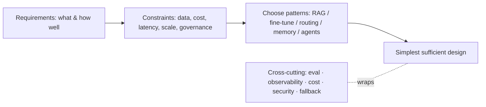

## Overview

This track is the architect layer: designing AI *systems*, not just using models. It opens with
the method itself — how a good architect goes from a goal to a design by working through
requirements, constraints, and structure, choosing among the patterns the rest of the track
details (RAG, fine-tuning, routing, memory, agents). The throughline: **design follows
constraints, and the simplest design that meets them wins.**

## Why this matters

Anyone can wire a model to a prompt. An architect produces a system that's correct, affordable,
fast enough, governable, and maintainable — and that survives contact with real users and change.
That's the difference between a demo and something a business can rely on. The method is learnable
and largely independent of which products are hot this month.

## Core concepts

- **Start with requirements, not technology.** What must the system *do*, for whom, how well? What
  does "good enough" mean (accuracy, latency, cost)?
- **Surface the constraints — they shape everything.** Data sensitivity/residency, budget, latency
  targets, scale, reliability, and governance. Constraints often eliminate options before
  capability is even considered (e.g. residency rules out hosted foreign APIs).
- **Choose the pattern.** Map requirements to the right building blocks: RAG (knowledge),
  fine-tuning (behaviour), routing (cost), memory (continuity), agents (open-ended action) — each
  a later lesson.
- **Prefer the simplest sufficient design.** Every added component (agent, framework, fine-tune)
  adds cost, failure modes, and maintenance. Justify each.
- **Design for the cross-cutting realities:** evaluation, observability, cost, security, and
  failure/fallback — not bolted on, built in.

## Visual explanation



## How it works

The architect's loop: clarify what the system must do and the bar for "good enough"; list the hard
constraints (especially data/residency, budget, latency, governance); pick the minimal set of
patterns that meet the requirements within the constraints; and design in the cross-cutting
concerns from the start. They reason in trade-offs (no "best," only "best for this under these
constraints"), keep the blast radius small, and favour reversible, swappable choices (e.g.
abstraction over lock-in). Then they validate with evaluation before trusting it.

## Decision framework

```decision
title: A first-pass architecture method
What must it do, and what's "good enough" (accuracy, latency, cost)? → Write this down first.
What are the hard constraints (data sensitivity/residency, budget, scale, governance)? → These eliminate options early.
Which minimal patterns meet that? → RAG for knowledge, fine-tune for behaviour, routing for cost, memory for continuity, agents only if truly needed.
What's the simplest design that satisfies it? → Justify every extra component.
How will we evaluate, monitor, secure, and fail safely? → Design these in, not on.
```

## Common mistakes

- **Technology-first** — choosing a fancy pattern, then forcing the problem to fit.
- **Ignoring constraints early** — building something residency or budget rules out.
- **Over-engineering** — agents/frameworks/fine-tunes where a prompt + RAG would do.
- **Forgetting cross-cutting concerns** — no evaluation, monitoring, security, or fallback until
  it breaks.
- **Designing for the demo, not the system** — happy-path only, no failure modes.

## Real business examples

- An architect, told "build an AI assistant over our docs," first establishes residency
  constraints (forcing self-hosting), the accuracy bar, and budget — then designs a simple RAG
  system, rejecting an agent as unnecessary.
- Faced with "make it smarter," an architect adds re-ranking to RAG (cheap quality win) instead of
  an expensive fine-tune, because the requirement was retrieval accuracy, not behaviour.

## Governance considerations

```governance
For the architect, governance is a design input alongside cost and latency — present from the requirements stage, not appended at the end. Data sensitivity and residency often *determine* the architecture (local vs cloud); accountability needs determine where humans sit; auditability needs determine what you log. Designing these in is cheaper and safer than retrofitting. The whole Architecture track therefore carries governance considerations in every lesson, because every architectural choice is also a control choice.
```

## How an architect thinks

```architect
The architect's signature move is to ask the constraint and "good enough" questions *before* reaching for any technology — because those answers do most of the deciding. They choose the fewest patterns that meet the bar, keep components justified and swappable, and build in evaluation, observability, security, and fallback from the start. Their mantra: "the simplest design that meets the requirements and constraints, that we can measure, govern, and maintain." Elegance is sufficiency, not cleverness.
```

## Key takeaways

- Design **from requirements and constraints**, not technology — constraints often decide the
  architecture.
- Map requirements to **minimal patterns** (RAG, fine-tune, routing, memory, agents); justify every
  addition.
- Prefer the **simplest sufficient design**; reason in **trade-offs**; keep choices **swappable**.
- Build in **evaluation, observability, cost, security, and fallback** — and treat **governance as a
  design input**.

## Self-check

1. Why start with requirements and constraints rather than technology?
2. What does "simplest sufficient design" mean, and why prefer it?
3. Name three cross-cutting concerns an architect designs in from the start.
