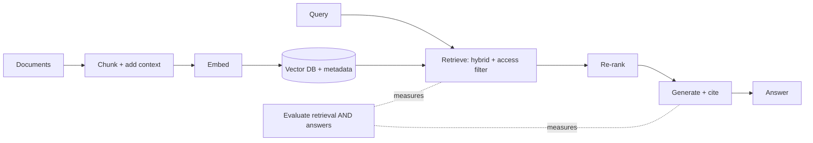

## Overview

The Foundations lesson covered *what* RAG is. This one is *how to design it well* — because the
gap between a toy RAG demo and a reliable one is entirely in the architecture. The dominant truth:
**retrieval quality is the whole game.** Most "the AI gives vague/wrong answers" problems are
retrieval problems, not model problems.

## Why this matters

RAG is the most common business AI architecture, and most RAG underperforms because teams treat it
as "embed everything, hope for the best." Knowing the levers — chunking, embedding choice,
re-ranking, query handling, and evaluation — lets you direct a build that actually works and to
diagnose one that doesn't.

## Core concepts

The pipeline, with the design lever at each stage:

- **Ingestion & chunking.** How you split documents massively affects results. Too big → noisy,
  diluted retrieval; too small → lost context. Overlap, structure-aware splitting, and adding
  context to chunks (e.g. "contextual retrieval": prepend a short description of where the chunk
  came from) all help.
- **Embedding model.** Drives whether "close" really means "relevant." Choose a strong one; keep
  it consistent for documents and queries.
- **Retrieval.** Top-k nearest chunks, often combined with keyword/**hybrid search** (semantic +
  exact match) for the best of both. Metadata filtering enforces access control.
- **Re-ranking.** A second model reorders candidates by true relevance before they reach the LLM —
  one of the highest-ROI quality boosts.
- **Generation.** The LLM answers from the retrieved chunks, ideally **with citations** so claims
  are checkable.
- **Evaluation.** Measure *retrieval* (did we fetch the right chunks?) and *answer* quality
  separately — you can't fix what you don't measure.

## Visual explanation



## How it works

You optimise the pipeline stage by stage, starting where the leverage is highest: chunking and the
embedding model (retrieval quality), then add hybrid search and re-ranking, then tune generation
(grounded, cited answers). Throughout, you evaluate retrieval and answers separately so you know
*which* stage to fix. The vector database (from Track 2) is largely interchangeable; the
intelligence is in how you chunk, retrieve, re-rank, and evaluate.

## Decision framework

```decision
title: My RAG gives weak answers — what do I fix first?
Are the right chunks being retrieved at all? → Measure retrieval first. If no, fix chunking and the embedding model before anything else.
Right chunks retrieved but buried/low-ranked? → Add or improve re-ranking.
Missing exact-match terms (names, codes, IDs)? → Add hybrid (semantic + keyword) search.
Right chunks reach the model but answers wander? → Tighten the generation prompt; require citations.
Leaking documents users shouldn't see? → Enforce metadata/access filtering at retrieval.
Can't tell what's wrong? → You're not evaluating retrieval separately — start there.
```

## Common mistakes

- **Blaming the model for retrieval failures** — most bad RAG is bad retrieval.
- **One-size chunking** with no thought to size, overlap, or document structure.
- **Skipping re-ranking** — leaving an easy, large quality gain on the table.
- **Pure semantic search** when exact terms (IDs, names) matter — add hybrid.
- **No citations** — answers can't be trusted or verified.
- **Evaluating only final answers**, so you can't localise the problem to retrieval vs generation.

## Real business examples

- A support RAG gives vague answers; measuring retrieval shows the right articles weren't being
  fetched. Fixing chunking + adding re-ranking transforms it — the model was never the issue.
- A legal RAG misses clauses referenced by exact section numbers until **hybrid search** is added
  for precise matches.
- A team adds contextual chunk descriptions and re-ranking and sees a large jump in answer
  accuracy with no model change.

## Governance considerations

```governance
RAG architecture is where several governance controls are implemented (from the RAG, privacy, and security lessons): enforce **per-user access control at retrieval** via metadata filtering (so the system can't surface documents a user isn't entitled to); treat the **vector store as sensitive data** (residency, access); use **citations** to make answers auditable and verifiable; and be deliberate about **what gets indexed** in the first place. Retrieval is also a **poisoning/injection** surface — if attackers can edit source documents, they can steer answers, so treat the knowledge base as a trust boundary.
```

## How an architect thinks

```architect
The architect knows the model is rarely the bottleneck — retrieval is — so they instrument and optimise retrieval first, and they evaluate retrieval and answers *separately* to localise problems. They reach for the high-ROI levers (good chunking, a strong embedding model, re-ranking, hybrid search, citations) before considering a fancier model or a fine-tune. And they bake access control into retrieval, because in RAG, security and quality are designed in the same place.
```

## Key takeaways

- In RAG, **retrieval quality is the whole game** — most failures are retrieval, not the model.
- Key levers: **chunking (+context), embedding model, hybrid search, re-ranking, cited
  generation.**
- **Evaluate retrieval and answers separately** to know what to fix.
- Implement governance here: **access control at retrieval, sensitive vector store, citations,
  curated index, poisoning awareness.**

## Self-check

1. Why is "the model gives bad answers" usually a retrieval problem?
2. What does re-ranking do, and why is it high-ROI?
3. Why evaluate retrieval separately from final answers?
