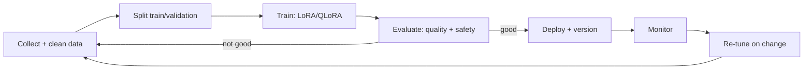

## Overview

When prompting and RAG can't deliver a needed *behaviour* (style, format, a narrow skill),
fine-tuning is the architecture. But fine-tuning is less a one-off command and more a *pipeline
and lifecycle*: data → train → evaluate → deploy → maintain. This lesson is how to design that
well — the data is the hard part, and the lifecycle is the part people forget.

## Why this matters

Fine-tuning done casually produces a model that's worse, stale, or unsafe. Done as a designed
pipeline with good data and evaluation, it reliably instils behaviour you couldn't get otherwise.
Knowing the architecture lets you decide whether it's worth it and direct it competently — and
recognise when it's the wrong tool (facts → RAG).

## Core concepts

- **Data pipeline (the real work).** Assemble representative input→ideal-output examples, clean
  them, remove/protect sensitive data, split into train/validation. Quality and representativeness
  dominate the outcome far more than the training settings.
- **Method.** Usually **LoRA/QLoRA** (cheap, swappable adapters) rather than full fine-tuning;
  self-run (Unsloth/Axolotl) or managed.
- **Evaluation.** A held-out test set of *your* real tasks, scored before and after — fine-tuning
  can help or hurt, and can erode safety alignment, so you must measure both quality and safety.
- **Lifecycle.** A fine-tuned model is an asset you now own: version it, track its training data
  (lineage), and **re-tune/re-evaluate** when the base model updates or needs change. This ongoing
  cost is real.

## Visual explanation



## How it works

You decide fine-tuning is warranted (behaviour gap, not facts), then invest in the dataset — the
lever that matters most. You train (usually LoRA), evaluate against your real tasks for both
quality and safety, and only deploy if it beats the baseline. Then you maintain it: track the data
lineage and version, monitor in production, and plan to re-tune when the base model changes or
requirements shift. Tools handle the mechanics (Track 2); your job is the data, the evaluation
bar, and the lifecycle plan.

## Decision framework

```decision
title: Designing a fine-tune
Is the goal behaviour/style/format (not facts)? → Proceed; facts belong in RAG.
Do you have (or can you build) a quality, representative dataset? → If not, fix that first — it's the whole game.
Method? → LoRA/QLoRA by default (cheap, swappable); full fine-tune rarely.
How will you evaluate? → Held-out set of real tasks; score quality AND re-test safety.
Who maintains it? → Plan versioning, data lineage, and re-tuning on base-model updates before you start.
```

## Common mistakes

- **Fine-tuning for facts** (use RAG) or before exhausting prompting + RAG.
- **Under-investing in data** — small, biased, or messy datasets produce worse models.
- **No held-out evaluation** — shipping a fine-tune that's actually worse on real tasks.
- **Skipping safety re-testing** — tuning can erode alignment, especially risky in sensitive
  domains.
- **Forgetting the lifecycle** — an unversioned fine-tune with untracked data and no re-tune plan
  becomes stale and unauditable.

## Real business examples

- A company needs strict, consistent structured output prompting couldn't guarantee; a LoRA
  fine-tune on a few hundred clean examples delivers it — evaluated against real cases before
  rollout.
- A firm tries to fine-tune in "domain knowledge," realises that's a RAG problem, and redirects —
  saving the effort and the maintenance burden.
- A team versions its adapter and re-evaluates when the base model updates, catching a regression
  before it reaches users.

## Governance considerations

```governance
Fine-tuning concentrates data and safety governance (from the fine-tuning and licensing lessons): confirm **rights** to the training data; **remove/protect personal and confidential** information (it can be memorised into the weights); record **data lineage** for audits; check the base model's **license** permits fine-tuning and your use; and **re-test safety/alignment** after training, since it can degrade guardrails. With managed services, training data goes to a third party — check terms and residency. The lifecycle (versioning, re-tuning, monitoring) is itself a governance obligation, not just engineering hygiene.
```

## How an architect thinks

```architect
The architect treats fine-tuning as a pipeline and a *commitment*, not a quick fix: the dataset is the real engineering, evaluation (quality + safety) is the gate, and the lifecycle (versioning, lineage, re-tuning) is an ongoing cost they budget up front. They only choose it when behaviour — not knowledge — is the gap, and they default to cheap, swappable LoRA adapters. "Can we get this from prompting or RAG instead?" is asked, and answered no, before any fine-tune begins.
```

## Key takeaways

- Fine-tuning is a **pipeline and lifecycle**: data → train (usually **LoRA**) → evaluate
  (quality + safety) → deploy → **maintain/re-tune**.
- **Data quality is the dominant lever**; it's for **behaviour, not facts** (use RAG for facts).
- **Evaluate on real tasks and re-test safety**; never ship a fine-tune that doesn't beat the
  baseline.
- Plan the **lifecycle and data governance** (rights, privacy, lineage, license, versioning)
  before starting.

## Self-check

1. What's the most important (and hardest) part of a fine-tuning effort?
2. Why must you re-test safety, not just quality, after fine-tuning?
3. What ongoing lifecycle costs does a fine-tuned model create?
