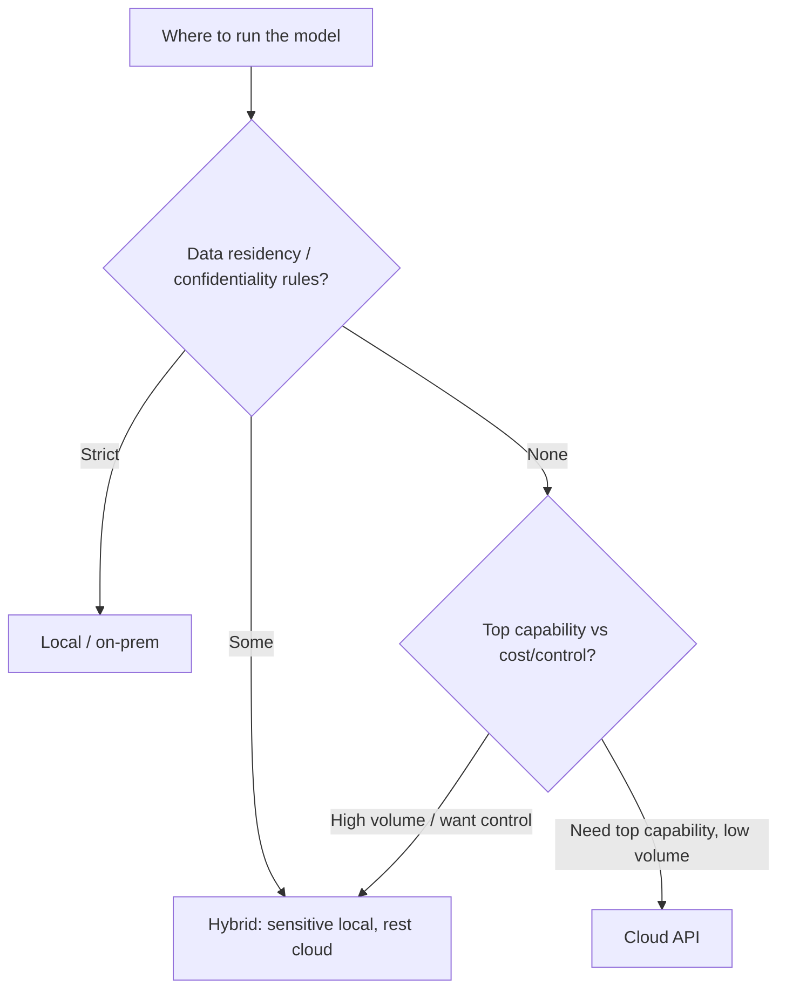

## Overview

Where does the model actually run? On a **cloud** provider's servers (hosted API), on **your own**
hardware (local/on-prem/self-hosted), or a **hybrid** that mixes both? This is one of the most
consequential architecture decisions — it's where capability, cost, control, privacy, and
residency all collide. Often the *data*, not the technology, decides it.

## Why this matters

This choice determines whether your data leaves your environment, your cost structure, your
operational burden, and which models you can even use. It's frequently the decision a regulated or
data-sensitive organisation must make first, because residency or confidentiality can rule out
cloud APIs entirely.

## Core concepts

- **Cloud / hosted API.** Call a provider's model. Max capability, zero infrastructure, fast to
  start; but data leaves your environment, ongoing per-use cost, and vendor dependence.
- **Local / self-hosted / on-prem.** Run an open model on your hardware (or rented GPUs in your
  control). Data stays put, you own it; but you take on GPUs, ops, and (usually) somewhat lower
  peak capability.
- **Hybrid.** Mix by sensitivity and difficulty: sensitive or high-volume work on local models;
  hardest tasks on cloud frontier models. Often the pragmatic best of both. (Closely related to
  **model routing**, next lessons.)
- **Edge** is a special local case — on the user's device (next lesson).
- **The deciding axes:** data sensitivity/residency, capability needed, cost at your volume,
  latency, and your ops capacity.

## Visual explanation



## How it works

You weigh the axes for *your* situation. Strict residency/confidentiality → local or hybrid (data
can't leave). No such constraint, need maximum capability, modest volume → cloud API. High steady
volume or a desire for control → local or hybrid can win on cost and independence. Most mature
setups end up **hybrid**: a default cloud model for hard tasks, local models for sensitive or
high-volume work, routed appropriately. Self-hosting brings the inference-engine and GPU concerns
(next lessons) and the operational ownership (security, uptime).

## Decision framework

```decision
title: Local, cloud, or hybrid?
Must data stay in-region / never leave? → **Local** (or in-region private cloud) — non-negotiable driver.
Some data sensitive, some not? → **Hybrid**: sensitive/high-volume local, hard/non-sensitive tasks on cloud.
No data constraints, want max capability fast, low/moderate volume, small team? → **Cloud API.**
Very high steady volume and ops capacity? → **Local/hybrid** can be cheaper and independent.
Unsure / early? → Start **cloud** to move fast; design an abstraction so you can move sensitive parts local later.
```

## Common mistakes

- **Defaulting to cloud without checking residency/confidentiality** — then discovering a
  compliance breach.
- **Self-hosting prematurely** "to save money" at low volume — APIs usually win until volume is
  high and steady.
- **Underestimating ops** for local — GPUs, security, uptime, patching are real, ongoing work.
- **All-or-nothing thinking** — missing the hybrid option that resolves the tension.
- **No abstraction** — hard-wiring one deployment so you can't shift later.

## Real business examples

- A hospital runs an open model **on-prem** so patient data never leaves — residency decided it,
  capability was secondary.
- A SaaS startup uses a **cloud API** to launch fast, behind an abstraction, planning to move
  sensitive workloads local as it scales.
- An enterprise runs a **hybrid**: an on-prem open model for confidential documents, a cloud
  frontier model for hard general tasks, with routing between them.

## Governance considerations

```governance
This decision *is* a governance decision as much as an architecture one. **Local/on-prem** keeps data and the model in your control — the strongest answer to residency and confidentiality — but shifts security, patching, and uptime responsibility to you (a self-hosted endpoint must be access-controlled like any sensitive service). **Cloud** offloads ops but means data leaves your environment, so vendor data terms, residency options, and lock-in must be governed. **Hybrid** lets you place each workload where its sensitivity dictates — often the most defensible design. Map data flows so you know exactly what runs where.
```

## How an architect thinks

```architect
The architect lets the *data* lead: they classify what the system handles and apply residency/confidentiality rules first, because those can eliminate cloud before capability is even discussed. Then they weigh capability, cost-at-volume, latency, and ops capacity. Their pragmatic default is hybrid — place each workload where its sensitivity and difficulty dictate — and they keep deployment behind an abstraction so the boundary can move as needs change. Control and capability are balanced per workload, not chosen once globally.
```

## Key takeaways

- Three options: **cloud** (capability, no infra, data leaves), **local** (control/residency, you
  own ops), **hybrid** (place each workload by sensitivity/difficulty).
- **Data residency/confidentiality often decides it first** — before capability.
- **Hybrid** is the common mature answer; pair it with **model routing**.
- It's a **governance decision**: local = control + ops burden; cloud = convenience + data leaves +
  vendor terms. **Map data flows** and keep deployment **swappable**.

## Self-check

1. Which factor most often forces a local or hybrid deployment?
2. Why is self-hosting not automatically cheaper?
3. What does a hybrid architecture let you do that pure cloud or pure local can't?
