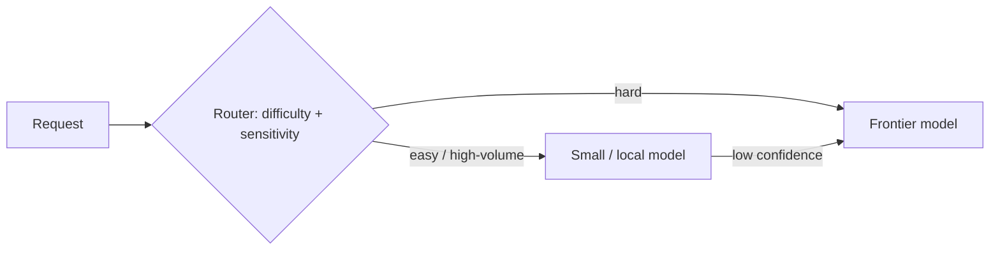

## Overview

You don't have to use one model for everything. **Model routing** sends each request to the most
appropriate model — cheap/fast models for easy tasks, powerful models for hard ones — so you get
good results without paying frontier prices for trivial work. It's one of the highest-leverage cost
and performance patterns in AI architecture.

## Why this matters

Most workloads are a mix: a majority of easy requests and a minority of hard ones. Using a frontier
model for all of them is the most common form of AI overspend. Routing can cut cost dramatically
while preserving quality where it matters — and it's also how hybrid local/cloud designs decide
what runs where.

## Core concepts

- **The insight:** difficulty is uneven. Route by difficulty/stakes, not one-size-fits-all.
- **What to route on:** task type, complexity, required quality, sensitivity (→ local vs cloud),
  and cost/latency targets.
- **How routing decides:** simple rules (e.g. by task type or length), a classifier, or a cheap
  model that escalates to a stronger one when unsure ("cascade").
- **Multi-model systems** also include using *specialist* models per modality (speech, vision) and
  per job — not just big-vs-small.
- **Ties to other patterns:** routing is how **hybrid local/cloud** (sensitive→local) and **cost
  governance** (cheap→small) are implemented in practice.

## Visual explanation



## How it works

A router (rules, a classifier, or a cheap-model-first cascade) inspects each request and dispatches
it to the right model. Easy, high-volume requests go to a small or local model; hard ones go to a
frontier model; sensitive ones go to a local model regardless. A common efficient pattern is the
**cascade**: try a cheap model first; if it's unsure (low confidence) or the task is flagged hard,
escalate. You evaluate per route to ensure each model clears the quality bar for its slice.

## Decision framework

```decision
title: Should I route, and how?
Is your workload a mix of easy and hard tasks? → Yes (usually) → routing will cut cost without hurting quality.
Using a frontier model for everything? → Strong candidate for routing — likely overspending on easy work.
Some requests sensitive? → Route those to a local model (implements hybrid).
How to decide routes? → Start with simple rules (task type/length); add a classifier or cascade if needed.
How do you know each route is good enough? → Evaluate per route — don't assume the small model passes everywhere.
```

## Common mistakes

- **One model for everything** — overpaying on easy tasks (the classic waste).
- **Routing without evaluation** — sending tasks to a small model that quietly fails on them.
- **Over-engineering the router** before proving routing helps — start with simple rules.
- **Ignoring sensitivity** — routing sensitive data to a cloud model when it should stay local.
- **No fallback** — if the chosen model/route fails, where does the request go?

## Real business examples

- A product routes ~80% of simple requests to a small model and reserves the frontier model for the
  hard 20%, cutting cost substantially with no quality loss where it matters.
- A company uses a **cascade**: a cheap model handles most queries and escalates only when its
  confidence is low — minimising frontier-model calls.
- A hybrid setup routes confidential documents to an on-prem model and general questions to a cloud
  frontier model — routing implements the residency policy.

## Governance considerations

```governance
Routing is a governance lever as much as a cost one. It's how you enforce **data residency/confidentiality** in practice — sensitive requests routed to local models, never to a cloud API — so the routing rules become a control you must get right and audit. It's also central to **cost governance** (cheap models for the bulk of work). Evaluate each route for quality (a wrong route can degrade answers) and log routing decisions, especially where sensitivity-based routing is a compliance requirement.
```

## How an architect thinks

```architect
The architect assumes workloads are uneven and designs for it: cheap/local models for the easy, high-volume, or sensitive majority; frontier models reserved for the genuinely hard minority; a cascade to minimise expensive calls. They start with simple routing rules and add sophistication only if it pays. Crucially they evaluate *each route* — routing saves money only if every model still clears the bar for its slice — and they use routing to enforce residency, not just cost.
```

## Key takeaways

- **Route each request to the right model** — cheap/local for easy/sensitive, frontier for hard.
- Routing is **high-leverage** for cost and is how **hybrid local/cloud** and **cost governance** are
  implemented.
- Use **rules, a classifier, or a cheap-first cascade**; **evaluate each route**.
- It's a **governance control** (residency-based routing) — get the rules right and **log** them.

## Self-check

1. Why is using one frontier model for everything usually wasteful?
2. What is a cascade, and how does it save cost?
3. How does routing enforce a data-residency policy?
