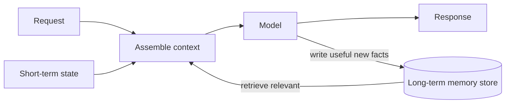

## Overview

By default, an AI model forgets everything once the conversation scrolls past its context window —
it has no memory across sessions. **Memory architecture** is how you add persistence: letting a
system remember facts, preferences, and past interactions over time. It's what turns a stateless
chatbot into an assistant that "knows" you and what's happened.

## Why this matters

Many valuable applications need memory: a support assistant recalling a customer's history, an
agent remembering progress on a long task, a copilot learning your preferences. Without a memory
design, every session starts from zero. With one, the system gets more useful over time — but
memory also raises real privacy and accuracy questions.

## Core concepts

- **The context window is not memory.** It's temporary working memory for the current exchange
  (Foundations lesson). Persistence must be added deliberately.
- **Short-term (working) memory.** Within a task/session — e.g. an agent tracking what it's tried.
  Often managed by summarising or carrying forward key state as the context fills.
- **Long-term memory.** Across sessions — facts, preferences, past interactions stored externally
  (often as embeddings in a vector DB) and **retrieved** when relevant. This is essentially RAG
  pointed at "things we remember."
- **What to remember (and forget).** You decide what's worth storing (useful, stable facts) vs.
  noise — and you need a way to update and *delete* memories (corrections, privacy).
- **Retrieval, not total recall.** You don't stuff all history into the prompt; you retrieve the
  relevant memories per request, like RAG.

## Visual explanation



## How it works

Long-term memory is usually RAG in disguise: you store memories (facts, summaries, preferences) as
embeddings, and at each turn retrieve the ones relevant to the current request, adding them to the
context. Short-term memory keeps the current task coherent, often by summarising older turns as the
window fills. The system writes new useful facts back to the store and must support updating and
deleting them. The hard design questions are *what* to remember, *when* to retrieve it, and *how* to
keep it correct and private.

## Decision framework

```decision
title: Designing memory for an AI system
Does it need to persist anything across sessions? → If no, you may not need long-term memory at all (simpler).
Long conversations within a session? → Add short-term memory (summarise/carry state) to handle the context limit.
Need to remember facts/preferences/history? → Long-term memory = store as embeddings + retrieve relevant (RAG-style).
What to store vs ignore? → Stable, useful facts; avoid hoarding noise and sensitive data you don't need.
Can users correct/delete memories? → Required for accuracy and privacy — design update/delete in.
```

## Common mistakes

- **Confusing the context window with memory** — assuming the model "remembers" without a store.
- **Remembering everything** — hoarding noise (and sensitive data) degrades retrieval and raises
  privacy risk.
- **No update/delete** — stale or wrong memories persist and compound; users can't be forgotten.
- **Dumping all memory into the prompt** instead of retrieving the relevant subset.
- **Ignoring that memories can be wrong** — a remembered hallucination becomes a persistent error.

## Real business examples

- A support assistant retrieves a customer's relevant history (past issues, preferences) at the
  start of each chat, giving continuity without re-asking — stored and retrieved like RAG.
- A long-running research agent keeps short-term state of what it's checked so it doesn't loop or
  repeat.
- A personal copilot remembers a user's stable preferences (tone, formats) and lets them edit or
  clear these.

## Governance considerations

```governance
Memory is a privacy-heavy architecture. A long-term memory store accumulates personal data and past interactions, so it inherits all the privacy/residency/confidentiality duties (and is itself sensitive, like any vector store). You must support **correction and deletion** (accuracy, and rights like "be forgotten"), be deliberate about **what is stored** (data minimisation — don't hoard sensitive data), control **who/what can retrieve** memories (access control), and remember that a stored hallucination becomes a *persistent* error. Govern the memory store as carefully as the source data.
```

## How an architect thinks

```architect
The architect treats long-term memory as RAG over "things worth remembering," and asks first whether persistence is even needed (often it isn't — simpler wins). When it is, they design *what* to store (minimal, stable, useful), *when* to retrieve it, and crucially *how to correct and delete* it — because memory compounds both value and errors. They guard the store as sensitive personal data and keep retrieval access-controlled. Memory is powerful and privacy-laden; they add it deliberately, not by default.
```

## Key takeaways

- The **context window is not memory** — persistence is a deliberate addition.
- **Short-term** memory keeps a session/task coherent; **long-term** memory = **store as embeddings
  + retrieve relevant** (RAG-style).
- Decide **what to remember**, retrieve **only the relevant subset**, and design **update/delete**.
- The memory store is **sensitive personal data** — minimise, access-control, allow deletion, and
  beware **persisted hallucinations**.

## Self-check

1. Why isn't the context window a form of long-term memory?
2. How is long-term memory essentially RAG?
3. Why are update/delete capabilities essential for a memory store?
