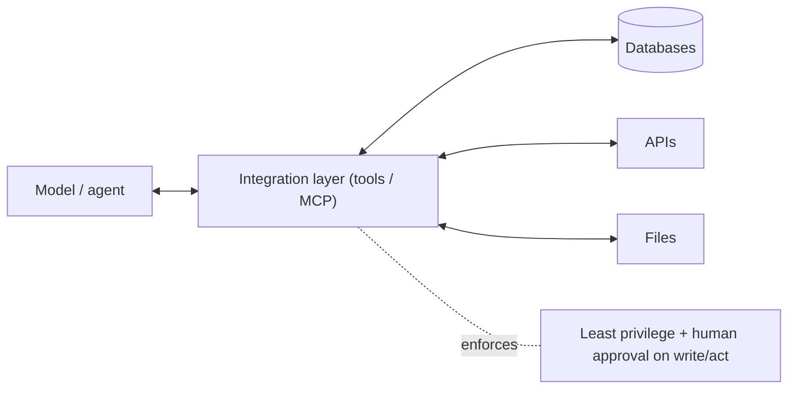

## Overview

A model on its own is just text in, text out. To be useful in a business it needs to *reach your
systems* — databases, APIs, files, calendars. The **integration layer** is how: **tools**
(functions the model can call) and standards like the **Model Context Protocol (MCP)** that connect
models to external systems in a consistent, governable way.

## Why this matters

The integration layer is where AI stops being a chat toy and starts doing real work — and it's
also where much of the *risk* lives, because connecting a model to your systems and giving it the
ability to act is exactly the dangerous "untrusted input meets powerful action" combination from
the security lesson. Designing this layer well is both what makes AI valuable and what keeps it
safe.

## Core concepts

- **Tools / function calling.** You expose functions (search the DB, send an email, fetch a record)
  that the model can choose to call; it gets the result and continues. This is how models act on the
  world (from the agents lesson).
- **MCP (Model Context Protocol).** An open standard for connecting models to tools and data
  sources in a uniform way — think "a universal connector" so you don't hand-build every
  integration and can reuse/share connectors. Reduces bespoke glue and lock-in.
- **The integration layer is a trust boundary.** Each tool is a permission; each data source is an
  exposure. This is where least privilege and human gates are enforced.
- **Read vs write tools.** Read-only tools (fetch info) are far lower risk than write/act tools
  (send, pay, delete). Treat them very differently.

## Visual explanation



## How it works

You define the tools the model may use and connect them — increasingly via MCP so connectors are
standardised and reusable rather than one-off code. The model, given a goal, decides which tools to
call; the integration layer executes them under the permissions you've set and returns results. The
architect's job is to expose the *minimum* necessary tools, scope their credentials tightly,
distinguish read from write, and gate high-impact actions with a human — so capability is added
without opening a dangerous hole.

## Decision framework

```decision
title: Designing the integration layer
What's the minimum set of tools/data the model needs? → Expose only those (least privilege).
Read or write? → Read-only tools are low risk; write/act tools need tight scoping and usually human approval.
Reusing across systems/models? → Prefer MCP/standard connectors over bespoke glue (less lock-in, less code).
Untrusted input flowing to a powerful tool? → Break that link or add a human gate (prompt-injection defence).
High-impact action (money, delete, external comms)? → Human approval, scoped credentials, full logging.
```

## Common mistakes

- **Over-exposing tools/data** — giving the model broad access "to be helpful," widening the blast
  radius.
- **Treating write tools like read tools** — letting the model act consequentially without gates.
- **Bespoke integrations everywhere** — more code, more lock-in; MCP/standards reduce this.
- **Ignoring the trust boundary** — forgetting that connecting untrusted input to powerful tools is
  the core security risk.
- **Broad standing credentials** for tools instead of narrow, revocable ones.

## Real business examples

- A company exposes a read-only "search our knowledge base" tool via MCP to several internal AI
  apps, reusing one connector instead of building many.
- An agent that can send emails is given a tightly scoped account, a human-approval step for
  external messages, and full logging — capability with containment.
- A team standardises its integrations on MCP so swapping the underlying model doesn't mean
  rebuilding every connection.

## Governance considerations

```governance
The integration layer is where agent governance is implemented. Apply **least privilege** to every tool and data source; sharply separate **read** (low risk) from **write/act** (gate with human approval, scope credentials); and remember this layer is the **trust boundary** where prompt injection turns into real-world action — never let untrusted content directly trigger a high-impact tool. Log every tool call for auditability and incident response. Standardising via MCP can also help governance: consistent, reviewable connectors beat sprawling bespoke integrations.
```

## How an architect thinks

```architect
The architect designs the integration layer as the control point: expose the fewest tools, scope every credential, separate read from write, and gate consequential actions with a human — because this is exactly where "untrusted input meets powerful action." They favour standard connectors (MCP) to cut bespoke code and lock-in, and they log every tool call. Capability and risk both live here, so it gets the most deliberate, least-privilege design in the whole system.
```

## Key takeaways

- The **integration layer** (tools / function calling / **MCP**) is how models reach your systems —
  where AI does real work.
- **MCP** is a standard "universal connector" — reusable, less bespoke glue, less lock-in.
- It's a **trust boundary**: apply **least privilege**, separate **read vs write/act**, **gate
  high-impact actions**, and **log** everything.
- Capability *and* the core security risk both live here — design it most carefully.

## Self-check

1. What does the integration layer let a model do, and why is it risky?
2. What problem does MCP solve?
3. Why treat read tools and write/act tools so differently?
