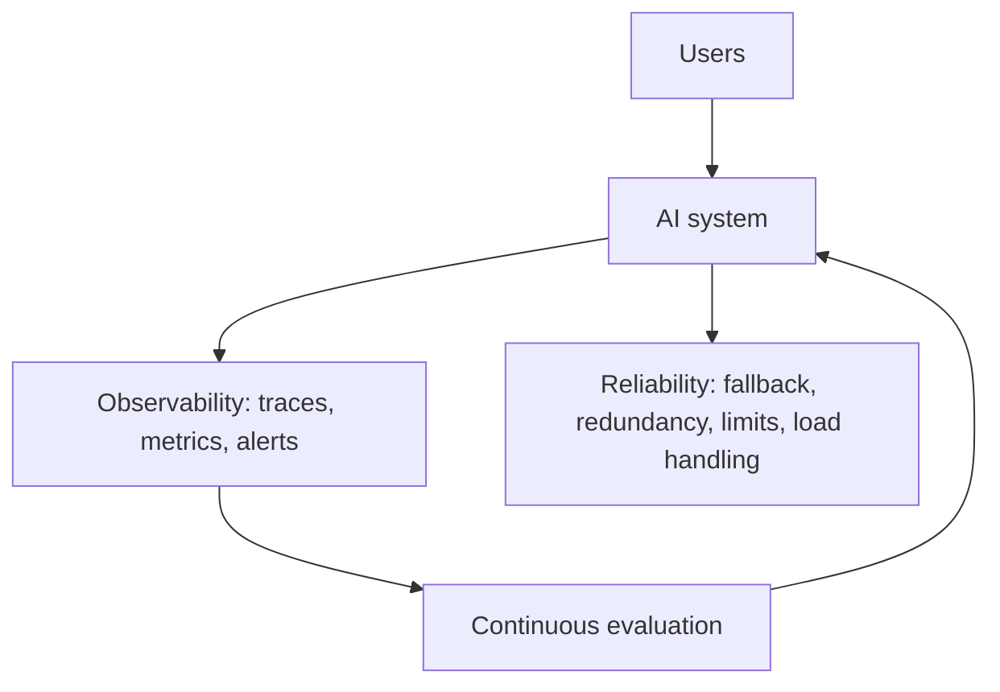

## Overview

A system that works in a demo isn't the same as one you can depend on in production.
**Observability** (seeing what the system does) and **reliability** (keeping it working through
load, failures, and change) are the operational backbone of any real AI deployment. This lesson
closes the Architecture track by making systems *dependable*, not just functional.

## Why this matters

AI systems are non-deterministic, depend on external providers, and can drift silently. Without
observability you're blind to errors, cost spikes, quality drops, and abuse; without reliability
engineering, one provider outage or traffic spike takes you down. For anything users or the
business rely on, these aren't optional polish — they're the difference between a tool and a
liability.

## Core concepts

- **Observability** (from Track 2, applied here): trace every request — inputs, retrieved sources,
  tool calls, outputs, tokens, latency, cost, errors — and monitor dashboards + alerts for quality,
  cost, latency, and abuse.
- **Reliability levers:**
  - **Graceful degradation / fallback** — defined behaviour when the AI is down/slow/uncertain
    (queue, backup model, human handoff, safe failure). (From the fallback lesson.)
  - **Redundancy** — a secondary model/provider for critical paths (enabled by an abstraction
    layer).
  - **Limits & timeouts** — caps on tokens, steps, retries, and time to contain runaways and
    hangs.
  - **Load handling** — rate limiting, queuing, batching for spikes.
- **Quality reliability:** continuous evaluation + monitoring to catch drift and silent model
  updates (from the evaluation and lifecycle lessons).

## Visual explanation



## How it works

You instrument the system so every request is traceable and key metrics (quality, cost, latency,
errors) are monitored with alerts. You engineer reliability proportionate to how critical the
system is: fallback paths so failures degrade gracefully, redundancy (a second provider) for
critical functions, hard limits/timeouts to contain runaways and hangs, and load handling for
spikes. Continuous evaluation watches for quality drift, including from silent model updates. The
result is a system you can trust, see into, and recover quickly.

## Decision framework

```decision
title: Is this AI system production-ready?
Can you see what it's doing (traces, metrics, alerts)? → If not, add observability before relying on it.
What happens when the AI/provider is down or slow? → Define graceful degradation + (for critical paths) a backup provider.
Could a loop, spike, or hang run away? → Add limits, timeouts, rate limiting, and queuing.
How will you catch quality drift / silent model updates? → Continuous evaluation + monitoring.
How critical is it? → Scale reliability investment to that — don't over-engineer trivial systems.
```

## Common mistakes

- **Shipping the demo** — no observability, no fallback, no limits; fine until it isn't.
- **No alerting** — logs nobody watches don't prevent incidents.
- **Single provider, no fallback** for a critical path.
- **No limits/timeouts** — runaway loops and hangs cause cost and outage incidents.
- **Assuming stable quality** — not monitoring for drift or silent model updates.
- **Over-engineering** reliability for a low-stakes internal tool.

## Real business examples

- A team's monitoring catches a quality drop within hours of a provider's silent model update —
  because continuous evaluation was running — and they pin/adjust before users complain.
- A critical assistant fails over to a secondary provider during an outage and keeps serving, with
  users barely noticing.
- Hard step/cost limits contain a buggy agent loop to pennies and a logged alert, instead of a
  large bill and a silent outage.

## Governance considerations

```governance
Observability and reliability are where several governance duties become operational. Observability provides the **audit trail** and the early warning for safety/quality issues and abuse; reliability (fallback, redundancy, limits) is the **availability and continuity** control. Both are expected for high-stakes/regulated systems. Protect the observability data (it's sensitive — secure it, set retention), keep continuous evaluation as ongoing safety evidence, and document fallback/recovery plans and limits as part of the system's governance. A production AI you can't see into or recover is not a governed one.
```

## How an architect thinks

```architect
The architect designs the operational backbone from the start, not after the first incident: full tracing and alerting, graceful degradation, redundancy for critical paths, hard limits and timeouts, load handling, and continuous evaluation for drift. They scale the investment to the system's criticality — production-grade for what the business depends on, light for throwaway tools. Their test of "done" isn't "it works in the demo" but "we can see it, trust it, and recover it when (not if) something fails."
```

## Key takeaways

- Production needs **observability** (traces, metrics, alerts) and **reliability** (fallback,
  redundancy, limits/timeouts, load handling).
- **Continuous evaluation** catches quality drift and **silent model updates**.
- Scale reliability to **criticality**; don't over-engineer trivial tools or under-engineer
  critical ones.
- These are **governance controls** too (audit trail, availability) — protect observability data and
  document plans.

## Self-check

1. What does observability let you catch that you'd otherwise miss?
2. Name three reliability levers for a critical AI system.
3. Why is continuous evaluation part of reliability, not just quality?
