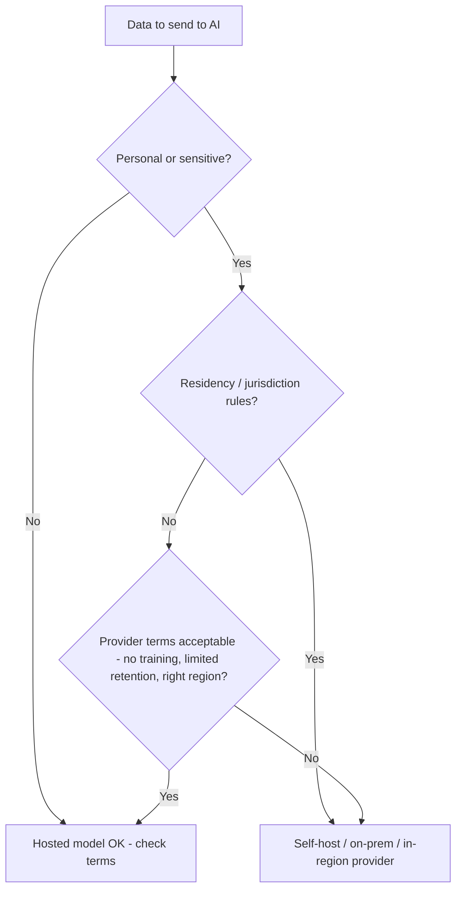

## Overview

Every time you send data to a hosted AI model, that data *leaves your environment* — it travels
to the provider, gets processed, and is often logged. **Privacy** is about protecting personal
and sensitive information; **data residency** is about where data is physically processed and
stored; **jurisdiction** is about whose laws apply. Together they're one of the biggest forces
shaping AI architecture decisions.

## Why this matters

These aren't abstract legal concerns — they directly determine *which models and deployments you
can use*. "We must keep patient data in-country" can rule out a hosted US model and force a
self-hosted open one. Getting this wrong risks legal penalties (GDPR fines are severe),
broken client contracts, and lost trust. Getting it right is often the deciding architecture
constraint.

## Core concepts

- **Personal data** (anything identifying a person) is regulated — GDPR in the EU, plus many
  national and sector laws. Special categories (health, biometrics) get extra protection.
- **Data residency** — legal or contractual requirements that data stays within a region/country.
  Common in healthcare, government, finance, and many client contracts.
- **Jurisdiction** — which country's laws govern the data. Sending data abroad can subject it to
  foreign laws (and foreign government access).
- **Data processing terms** — what the AI provider does with your data: trains on it? retains it?
  for how long? where? Business/enterprise tiers usually offer stronger guarantees than consumer
  ones — but you must check.
- **The core trade-off:** hosted models (data leaves, convenient, capable) vs. self-hosted/local
  models (data stays, you run it). Residency often forces the latter.

## Visual explanation



## How it works

Before sending data to any AI service, you classify it (is it personal/sensitive?) and check the
rules that apply (laws, client contracts). Then you match the deployment: if data can't leave a
region, you need an in-region provider option or a self-hosted model. Techniques that help:
**data minimisation** (send only what's needed — another reason for retrieval over dumping
documents), **redaction/anonymisation** (strip identifiers before sending), and **local
inference** (data never leaves). The EU AI Act adds further obligations for higher-risk uses on
top of privacy law.

## Decision framework

```decision
title: Can I send this data to a hosted AI model?
Is it personal or otherwise sensitive? → If no, hosted is usually fine (still check terms).
Do laws/contracts require it to stay in a region? → If yes, use an in-region option or self-host; don't send it abroad.
Can I minimise or anonymise what I send? → Do it — less sensitive data leaving = less risk.
Are the provider's data terms acceptable (no training on your data, limited retention, right region)? → If not, choose another tier/provider or self-host.
Highest sensitivity (health, legal privilege, secrets)? → Favour local/on-prem inference by default.
```

## Common mistakes

- **Pasting sensitive/personal data into consumer AI tools** whose terms allow training on it.
- **Assuming "cloud" means compliant.** Residency depends on *which region* processes the data;
  confirm it.
- **Ignoring data minimisation.** Sending whole documents when a snippet would do multiplies
  exposure.
- **Forgetting logs.** Prompts (and your observability traces) may store sensitive data —
  govern those stores too.
- **One-size-fits-all.** Different data classes need different handling; classify first.

## Real business examples

- A **clinic** must keep patient data in-country, so it self-hosts an open model on-prem rather
  than using a hosted US API — residency was the deciding factor, not capability.
- A **law firm** redacts client identifiers before using a hosted model for drafting, and uses an
  enterprise tier with no-training, limited-retention terms.
- A **global company** routes EU users' data to an EU-region deployment to satisfy GDPR, while
  using a different region elsewhere.

## Governance considerations

```governance
This lesson *is* a governance core, so the emphasis: classify data before it touches AI; match the deployment to the strictest applicable rule; minimise and redact; and remember every place data lands (provider, logs, vector store, backups) inherits the obligation. Document your data flows — knowing exactly where each class of data goes is both good practice and what regulators and clients will ask for. When in doubt on personal/sensitive data, default to keeping it local.
```

## How an architect thinks

```architect
For the architect, residency and privacy are *constraints that come first*, not features bolted on. They start a design by asking "what data does this touch, and where is it legally allowed to be?" — because the answer can eliminate whole categories of solution (e.g. all hosted foreign APIs) before capability is even considered. They map data flows explicitly and minimise what leaves the building, treating local inference as the safe default for the most sensitive data.
```

## Key takeaways

- Hosted AI means **your data leaves**; **privacy, residency, and jurisdiction** govern whether
  that's allowed.
- These constraints often **decide the architecture** (e.g. forcing self-hosted/in-region).
- Use **classification, data minimisation, redaction, and local inference** to manage exposure.
- Every place data lands (**provider, logs, vector store**) inherits the obligation — **map your
  data flows**.

## Self-check

1. What's the difference between data residency and jurisdiction?
2. How can a residency requirement change your choice of model/deployment?
3. Name two techniques to reduce sensitive-data exposure when using hosted AI.
